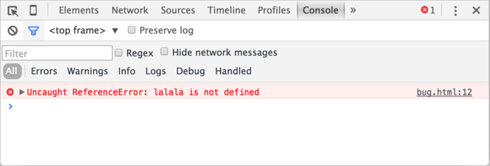

<<<<<<< HEAD
# 開発者コンソール

コードにエラーはつきものです。少なくともあなたが [ロボット](https://en.wikipedia.org/wiki/Bender_(Futurama)) ではなく人間であるなら、*絶対に* 間違いをする、ということです。

しかしブラウザでは、ユーザはデフォルトではエラーは見えません。そのため、スクリプトが上手くいかない場合、何が悪かったのか見ることができず、直すこともできないでしょう。

エラーを確認したりスクリプトに関する多くの役立つ情報を得るために、ブラウザには "開発者ツール" が組み込まれています。

開発者の多くは、開発するのに Chrome か Firefox を利用することが多いです。なぜなら、それらのブラウザは最高の開発者ツールを持っているからです。開発者ツールを提供している他のブラウザも特別な機能を持っていますが、たいてい Chrome かFirefox の "キャッチアップ" です。なので、ほとんどの開発者は "お気に入り" のブラウザを持っており、問題がブラウザ依存の場合は他のブラウザに切り替えます。

開発者ツールは、本当に強力で多くの機能があります。開発を開始するために、私たちはどうやってそれらを開き、エラーを見て、JavaScriptコマンドを実行するのか学びましょう。

## Google Chrome

[bug.html](bug.html)を開きましょう。

このJavaScriptコードにはエラーがあります。通常のサイト訪問者の目からは隠れているので、エラーを確認するために開発者ツールを開きましょう。

`key:F12`もしくは、Macの場合は`key:Cmd+Opt+J`を押します。

開発者ツールが起動します。デフォルトではConsoleタブが開かれているでしょう。

次のようになります:



開発者ツールの正確な見栄えは、利用しているChromeのバージョンに依存します。見栄えが変わることもありますが似ているはずです。

- ここでは赤色でエラーメッセージを見ることができます。このケースでは、スクリプトに未定義の "lalala" コマンドが含まれています。
- 右側にはエラーが発生した行番号とともに、ソース `bug.html：12` へのクリック可能なリンクがあります。

エラーメッセージの下に、青の `>` の記号があります。それは "コマンドライン" を意味し、JavaScriptコマンドを入力し、`key:Enter` を押すことでそれらを実行することができます。

これで私たちはエラーを見ることができるようになったので、開発を開始するには十分です。後ほど開発者ツールに戻り、チャプター <info:debugging-chrome> でより詳細なデバッグをカバーします。

```smart header="複数行の入力"
通常、コンソールに1行コードを入力して `key:Enter` を押すと、コードが実行されます。

複数行を入力したい場合は、`key:Shift+Enter` を押します。この方法で長い  JavaScript コードも入力できます。
```

## Firefox, Edge やその他

ほとんどのブラウザは開発者ツールを開くために `key:F12` を使います。

それらのルック＆フィールはとても似ています。それらの1つ(Chromeで始めるのが良いでしょう)の使い方を知ったら、簡単に別のものに切り替えることができるでしょう。

## Safari

Safari (Mac ブラウザ, Windows/Linux ではサポートされていません)はここでは少しだけ特別です。最初に、 "開発者メニュー" を有効にする必要があります。

Preferencesを開き、"Advanced" ペインに行きます。一番下にチェックボックスがあります。


`key:Cmd+Opt+C`でコンソールを切り替えることができます。また、"開発"という名前の新しいトップメニュー項目が表示されていることにも留意してください。 それは多くのコマンドとオプションを持っています。

## サマリ 

- 開発者ツールは私達がエラーを見たり、コマンドを実行したり、変数を検査したりほかにも多くのことを可能にします。
- Windows下では、ほとんどのブラウザは `key:F12` で開くことができます。Mac用のChromeは `key:Cmd+Opt+J` が必要で、Safariは`key:Cmd+Opt+C`です(最初に有効化が必要)。

これで環境が整いました。次のセクションでは、JavaScriptの説明に入ります。
=======
# Developer console

Code is prone to errors. You will quite likely make errors... Oh, what am I talking about? You are *absolutely* going to make errors, at least if you're a human, not a [robot](https://en.wikipedia.org/wiki/Bender_(Futurama)).

But in the browser, users don't see errors by default. So, if something goes wrong in the script, we won't see what's broken and can't fix it.

To see errors and get a lot of other useful information about scripts, "developer tools" have been embedded in browsers.

Most developers lean towards Chrome or Firefox for development because those browsers have the best developer tools. Other browsers also provide developer tools, sometimes with special features, but are usually playing "catch-up" to Chrome or Firefox. So most developers have a "favorite" browser and switch to others if a problem is browser-specific.

Developer tools are potent; they have many features. To start, we'll learn how to open them, look at errors, and run JavaScript commands.

## Google Chrome

Open the page [bug.html](bug.html).

There's an error in the JavaScript code on it. It's hidden from a regular visitor's eyes, so let's open developer tools to see it.

Press `key:F12` or, if you're on Mac, then `key:Cmd+Opt+J`.

The developer tools will open on the Console tab by default.

It looks somewhat like this:


The exact look of developer tools depends on your version of Chrome. It changes from time to time but should be similar.

- Here we can see the red-colored error message. In this case, the script contains an unknown "lalala" command.
- On the right, there is a clickable link to the source `bug.html:12` with the line number where the error has occurred.

Below the error message, there is a blue `>` symbol. It marks a "command line" where we can type JavaScript commands. Press `key:Enter` to run them.

Now we can see errors, and that's enough for a start. We'll come back to developer tools later and cover debugging more in-depth in the chapter <info:debugging-chrome>.

```smart header="Multi-line input"
Usually, when we put a line of code into the console, and then press `key:Enter`, it executes.

To insert multiple lines, press `key:Shift+Enter`. This way one can enter long fragments of JavaScript code.
```

## Firefox, Edge, and others

Most other browsers use `key:F12` to open developer tools.

The look & feel of them is quite similar. Once you know how to use one of these tools (you can start with Chrome), you can easily switch to another.

## Safari

Safari (Mac browser, not supported by Windows/Linux) is a little bit special here. We need to enable the "Develop menu" first.

Open Preferences and go to the "Advanced" pane. There's a checkbox at the bottom:


Now `key:Cmd+Opt+C` can toggle the console. Also, note that the new top menu item named "Develop" has appeared. It has many commands and options.

## Summary

- Developer tools allow us to see errors, run commands, examine variables, and much more.
- They can be opened with `key:F12` for most browsers on Windows. Chrome for Mac needs `key:Cmd+Opt+J`, Safari: `key:Cmd+Opt+C` (need to enable first).

Now we have the environment ready. In the next section, we'll get down to JavaScript.
>>>>>>> ea7738bb7c3616bb51ff14ae3db2a2747d7888ff
