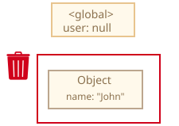
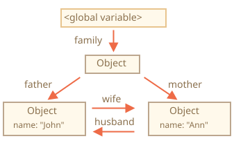
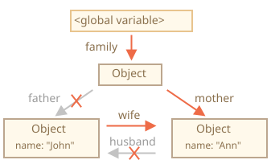
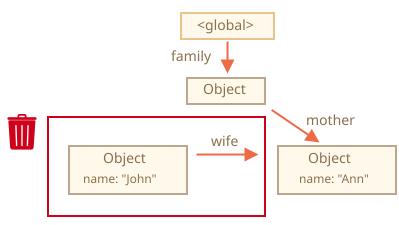
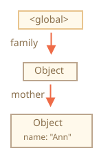
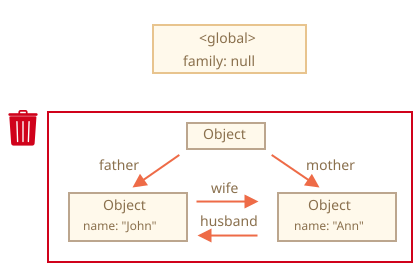
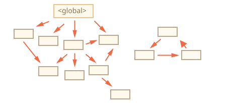
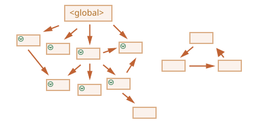
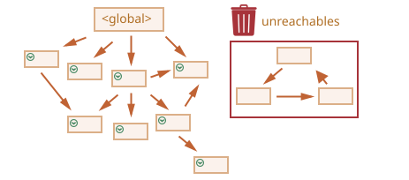

<<<<<<< HEAD
# ガベージコレクション

JavaScriptのメモリ管理は、自動で私たちの目には見えないように行われます。私たちが作るプリミティブ、オブジェクト、関数... それらはすべてメモリを必要とします。

何かがもう必要なくなったとき、何が起こるでしょう？JavaScriptエンジンはどのようにそれを検出し、クリーンアップするのでしょうか？

## 到達性 

JavaScriptのメモリ管理の主要なコンセプトは、*到達性* です。

簡単に言えば、「到達可能な」値は、何らかの形でアクセス可能、または使用可能な値です。それらはメモリに格納されることが保証されています。

1. 本質的に到達可能な値の基本セットがあり、それらは明白な理由により削除されません。

    例:

    - 現在の関数のローカル変数とパラメータ
    - ネストされた呼び出しの、現在のチェーン上の他の関数のローカル変数とパラメータ
    - グローバル変数
    - (他にも幾つか同様に内部のものがあります)

    それらの値は *ルート* と呼ばれます。

2. 他の任意の値は、参照または参照のチェーンにより、ルートから到達可能であれば、到達可能とみなされます。

    例えば、ローカル変数にオブジェクトがあった場合、そしてそのオブジェクトが別のオブジェクトの参照をもっていたとすると、そのオブジェクトは到達可能とみなされます。そして、それが参照するものもまた到達可能です。詳しくは後述します。

JavaScriptエンジンには[ガベージコレクタ](https://ja.wikipedia.org/wiki/%E3%82%AC%E3%83%99%E3%83%BC%E3%82%B8%E3%82%B3%E3%83%AC%E3%82%AF%E3%82%B7%E3%83%A7%E3%83%B3)と呼ばれるバックグラウンドプロセスがあります。それはすべてのオブジェクトを監視し、到達不可能になったオブジェクトを削除します。

## シンプルな例 

これは最もシンプルな例です:

```js
// user は オブジェクトへの参照を持っています
=======
# Garbage collection

Memory management in JavaScript is performed automatically and invisibly to us. We create primitives, objects, functions... All that takes memory.

What happens when something is not needed any more? How does the JavaScript engine discover it and clean it up?

## Reachability

The main concept of memory management in JavaScript is *reachability*.

Simply put, "reachable" values are those that are accessible or usable somehow. They are guaranteed to be stored in memory.

1. There's a base set of inherently reachable values, that cannot be deleted for obvious reasons.

    For instance:

    - The currently executing function, its local variables and parameters.
    - Other functions on the current chain of nested calls, their local variables and parameters.
    - Global variables.
    - (there are some other, internal ones as well)

    These values are called *roots*.

2. Any other value is considered reachable if it's reachable from a root by a reference or by a chain of references.

    For instance, if there's an object in a global variable, and that object has a property referencing another object, *that* object is considered reachable. And those that it references are also reachable. Detailed examples to follow.

There's a background process in the JavaScript engine that is called [garbage collector](https://en.wikipedia.org/wiki/Garbage_collection_(computer_science)). It monitors all objects and removes those that have become unreachable.

## A simple example

Here's the simplest example:

```js
// user has a reference to the object
>>>>>>> d78b01e9833009fab534462e05c03cffc51bf0e3
let user = {
  name: "John"
};
```


<<<<<<< HEAD
ここで、矢印はオブジェクトの参照を示しています。グローバル変数 `user` はオブジェクト `{name: "John"}` を参照しています(簡略化して John と呼びます)。John の `"name"` プロパティはプリミティブを格納しているので、オブジェクトの枠内に描かれています。

もし `user` の値が上書きされると、参照はなくなります。:
=======
Here the arrow depicts an object reference. The global variable `"user"` references the object `{name: "John"}` (we'll call it John for brevity). The `"name"` property of John stores a primitive, so it's painted inside the object.

If the value of `user` is overwritten, the reference is lost:
>>>>>>> d78b01e9833009fab534462e05c03cffc51bf0e3

```js
user = null;
```



<<<<<<< HEAD
今、John は到達不能になりました。参照が存在しないため、アクセスする方法はありません。ガベージコレクタはデータを捨て、メモリを解放します。

## 2つの参照 

さて、`user` の参照を `admin` にコピーしたとしましょう:

```js
// user は オブジェクトへの参照を持っています
=======
Now John becomes unreachable. There's no way to access it, no references to it. Garbage collector will junk the data and free the memory.

## Two references

Now let's imagine we copied the reference from `user` to `admin`:

```js
// user has a reference to the object
>>>>>>> d78b01e9833009fab534462e05c03cffc51bf0e3
let user = {
  name: "John"
};

*!*
let admin = user;
*/!*
```


<<<<<<< HEAD
今、先ほどと同じことをしたとすると:
=======
Now if we do the same:
>>>>>>> d78b01e9833009fab534462e05c03cffc51bf0e3
```js
user = null;
```

<<<<<<< HEAD
...オブジェクトはまだグローバル変数 `admin` 経由で到達可能なため、メモリ内に存在します。もし `admin` も上書きしてしまうと、オブジェクトは削除可能となります。

## 連結されたオブジェクト 

これはより複雑な例です。家族(family):
=======
...Then the object is still reachable via `admin` global variable, so it must stay in memory. If we overwrite `admin` too, then it can be removed.

## Interlinked objects

Now a more complex example. The family:
>>>>>>> d78b01e9833009fab534462e05c03cffc51bf0e3

```js
function marry(man, woman) {
  woman.husband = man;
  man.wife = woman;

  return {
    father: man,
    mother: woman
  }
}

let family = marry({
  name: "John"
}, {
  name: "Ann"
});
```

<<<<<<< HEAD
関数 `marry` は与えられた2つのオブジェクトを互いに参照することによって "marry(結婚)" し、それら両方を含む新しいオブジェクトを返します。

結果のメモリ構造:



今のところ、全てのオブジェクトは到達可能です:

ここで、2つの参照を削除してみましょう:
=======
Function `marry` "marries" two objects by giving them references to each other and returns a new object that contains them both.

The resulting memory structure:


As of now, all objects are reachable.

Now let's remove two references:
>>>>>>> d78b01e9833009fab534462e05c03cffc51bf0e3

```js
delete family.father;
delete family.mother.husband;
```



<<<<<<< HEAD
それら2つの参照のうち、1つだけを削除するのでは不十分です。なぜなら全てのオブジェクトはまだ到達可能だからです。

しかし、もし両方を削除すると、John にはもう参照がないことがわかります:



他のオブジェクトへの参照は気にする必要はありません。自身への参照のみがオブジェクトを到達可能にします。したがって、John は今や到達不能で、他の到達不能になったすべてのデータとともにメモリ内から削除されるでしょう。

ガベージコレクションの後:



## 到達不可能な島 

連携されたオブジェクトの島全体が到達不可能になり、メモリから削除される場合があります。

ソースとなるオブジェクトは上記と同じです。 次にこのようにします：
=======
It's not enough to delete only one of these two references, because all objects would still be reachable.

But if we delete both, then we can see that John has no incoming reference any more:


Outgoing references do not matter. Only incoming ones can make an object reachable. So, John is now unreachable and will be removed from the memory with all its data that also became unaccessible.

After garbage collection:


## Unreachable island

It is possible that the whole island of interlinked objects becomes unreachable and is removed from the memory.

The source object is the same as above. Then:
>>>>>>> d78b01e9833009fab534462e05c03cffc51bf0e3

```js
family = null;
```

<<<<<<< HEAD
すると、メモリの中はこうなります:



この例は、到達可能性の概念がいかに重要であるかを示しています。

John と Ann がまだリンクされているのは明らかで、両方とも他からの参照を持っていることになります。しかしそれだけでは十分ではありません。

以前 `"family"` であったオブジェクトはルートからのリンクが解除されており、これ以上、他からの参照はないため、島全体が到達不可能になり、削除されることになります。

## 内部のアルゴリズム 

基本のガベージコレクションのアルゴリズムは "マーク・アンド・スイープ" と呼ばれます。

次の "ガベージコレクション" のステップが定期的に実行されます:

- ガベージコレクタはルートを取得し、 それらを "マーク" (記憶)します。
- 次に、そこからのすべての参照先を訪れ、"マーク" します。
- 次に、マークされたオブジェクトへアクセスし、*それらの* 参照をマークします。訪問されたすべてのオブジェクトは記憶されているので、将来同じオブジェクトへは2度訪問しないようにします。
- ...そしてすべての到達可能な(ルートからの)参照が訪問されるまで続けます。
- マークされたオブジェクトを除いた、すべてのオブジェクトが削除されます。

例えば、我々のオブジェクト構造はこのように見えます:



右側に明らかに "到達不可能な島" が見えます。今、どのように "マーク・アンド・スイープ" ガベージコレクタがそれを扱うか見てみましょう。

最初のステップではルートをマークします:


次に、それらの参照をマークします:



...そしてそれらの参照も、可能な限り、マークしていきます:


この手順でたどりつけなかったオブジェクトは到達不能とみなされ、削除されます:



このプロセスは、巨大なバケツに入った絵の具を根元からこぼすようなものだと想像することもできます。この絵の具は、すべてのリファレンスを通過して、手の届く範囲のすべてのオブジェクトをマークします。そして、マークされていないものは削除されます。

これが、ガベージコレクションの仕組みのコンセプトです。JavaScriptのエンジンは、実行に影響を与えないように、より速くガベージコレクションを行うための多くの最適化を施します。

これらは最適化のいくつかです:

- **世代コレクション** -- オブジェクトは2つのセットに分割されます: "新しいオブジェクト" と "古いオブジェクト" です。多くのオブジェクトは出現し、仕事をするとすぐ不要になります。これらは積極的にクリーンアップされます。長期間生き残ったものは "古い" ものになり、それほど頻繁には検査されません。
- **インクリメンタルコレクション** -- 多くのオブジェクトがある場合、1度に全てのオブジェクトの集合をマークしようとすると、時間がかかってしまい、実行時に目に見える遅延を引き起こす可能性があります。なので、エンジンはガベージコレクションを小さく分割します。そしてそれらのピースが1つずつ、別々に実行されます。変更を追跡するため、多少の追加の記憶域を必要とはしますが、大きな遅延ではなく多くの小さな遅延になります。
- **アイドルタイムコレクション** -- ガベージコレクタは、CPUがアイドル状態のときにのみ実行を試み、実行への影響を減らします。

ガベージコレクションアルゴリズムには他にも最適化やバリエーションがあります。ここでそれらも説明したいのですが、止めておかなくてはいけません。なぜなら、エンジンによって、調整方法やテクニックの使い方がバラバラだからです。 そして、さらに重要なのは、エンジンの開発に伴って状況が変化するため、実際に必要がない場合には「先立って」深く進んでいくことはそれほど価値はありません。 もちろん、それが純粋な興味であれば、参照すると良いいくつかのリンクが下にあります。

## サマリ 

知っておくべきポイント:

- ガベージコレクションは自動で実行されます。実行を強制したり、防ぐことはできません。
- オブジェクトは到達可能な間、メモリ上に保持されます。
- 参照されることは、(ルートから)到達可能であることと同じではありません: 連結されたオブジェクトのパックはそれ全体で到達不可能になる可能性があります。

現代のエンジンはガベージコレクションの高度なアルゴリズムを実装しています。

一般的な本 "ガベージコレクションハンドブック": 自動メモリ管理の技術（R.Jones et al）は、それらのいくつかをカバーしています。

もしあなたが低レベルのプログラミングに慣れている場合、V8のガベージコレクションに関するより詳細な情報はこの記事[A tour of V8: Garbage Collection](http://jayconrod.com/posts/55/a-tour-of-v8-garbage-collection).にあります。

[V8 blog](http://v8project.blogspot.com/) には、メモリ管理の変更に関する記事も随時掲載されています。 ガベージコレクションを学ぶには、V8の内部について一般的に学習し、V8エンジニアの一人として働いていた [Vyacheslav Egorov](http://mrale.ph) のブログを読むとよいでしょう。 "V8", それはインターネット上の記事で最もよくカバーされるからです。 他のエンジンでは、多くのアプローチは似ていますが、ガベージコレクションは多くの点で異なります。

低レベルの最適化が必要な場合は、エンジンに関する深い知識が必要です。 あなたが言語に精通した後の次のステップとしてそれを計画することが賢明でしょう。
=======
The in-memory picture becomes:


This example demonstrates how important the concept of reachability is.

It's obvious that John and Ann are still linked, both have incoming references. But that's not enough.

The former `"family"` object has been unlinked from the root, there's no reference to it any more, so the whole island becomes unreachable and will be removed.

## Internal algorithms

The basic garbage collection algorithm is called "mark-and-sweep".

The following "garbage collection" steps are regularly performed:

- The garbage collector takes roots and "marks" (remembers) them.
- Then it visits and "marks" all references from them.
- Then it visits marked objects and marks *their* references. All visited objects are remembered, so as not to visit the same object twice in the future.
- ...And so on until every reachable (from the roots) references are visited.
- All objects except marked ones are removed.

For instance, let our object structure look like this:


We can clearly see an "unreachable island" to the right side. Now let's see how "mark-and-sweep" garbage collector deals with it.

The first step marks the roots:


Then we follow their references and mark referenced objects:


...And continue to follow further references, while possible:


Now the objects that could not be visited in the process are considered unreachable and will be removed:


We can also imagine the process as spilling a huge bucket of paint from the roots, that flows through all references and marks all reachable objects. The unmarked ones are then removed.

That's the concept of how garbage collection works. JavaScript engines apply many optimizations to make it run faster and not introduce any delays into the code execution.

Some of the optimizations:

- **Generational collection** -- objects are split into two sets: "new ones" and "old ones". In typical code, many objects have a short life span: they appear, do their job and die fast, so it makes sense to track new objects and clear the memory from them if that's the case. Those that survive for long enough, become "old" and are examined less often.
- **Incremental collection** -- if there are many objects, and we try to walk and mark the whole object set at once, it may take some time and introduce visible delays in the execution. So the engine splits the whole set of existing objects into multiple parts. And then clear these parts one after another. There are many small garbage collections instead of a total one. That requires some extra bookkeeping between them to track changes, but we get many tiny delays instead of a big one.
- **Idle-time collection** -- the garbage collector tries to run only while the CPU is idle, to reduce the possible effect on the execution.

There exist other optimizations and flavours of garbage collection algorithms. As much as I'd like to describe them here, I have to hold off, because different engines implement different tweaks and techniques. And, what's even more important, things change as engines develop, so studying deeper "in advance", without a real need is probably not worth that. Unless, of course, it is a matter of pure interest, then there will be some links for you below.

## Summary

The main things to know:

- Garbage collection is performed automatically. We cannot force or prevent it.
- Objects are retained in memory while they are reachable.
- Being referenced is not the same as being reachable (from a root): a pack of interlinked objects can become unreachable as a whole, as we've seen in the example above.

Modern engines implement advanced algorithms of garbage collection.

A general book "The Garbage Collection Handbook: The Art of Automatic Memory Management" (R. Jones et al) covers some of them.

If you are familiar with low-level programming, more detailed information about V8's garbage collector is in the article [A tour of V8: Garbage Collection](https://jayconrod.com/posts/55/a-tour-of-v8-garbage-collection).

The [V8 blog](https://v8.dev/) also publishes articles about changes in memory management from time to time. Naturally, to learn more about garbage collection, you'd better prepare by learning about V8 internals in general and read the blog of [Vyacheslav Egorov](https://mrale.ph) who worked as one of the V8 engineers. I'm saying: "V8", because it is best covered by articles on the internet. For other engines, many approaches are similar, but garbage collection differs in many aspects.

In-depth knowledge of engines is good when you need low-level optimizations. It would be wise to plan that as the next step after you're familiar with the language.
>>>>>>> d78b01e9833009fab534462e05c03cffc51bf0e3
