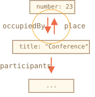

<<<<<<< HEAD
# JSON メソッド, toJSON

複雑なオブジェクトを持っており、それをネットワーク経由で送ったり、単にログ出力するために文字列に変換したいとします。

もちろん、変換された文字列にはすべての重要なプロパティを含んでいる必要があります。

私たちは、次のように変換処理を実装することができます:
=======
# JSON methods, toJSON

Let's say we have a complex object, and we'd like to convert it into a string, to send it over a network, or just to output it for logging purposes.

Naturally, such a string should include all important properties.

We could implement the conversion like this:
>>>>>>> 3d7abb9cc8fa553963025547717f06f126c449b6

```js run
let user = {
  name: "John",
  age: 30,

*!*
  toString() {
    return `{name: "${this.name}", age: ${this.age}}`;
  }
*/!*
};

alert(user); // {name: "John", age: 30}
```

<<<<<<< HEAD
...しかし、開発の過程では、新しいプロパティが追加されたり、古いプロパティがリネーム/削除されます。このような状況で `toString` を毎回更新するのは面倒です。オブジェクト中のプロパティをループすることはできますが、オブジェクトが複雑で、プロパティにネストされたオブジェクトがある場合はどうなるでしょうか？ それらの変換処理も実装する必要があります。 また、ネットワーク経由でオブジェクトを送信する場合には、受信側でそれらを「読み取る」ためのコードも提供する必要があります。

幸いにも、これらの処理を行うためにコードを書く必要はありません。この課題は既に解決されています。

## JSON.stringify

[JSON](http://en.wikipedia.org/wiki/JSON) (JavaScript Object Notation) は値とオブジェクトを表現する一般的な形式です。[RFC 4627](http://tools.ietf.org/html/rfc4627) で標準として記述されています。当初はJavaScriptのために作られたものでしたが、多くの他の言語も同様に JSON を処理するライブラリを持っています。従って、クライアントが JavaScript を使い、サーバが Ruby/PHP/Java/その他 で書かれている場合に、データ交換としてJSONを使うのは簡単です。

JavaScriptは次のメソッドを提供しています:

- `JSON.stringify` : オブジェクトをJSONに変換します。
- `JSON.parse` : JSONをオブジェクトに変換します。

例えば、ここで student を `JSON.stringify` します:
=======
...But in the process of development, new properties are added, old properties are renamed and removed. Updating such `toString` every time can become a pain. We could try to loop over properties in it, but what if the object is complex and has nested objects in properties? We'd need to implement their conversion as well.

Luckily, there's no need to write the code to handle all this. The task has been solved already.

## JSON.stringify

The [JSON](https://en.wikipedia.org/wiki/JSON) (JavaScript Object Notation) is a general format to represent values and objects. It is described as in [RFC 4627](https://tools.ietf.org/html/rfc4627) standard. Initially it was made for JavaScript, but many other languages have libraries to handle it as well.  So it's easy to use JSON for data exchange when the client uses JavaScript and the server is written on Ruby/PHP/Java/Whatever.

JavaScript provides methods:

- `JSON.stringify` to convert objects into JSON.
- `JSON.parse` to convert JSON back into an object.

For instance, here we `JSON.stringify` a student:
>>>>>>> 3d7abb9cc8fa553963025547717f06f126c449b6
```js run
let student = {
  name: 'John',
  age: 30,
  isAdmin: false,
  courses: ['html', 'css', 'js'],
<<<<<<< HEAD
  wife: null
=======
  spouse: null
>>>>>>> 3d7abb9cc8fa553963025547717f06f126c449b6
};

*!*
let json = JSON.stringify(student);
*/!*

<<<<<<< HEAD
alert(typeof json); // string です!
=======
alert(typeof json); // we've got a string!
>>>>>>> 3d7abb9cc8fa553963025547717f06f126c449b6

alert(json);
*!*
/* JSON-encoded object:
{
  "name": "John",
  "age": 30,
  "isAdmin": false,
  "courses": ["html", "css", "js"],
<<<<<<< HEAD
  "wife": null
=======
  "spouse": null
>>>>>>> 3d7abb9cc8fa553963025547717f06f126c449b6
}
*/
*/!*
```

<<<<<<< HEAD
メソッド `JSON.stringify(student)` はオブジェクトを受け取り、それを文字列に変換します。

結果の `json` 文字列は *JSONエンコードされた*, *シリアライズされた(serialized)*, *文字列化された(stringified)* または *整列化された(marshalled)* オブジェクトと呼ばれます。
これでネットワーク経由で送信したり、シンプルなデータストアに格納する準備ができました。

JSONエンコードされたオブジェクトは、オブジェクトリテラルと比べ、何点か重要な違いがあることに注意してください:

- 文字列にはダブルクォートを使います。JSONにはシングルクォートやバッククォートはありません。従って `'John'` は `"John"` になります。
- オブジェクトのプロパティ名もまたダブルクォートであり、必須です。従って `age:30` は `"age":30` になります。

`JSON.stringify` はプリミティブに対しても同様に適用できます。

ネイティブにサポートされるJSONタイプは次のとおりです。:

- オブジェクト(Object) `{ ... }`
- 配列(Array) `[ ... ]`
- プリミティブ(Primitives):
    - 文字列(strings),
    - 数値(numbers),
    - 真偽値(boolean values) `true/false`,
    - `null`.

例:

```js run
// JSON 内の数値はまさに数値です
alert( JSON.stringify(1) ) // 1

// JSON 内の文字列は文字列のままですが、ダブルクォートです
=======
The method `JSON.stringify(student)` takes the object and converts it into a string.

The resulting `json` string is called a *JSON-encoded* or *serialized* or *stringified* or *marshalled* object. We are ready to send it over the wire or put into a plain data store.


Please note that a JSON-encoded object has several important differences from the object literal:

- Strings use double quotes. No single quotes or backticks in JSON. So `'John'` becomes `"John"`.
- Object property names are double-quoted also. That's obligatory. So `age:30` becomes `"age":30`.

`JSON.stringify` can be applied to primitives as well.

JSON supports following data types:

- Objects `{ ... }`
- Arrays `[ ... ]`
- Primitives:
    - strings,
    - numbers,
    - boolean values `true/false`,
    - `null`.

For instance:

```js run
// a number in JSON is just a number
alert( JSON.stringify(1) ) // 1

// a string in JSON is still a string, but double-quoted
>>>>>>> 3d7abb9cc8fa553963025547717f06f126c449b6
alert( JSON.stringify('test') ) // "test"

alert( JSON.stringify(true) ); // true

alert( JSON.stringify([1, 2, 3]) ); // [1,2,3]
```

<<<<<<< HEAD
JSONはデータのみのマルチ言語仕様なので、JavaScript固有のオブジェクトプロパティの一部は `JSON.stringify` ではスキップされます。

つまり:

- 関数プロパティ(メソッド)
- シンボルキーと値
- `undefined` を格納しているプロパティ

```js run
let user = {
  sayHi() { // 無視される
    alert("Hello");
  },
  [Symbol("id")]: 123, // 無視される
  something: undefined // 無視される
};

alert( JSON.stringify(user) ); // {} (空オブジェクト)
```

通常これは問題ありませんが、もしそうしたくない場合、その処理をカスタマイズすることができます(方法は後ほど説明します)。

このメソッドの素晴らしい点は、入れ子のオブジェクトもサポートされており自動的に変換されることです。

例:
=======
JSON is data-only language-independent specification, so some JavaScript-specific object properties are skipped by `JSON.stringify`.

Namely:

- Function properties (methods).
- Symbolic keys and values.
- Properties that store `undefined`.

```js run
let user = {
  sayHi() { // ignored
    alert("Hello");
  },
  [Symbol("id")]: 123, // ignored
  something: undefined // ignored
};

alert( JSON.stringify(user) ); // {} (empty object)
```

Usually that's fine. If that's not what we want, then soon we'll see how to customize the process.

The great thing is that nested objects are supported and converted automatically.

For instance:
>>>>>>> 3d7abb9cc8fa553963025547717f06f126c449b6

```js run
let meetup = {
  title: "Conference",
*!*
  room: {
<<<<<<< HEAD
    number: 123,
=======
    number: 23,
>>>>>>> 3d7abb9cc8fa553963025547717f06f126c449b6
    participants: ["john", "ann"]
  }
*/!*
};

alert( JSON.stringify(meetup) );
<<<<<<< HEAD
/* 構造全体が文字列化されました:
=======
/* The whole structure is stringified:
>>>>>>> 3d7abb9cc8fa553963025547717f06f126c449b6
{
  "title":"Conference",
  "room":{"number":23,"participants":["john","ann"]},
}
*/
```

<<<<<<< HEAD
重要な制限: 循環参照があってはいけません。

例:
=======
The important limitation: there must be no circular references.

For instance:
>>>>>>> 3d7abb9cc8fa553963025547717f06f126c449b6

```js run
let room = {
  number: 23
};

let meetup = {
  title: "Conference",
  participants: ["john", "ann"]
};

<<<<<<< HEAD
meetup.place = room;       // meetup は room を参照
room.occupiedBy = meetup; // room は meetup を参照
=======
meetup.place = room;       // meetup references room
room.occupiedBy = meetup; // room references meetup
>>>>>>> 3d7abb9cc8fa553963025547717f06f126c449b6

*!*
JSON.stringify(meetup); // Error: Converting circular structure to JSON
*/!*
```

<<<<<<< HEAD
ここでは、循環参照(`room.occupiedBy` が `meetup` を参照し、`meetup.place` が `room` を参照している)のため変換が失敗します。:
=======
Here, the conversion fails, because of circular reference: `room.occupiedBy` references `meetup`, and `meetup.place` references `room`:
>>>>>>> 3d7abb9cc8fa553963025547717f06f126c449b6




<<<<<<< HEAD
## 除外(Excluding)と変形(transforming): replacer 

`JSON.stringify` の完全な構文は次の通りです:
=======
## Excluding and transforming: replacer

The full syntax of `JSON.stringify` is:
>>>>>>> 3d7abb9cc8fa553963025547717f06f126c449b6

```js
let json = JSON.stringify(value[, replacer, space])
```

value
<<<<<<< HEAD
: エンコードする値です。

replacer
: エンコードするプロパティの配列、またはマッピング関数 `function(key, value)` です。

space
: フォーマットで使うスペースの数です。

ほとんどのケースで `JSON.stringify` は最初の引数だけで使用されます。しかし、循環参照をフィルタリングするような置換処理を微調整する必要がある場合は、`JSON.stringify` の第2引数を使用できます。

もしも第2引数にプロパティの配列を渡した場合、それらのプロパティだけがエンコードされます。

例:
=======
: A value to encode.

replacer
: Array of properties to encode or a mapping function `function(key, value)`.

space
: Amount of space to use for formatting

Most of the time, `JSON.stringify` is used with the first argument only. But if we need to fine-tune the replacement process, like to filter out circular references, we can use the second argument of `JSON.stringify`.

If we pass an array of properties to it, only these properties will be encoded.

For instance:
>>>>>>> 3d7abb9cc8fa553963025547717f06f126c449b6

```js run
let room = {
  number: 23
};

let meetup = {
  title: "Conference",
  participants: [{name: "John"}, {name: "Alice"}],
<<<<<<< HEAD
  place: room // meetup は room を参照
};

room.occupiedBy = meetup; // room は meetup を参照
=======
  place: room // meetup references room
};

room.occupiedBy = meetup; // room references meetup
>>>>>>> 3d7abb9cc8fa553963025547717f06f126c449b6

alert( JSON.stringify(meetup, *!*['title', 'participants']*/!*) );
// {"title":"Conference","participants":[{},{}]}
```

<<<<<<< HEAD
これでは厳しすぎるかもしれません。プロパティリストは、オブジェクト構造全体に適用されるため、`name` はリストに無く、`participants` は空になります。

循環参照を引き起こす `room.occupiedBy` を除いた各プロパティを含めましょう:
=======
Here we are probably too strict. The property list is applied to the whole object structure. So the objects in `participants` are empty, because `name` is not in the list.

Let's include in the list every property except `room.occupiedBy` that would cause the circular reference:
>>>>>>> 3d7abb9cc8fa553963025547717f06f126c449b6

```js run
let room = {
  number: 23
};

let meetup = {
  title: "Conference",
  participants: [{name: "John"}, {name: "Alice"}],
<<<<<<< HEAD
  place: room // meetup は room を参照
};

room.occupiedBy = meetup; // room は meetup を参照
=======
  place: room // meetup references room
};

room.occupiedBy = meetup; // room references meetup
>>>>>>> 3d7abb9cc8fa553963025547717f06f126c449b6

alert( JSON.stringify(meetup, *!*['title', 'participants', 'place', 'name', 'number']*/!*) );
/*
{
  "title":"Conference",
  "participants":[{"name":"John"},{"name":"Alice"}],
  "place":{"number":23}
}
*/
```

<<<<<<< HEAD
これで、`occupiedBy` を除くすべてがシリアライズされました。しかし、プロパティのリストは非常に長いです。

幸いなことに、そのような場合は配列の代わりに `replacer` 関数を使うことができます。

関数はすべての `(key,value)` ペアで呼ばれ、"置換された" 値を返す必要があります。そしてそれはオリジナルのものの代わりに使われます。

私たちのケースでは、`occupiedBy` 以外のすべてが "そのままの" `value` を返せばOKです。`occupiedBy` を無視するため、下のコードでは `undefied` を返しています:
=======
Now everything except `occupiedBy` is serialized. But the list of properties is quite long.

Fortunately, we can use a function instead of an array as the `replacer`.

The function will be called for every `(key, value)` pair and should return the "replaced" value, which will be used instead of the original one. Or `undefined` if the value is to be skipped.

In our case, we can return `value` "as is" for everything except `occupiedBy`. To ignore `occupiedBy`, the code below returns `undefined`:
>>>>>>> 3d7abb9cc8fa553963025547717f06f126c449b6

```js run
let room = {
  number: 23
};

let meetup = {
  title: "Conference",
  participants: [{name: "John"}, {name: "Alice"}],
<<<<<<< HEAD
  place: room // meetup は room を参照
};

room.occupiedBy = meetup; // room は meetup を参照
=======
  place: room // meetup references room
};

room.occupiedBy = meetup; // room references meetup
>>>>>>> 3d7abb9cc8fa553963025547717f06f126c449b6

alert( JSON.stringify(meetup, function replacer(key, value) {
  alert(`${key}: ${value}`);
  return (key == 'occupiedBy') ? undefined : value;
}));

/* key:value pairs that come to replacer:
:             [object Object]
title:        Conference
participants: [object Object],[object Object]
0:            [object Object]
name:         John
1:            [object Object]
name:         Alice
place:        [object Object]
number:       23
occupiedBy: [object Object]
*/
```

<<<<<<< HEAD
`replacer` 関数はネストされたオブジェクトや配列のアイテムを含むすべての key/value ペアを取得することに留意してください。再帰的に適用されます。`replacer` の内側での `this` の値は現在のプロパティを含むオブジェクトです。

最初の呼び出しだけ特別です。これは特別な "ラッパーオブジェクト" (`{"": meetup}`) を使って作られます。 言い換えると、最初の `(key,value)` ペアは空のキーを持ち、値はターゲットのオブジェクト全体です。そういう訳で、上の例の最初の行は `":[object Object]"` となっています。

このアイデアは、できるだけ多くの力を `replace` を提供することです。必要に応じてオブジェクト全体を分析したり、置換/スキップすることができます。


## 書式設定: spacer 

`JSON.stringify(value, replacer, spaces)` の第3引数は、整形されたフォーマットで使うスペースの数です。

以前は、すべての文字列化(stringified)されたオブジェクトはインデントや余分なスペースを持っていませんでした。それはネットワーク経由でオブジェクトを送りたいときには正しいです。`spaces` 引数は見やすい出力をしたいときに使われます。

この例では、`spaces = 2` はJavaScriptがネストされたオブジェクトを複数行で表示するように指示し、オブジェクトの内側は2つスペースでインデントします:
=======
Please note that `replacer` function gets every key/value pair including nested objects and array items. It is applied recursively. The value of `this` inside `replacer` is the object that contains the current property.

The first call is special. It is made using a special "wrapper object": `{"": meetup}`. In other words, the first `(key, value)` pair has an empty key, and the value is the target object as a whole. That's why the first line is `":[object Object]"` in the example above.

The idea is to provide as much power for `replacer` as possible: it has a chance to analyze and replace/skip even the whole object if necessary.


## Formatting: space

The third argument of `JSON.stringify(value, replacer, space)` is the number of spaces to use for pretty formatting.

Previously, all stringified objects had no indents and extra spaces. That's fine if we want to send an object over a network. The `space` argument is used exclusively for a nice output.

Here `space = 2` tells JavaScript to show nested objects on multiple lines, with indentation of 2 spaces inside an object:
>>>>>>> 3d7abb9cc8fa553963025547717f06f126c449b6

```js run
let user = {
  name: "John",
  age: 25,
  roles: {
    isAdmin: false,
    isEditor: true
  }
};

alert(JSON.stringify(user, null, 2));
<<<<<<< HEAD
/* 2つのスペースインデント:
=======
/* two-space indents:
>>>>>>> 3d7abb9cc8fa553963025547717f06f126c449b6
{
  "name": "John",
  "age": 25,
  "roles": {
    "isAdmin": false,
    "isEditor": true
  }
}
*/

<<<<<<< HEAD
/* JSON.stringify(user, null, 4) の場合、結果はよりインデントされたものです:
=======
/* for JSON.stringify(user, null, 4) the result would be more indented:
>>>>>>> 3d7abb9cc8fa553963025547717f06f126c449b6
{
    "name": "John",
    "age": 25,
    "roles": {
        "isAdmin": false,
        "isEditor": true
    }
}
*/
```

<<<<<<< HEAD
3番目の引数も文字列にすることができます。 この場合、文字列はスペースの数の代わりにインデントに使用されます。

`spaces` パラメータは単にロギングや見やすい出力のためだけに使われます。

## カスタムの "toJSON" 

文字列変換用の `toString` のように、オブジェクトはJSONへの変換用メソッド `toJSON` を提供しています。`JSON.stringify` は利用可能であればそれを自動で呼び出します。

例:
=======
The third argument can also be a string. In this case, the string is used for indentation instead of a number of spaces.

The `space` parameter is used solely for logging and nice-output purposes.

## Custom "toJSON"

Like `toString` for string conversion, an object may provide method `toJSON` for to-JSON conversion. `JSON.stringify` automatically calls it if available.

For instance:
>>>>>>> 3d7abb9cc8fa553963025547717f06f126c449b6

```js run
let room = {
  number: 23
};

let meetup = {
  title: "Conference",
  date: new Date(Date.UTC(2017, 0, 1)),
  room
};

alert( JSON.stringify(meetup) );
/*
  {
    "title":"Conference",
*!*
    "date":"2017-01-01T00:00:00.000Z",  // (1)
*/!*
    "room": {"number":23}               // (2)
  }
*/
```

<<<<<<< HEAD
ここで、`date` `(1)` が文字列になっているのが分かります。これは、すべての date にこのような種類の文字列を返す組み込みの `toJSON` メソッドがあるからです。

さて、オブジェクト `room` にカスタムの `toJSON` を足してみましょう:
=======
Here we can see that `date` `(1)` became a string. That's because all dates have a built-in `toJSON` method which returns such kind of string.

Now let's add a custom `toJSON` for our object `room` `(2)`:
>>>>>>> 3d7abb9cc8fa553963025547717f06f126c449b6

```js run
let room = {
  number: 23,
*!*
  toJSON() {
    return this.number;
  }
*/!*
};

let meetup = {
  title: "Conference",
  room
};

*!*
alert( JSON.stringify(room) ); // 23
*/!*

alert( JSON.stringify(meetup) );
/*
  {
    "title":"Conference",
*!*
    "room": 23
*/!*
  }
*/
```

<<<<<<< HEAD
上の通り、`toJSON` は `JSON.stringify(room)` の直接呼び出しとネストされたオブジェクト両方で使われます。
=======
As we can see, `toJSON` is used both for the direct call `JSON.stringify(room)` and when `room` is nested in another encoded object.
>>>>>>> 3d7abb9cc8fa553963025547717f06f126c449b6


## JSON.parse

<<<<<<< HEAD
JSON文字列をデコードするには、[JSON.parse](mdn:js/JSON/parse) と言うメソッドが必要です。

構文:
=======
To decode a JSON-string, we need another method named [JSON.parse](mdn:js/JSON/parse).

The syntax:
>>>>>>> 3d7abb9cc8fa553963025547717f06f126c449b6
```js
let value = JSON.parse(str[, reviver]);
```

str
<<<<<<< HEAD
: パースする JSON文字列です。

reviver
: 各 `(key,value)` ペアで呼ばれ、値を変形することができるオプションの関数(function(key,value))です。

例:

```js run
// 文字列化された配列
=======
: JSON-string to parse.

reviver
: Optional function(key,value) that will be called for each `(key, value)` pair and can transform the value.

For instance:

```js run
// stringified array
>>>>>>> 3d7abb9cc8fa553963025547717f06f126c449b6
let numbers = "[0, 1, 2, 3]";

numbers = JSON.parse(numbers);

alert( numbers[1] ); // 1
```

<<<<<<< HEAD
次はネストされたオブジェクトの場合です:

```js run
let user = '{ "name": "John", "age": 35, "isAdmin": false, "friends": [0,1,2,3] }';

user = JSON.parse(user);
=======
Or for nested objects:

```js run
let userData = '{ "name": "John", "age": 35, "isAdmin": false, "friends": [0,1,2,3] }';

let user = JSON.parse(userData);
>>>>>>> 3d7abb9cc8fa553963025547717f06f126c449b6

alert( user.friends[1] ); // 1
```

<<<<<<< HEAD
JSONは必要に応じて複雑になることがあります。オブジェクトと配列には他のオブジェクトや配列を含むことができます。しかし、それらは形式に従う必要があります。

ここに手書きのJSONでの典型的な間違いを示します(デバッグ目的で書かなければならないことがあります)。:

```js
let json = `{
  *!*name*/!*: "John",                     // 誤り: クォートなしのプロパティ名
  "surname": *!*'Smith'*/!*,               // 誤り: 値がシングルクォート (ダブルクォート必須)
  *!*'isAdmin'*/!*: false                  // 誤り: キーがシングルクォート (ダブルクォート必須)
  "birthday": *!*new Date(2000, 2, 3)*/!*, // 誤り: "new" は許可されていません, 裸の値のみです。
  "friends": [0,1,2,3]              // ここはOKです
}`;
```

加えて、JSONはコメントをサポートしていません。JSONへコメントを追加すると無効になります。

[JSON5](http://json5.org/) と呼ばれる別のフォーマットもあり、それは引用符のないキーや、コメントなどが許可されています。しかし、これはスタンドアローンのライブラリで、言語仕様ではありません。

正規のJSONは、その開発者が怠惰なのではなく、簡単で信頼性があり、かつ非常に高速なパースアルゴリズムの実装を可能にするために厳格です。

## リバイバー(reviver)を利用する

私たちはサーバから JSONエンコードされた `meetup` オブジェクトを取得したとイメージしてください。

それはこのように見えます:
=======
The JSON may be as complex as necessary, objects and arrays can include other objects and arrays. But they must obey the same JSON format.

Here are typical mistakes in hand-written JSON (sometimes we have to write it for debugging purposes):

```js
let json = `{
  *!*name*/!*: "John",                     // mistake: property name without quotes
  "surname": *!*'Smith'*/!*,               // mistake: single quotes in value (must be double)
  *!*'isAdmin'*/!*: false                  // mistake: single quotes in key (must be double)
  "birthday": *!*new Date(2000, 2, 3)*/!*, // mistake: no "new" is allowed, only bare values
  "friends": [0,1,2,3]              // here all fine
}`;
```

Besides, JSON does not support comments. Adding a comment to JSON makes it invalid.

There's another format named [JSON5](https://json5.org/), which allows unquoted keys, comments etc. But this is a standalone library, not in the specification of the language.

The regular JSON is that strict not because its developers are lazy, but to allow easy, reliable and very fast implementations of the parsing algorithm.

## Using reviver

Imagine, we got a stringified `meetup` object from the server.

It looks like this:
>>>>>>> 3d7abb9cc8fa553963025547717f06f126c449b6

```js
// title: (meetup title), date: (meetup date)
let str = '{"title":"Conference","date":"2017-11-30T12:00:00.000Z"}';
```

<<<<<<< HEAD
...そして今、JavaScriptオブジェクトに戻すため、それを *デシリアライズ* する必要があります。

`JSON.parse` を呼び出してそれをしましょう:
=======
...And now we need to *deserialize* it, to turn back into JavaScript object.

Let's do it by calling `JSON.parse`:
>>>>>>> 3d7abb9cc8fa553963025547717f06f126c449b6

```js run
let str = '{"title":"Conference","date":"2017-11-30T12:00:00.000Z"}';

let meetup = JSON.parse(str);

*!*
alert( meetup.date.getDate() ); // Error!
*/!*
```

<<<<<<< HEAD
おっと!エラーです!

`meetup.date` の値は文字列であり、`Date` オブジェクトではありません。どうやれば `JSON.parse` はその文字列を `Date` に変換すべきだと知ることができるでしょうか？

すべての値を "そのまま" で返しますが、`date` は `Date` になるような復帰関数を `JSON.parse` に渡しましょう。:
=======
Whoops! An error!

The value of `meetup.date` is a string, not a `Date` object. How could `JSON.parse` know that it should transform that string into a `Date`?

Let's pass to `JSON.parse` the reviving function as the second argument, that returns all values "as is", but `date` will become a `Date`:
>>>>>>> 3d7abb9cc8fa553963025547717f06f126c449b6

```js run
let str = '{"title":"Conference","date":"2017-11-30T12:00:00.000Z"}';

*!*
let meetup = JSON.parse(str, function(key, value) {
  if (key == 'date') return new Date(value);
  return value;
});
*/!*

<<<<<<< HEAD
alert( meetup.date.getDate() ); // 動作します!
```

ところで、これはネストされたオブジェクトでも同様に動作します:
=======
alert( meetup.date.getDate() ); // now works!
```

By the way, that works for nested objects as well:
>>>>>>> 3d7abb9cc8fa553963025547717f06f126c449b6

```js run
let schedule = `{
  "meetups": [
    {"title":"Conference","date":"2017-11-30T12:00:00.000Z"},
    {"title":"Birthday","date":"2017-04-18T12:00:00.000Z"}
  ]
}`;

schedule = JSON.parse(schedule, function(key, value) {
  if (key == 'date') return new Date(value);
  return value;
});

*!*
<<<<<<< HEAD
alert( schedule.meetups[1].date.getDate() ); // これも動作します!
=======
alert( schedule.meetups[1].date.getDate() ); // works!
>>>>>>> 3d7abb9cc8fa553963025547717f06f126c449b6
*/!*
```


<<<<<<< HEAD
## サマリ 

- JSON はほとんどのプログラミング言語に対して、自身の独立した標準とライブラリを持つデータ形式です。
- JSON はプレーンなオブジェクト、配列、文字列、数値、真偽値、`null` をサポートします。
- JavaScript は JSON にシリアライズするためのメソッド [JSON.stringify](mdn:js/JSON/stringify) と、 JSONから読み込みをする [JSON.parse](mdn:js/JSON/parse) を提供します。
- 両メソッドとも、スマートな読み書きのための変換関数をサポートしています。
- もしもオブジェクトが `toJSON` を持っていたら、`JSON.stringify` がそれを呼び出します。
=======
## Summary

- JSON is a data format that has its own independent standard and libraries for most programming languages.
- JSON supports plain objects, arrays, strings, numbers, booleans, and `null`.
- JavaScript provides methods [JSON.stringify](mdn:js/JSON/stringify) to serialize into JSON and [JSON.parse](mdn:js/JSON/parse) to read from JSON.
- Both methods support transformer functions for smart reading/writing.
- If an object has `toJSON`, then it is called by `JSON.stringify`.
>>>>>>> 3d7abb9cc8fa553963025547717f06f126c449b6
