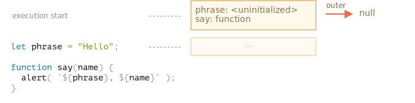
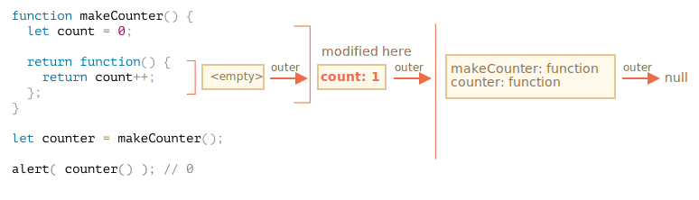

<<<<<<< HEAD
# 変数スコープ、クロージャ

JavaScript は非常に関数指向な言語であり、これにより多くの自由があります。ある時点で作成した関数を別の変数にコピーしたり別の関数に引数として渡し、後でまったく別の場所から呼ぶことができます。

私たちはすでに関数がその外（"外側" の変数）にアクセスできることを知っています

ですが、関数が作成されたあとで外側の変数を変更すると何が起きるでしょうか？関数は最新の値 or 古い値どちらを取得するのでしょうか？

また、関数がパラメータとして渡され、別のコード部分から呼び出される場合、新しい場所での外側の変数にアクセスできるのでしょうか？

これらのシナリオやより複雑なシナリオを理解するために、知識を広げていきましょう。

```smart header="ここでは `let/const` の変数について話します"
JavaScript では変数を宣言する方法が3通りあります: `let`, `const`（モダンな方法）,と`var` (過去の名残)です。

- この記事では、例には `let` を使用します。
- `const` で宣言された変数は同じように動作するため、この記事は `const` についても当てはまります。
- 古い `var` はいくつか大きな違いがあり、それらは <info:var> の記事で説明しています。
```

### コードブロック

変数がコードブロック `{...}` の中で宣言された場合は、そのブロックの中でだけ見えます。

例:

```js run
{
  // 外には見せる必要のない、ローカル変数で処理をする

  let message = "Hello"; // このコードブロックでだけ見えます。
=======
# Variable scope, closure

JavaScript is a very function-oriented language. It gives us a lot of freedom. A function can be created at any moment, passed as an argument to another function, and then called from a totally different place of code later.

We already know that a function can access variables outside of it ("outer" variables).

But what happens if outer variables change since a function is created? Will the function get newer values or the old ones?

And what if a function is passed along as an argument and called from another place of code, will it get access to outer variables at the new place?

Let's expand our knowledge to understand these scenarios and more complex ones.

```smart header="We'll talk about `let/const` variables here"
In JavaScript, there are 3 ways to declare a variable: `let`, `const` (the modern ones), and `var` (the remnant of the past).

- In this article we'll use `let` variables in examples.
- Variables, declared with `const`, behave the same, so this article is about `const` too.
- The old `var` has some notable differences, they will be covered in the article <info:var>.
```

## Code blocks

If a variable is declared inside a code block `{...}`, it's only visible inside that block.

For example:

```js run
{
  // do some job with local variables that should not be seen outside

  let message = "Hello"; // only visible in this block
>>>>>>> ea7738bb7c3616bb51ff14ae3db2a2747d7888ff

  alert(message); // Hello
}

alert(message); // Error: message is not defined
```

<<<<<<< HEAD
これを使用して、独自のタスクを実行するコード部分を、そのタスクにのみ属する変数で分離することができます。:

```js run
{
  // メッセージを表示
=======
We can use this to isolate a piece of code that does its own task, with variables that only belong to it:

```js run
{
  // show message
>>>>>>> ea7738bb7c3616bb51ff14ae3db2a2747d7888ff
  let message = "Hello";
  alert(message);
}

{
<<<<<<< HEAD
  // 別のメッセージを表示
=======
  // show another message
>>>>>>> ea7738bb7c3616bb51ff14ae3db2a2747d7888ff
  let message = "Goodbye";
  alert(message);
}
```

<<<<<<< HEAD
````smart header="ブロックがないとエラーが発生します"
存在する変数名で `let` を使用しようとすると、分離するブロックがないとエラーになることに注意してください。:

```js run
// メッセージヲ表示
let message = "Hello";
alert(message);

// 別のメッセージヲ表示
=======
````smart header="There'd be an error without blocks"
Please note, without separate blocks there would be an error, if we use `let` with the existing variable name:

```js run
// show message
let message = "Hello";
alert(message);

// show another message
>>>>>>> ea7738bb7c3616bb51ff14ae3db2a2747d7888ff
*!*
let message = "Goodbye"; // Error: variable already declared
*/!*
alert(message);
```
````

<<<<<<< HEAD
`if`, `for`, `while` などの場合も、`{...}` の中で宣言された変数は、その内側でだけ見えます:
=======
For `if`, `for`, `while` and so on, variables declared in `{...}` are also only visible inside:
>>>>>>> ea7738bb7c3616bb51ff14ae3db2a2747d7888ff

```js run
if (true) {
  let phrase = "Hello!";

  alert(phrase); // Hello!
}

<<<<<<< HEAD
alert(phrase); // Error, そのような変数は有りません!
```

ここでは `if` が終わったあとで、次の `alert` は `phrase` は見えないため、エラーになります。

これにより、`if` 分岐固有のブロックレベルのローカル変数が作成できるので、素晴らしいことです。

同様のことが `for`ループと` while`ループにも当てはまります。

```js run
for (let i = 0; i < 3; i++) {
  // 変数 i はこの for の中でだけ見えます
  alert(i); // 0, 1, 2
=======
alert(phrase); // Error, no such variable!
```

Here, after `if` finishes, the `alert` below won't see the `phrase`, hence the error.

That's great, as it allows us to create block-local variables, specific to an `if` branch.

The similar thing holds true for `for` and `while` loops:

```js run
for (let i = 0; i < 3; i++) {
  // the variable i is only visible inside this for
  alert(i); // 0, then 1, then 2
>>>>>>> ea7738bb7c3616bb51ff14ae3db2a2747d7888ff
}

alert(i); // Error, no such variable
```

<<<<<<< HEAD
視覚的には `let i` は `{...}` の外側に見えますが、ここでは `for` 構文は特別です。この中で宣言された変数はブロックの一部とみなされます。
=======
Visually, `let i` is outside of `{...}`. But the `for` construct is special here: the variable, declared inside it, is considered a part of the block.
>>>>>>> ea7738bb7c3616bb51ff14ae3db2a2747d7888ff

## ネストされた関数 

別の関数の内部で作成される関数は、"ネストされた" 関数と呼ばれます。

<<<<<<< HEAD
JavaScript では簡単に実現できます。

これは、次のようにコードを整理するのに利用できます:
=======
It is easily possible to do this with JavaScript.

We can use it to organize our code, like this:
>>>>>>> ea7738bb7c3616bb51ff14ae3db2a2747d7888ff

```js
function sayHiBye(firstName, lastName) {

  // 下で使うネストされたヘルパー関数です
  function getFullName() {
    return firstName + " " + lastName;
  }

  alert( "Hello, " + getFullName() );
  alert( "Bye, " + getFullName() );

}
```

<<<<<<< HEAD
ここでの *ネストされた* 関数 `getFullName()` は利便性のために作られています。それは外部変数にアクセスすることができるので、フルネームを返すことができます。

さらに興味深い点は、新しいオブジェクトのプロパティ（外部関数がメソッドを持つオブジェクトを作成する場合）またはその自身の結果として、ネストされた関数を返すことができることです:  それは他の場所で使うことができます。どこにいても、同じ外部変数には依然としてアクセスできます。

下記の `makeCounter` は実行ごとに次の数を返す "counter" 関数を作成します。
=======
Here the *nested* function `getFullName()` is made for convenience. It can access the outer variables and so can return the full name. Nested functions are quite common in JavaScript.

What's much more interesting, a nested function can be returned: either as a property of a new object or as a result by itself. It can then be used somewhere else. No matter where, it still has access to the same outer variables.

Below, `makeCounter` creates the "counter" function that returns the next number on each invocation:
>>>>>>> ea7738bb7c3616bb51ff14ae3db2a2747d7888ff

```js run
function makeCounter() {
  let count = 0;

  return function() {
    return count++;
  };
}

let counter = makeCounter();

alert( counter() ); // 0
alert( counter() ); // 1
alert( counter() ); // 2
```

<<<<<<< HEAD
単純ですが、このコードをわずかに変更したバリアントは実践で使用されています。例えば、自動テスト用の乱数を生成するための[乱数ジェネレータ(random number generator)](https://en.wikipedia.org/wiki/Pseudorandom_number_generator) があります。

これはどのように動作するでしょうか？複数の counter を作成する場合、これらは独立しますか？変数はどのようになっているでしょうか。

このようなことを理解するのは、JavaScriptの全体的な知識にとって素晴らしいことであり、より複雑なシナリオでは有益です。では、より詳しくみていきましょう。

## レキシカル/語彙環境(Lexical Environment) 

```warn header="Here be dragons!"
この先には詳細な技術的説明があります。

低水準言語の詳細は避けたいところですが、それを抜きにして理解することは不十分で不完全なものになるため、準備してください。
```

わかりやすくするために、複数のステップに分けて説明しています。

### Step 1. 変数

JavaScript では、実行中のすべて関数、コードブロック `{...}` およびスクリプト全体には、*レキシカル環境* と呼ばれる内部の（隠れた）関連オブジェクトがあります。

レキシカル環境オブジェクトは2つの部分から構成されます:

1. *環境レコード(Environment Record)* 。プロパティとしてすべてのローカル変数をもつオブジェクトです(`this` の値など、他の情報もいくらか持っています)。
2. *外部のレキシカル環境* への参照。通常、直近の外部のレキシカルなコードに関連付けられています（現在の波括弧の外側）。

**"変数" は単に、特別な内部オブジェクトである `環境レコード` のプロパティです。"変数を取得または変更する" とは、"そのオブジェクトのプロパティを取得または変更する" ことを意味します。**

例えば、この簡単なコードでは、レキシカル環境は1つだけあります。:


これは、スクリプト全体に関連付けられた、いわゆるグローバルレキシカル環境です。 

上の図の長方形は環境レコード(変数ストア)で、矢印(outerの部分)は外部参照を意味します。グローバルレキシカル環境は外部参照を持っていないので、 `null` です。

コードが実行されていくと、レキシカル環境は変化していきます。

ここでは少し長いコードを紹介します:


右側の長方形は、実行の間でどのようにグローバルレキシカル環境が変わるかを示しています。:

1. スクリプトを開始すると、レキシカル環境には宣言されたすべての変数があらかじめ用意されています。
    - 最初は、"未初期化" の状態です。これは特別な内部状態で、エンジンは変数は知っていますが、`let` で宣言されるまでは参照できないことを意味します。変数が存在しないのとほぼ同じです。
2. その後 `let phrase` 定義が現れました。今は初期値がないので、 `undefined` が格納されます。この時点からこの変数を使用することができます。
3. `phrase` に値が割り当てられます。
4. `phrase` の値を変更します。

今のところすべてシンプルに見えますね。

- 変数は特別な内部オブジェクトのプロパティで、現在の実行ブロック/関数/スクリプトと関連付けられています。
- 変数を使った作業は、実際にはそのオブジェクトのプロパティを使って作業しています。

```smart header="レキシカル環境は仕様上のオブジェクトです"
"レキシカル環境" は仕様上のオブジェクトです。これは [言語仕様](https://tc39.es/ecma262/#sec-lexical-environments) の中で動作の仕組みを説明するために、「理論的に」存在するものです。このオブジェクトをコード上で取得したり直接操作することはできません。

また、JavaScript エンジンは、目に見える振る舞いはそのままな上で、最適化したり、メモリを節約するために未使用の変数を破棄したり、他の内部的なトリックを実行することがあります。
```

### Step 2. 関数宣言

関数も変数のように値です。

**違いは、関数宣言は即座に完全に初期化されることです**

レキシカル環境が作られたとき、関数宣言はすぐに使用できる関数（宣言まで使用できない `let` とは異なります）になります。

そのため、宣言自体の前でも関数宣言として宣言された関数を呼び出すことができます。

例えば、以下は関数を追加したときのグローバルレキシカル環境の初期状態です:



当然、この動作は関数宣言にのみ適用され、`let say = function(name)...` のように変数に関数を割り当てる関数式にはあてはまりません。

### Step 3. 内外のレキシカル環境

関数が実行されると、呼び出しの先頭では新しいレキシカル環境が自動的に作られ、ローカル変数と呼び出しパラメータを格納します。

例えば、`say("John")` の場合、このようになります（実行は矢印でラベル付けされた行です）:
=======
Despite being simple, slightly modified variants of that code have practical uses, for instance, as a [random number generator](https://en.wikipedia.org/wiki/Pseudorandom_number_generator) to generate random values for automated tests.

How does this work? If we create multiple counters, will they be independent? What's going on with the variables here?

Understanding such things is great for the overall knowledge of JavaScript and beneficial for more complex scenarios. So let's go a bit in-depth.

## Lexical Environment

```warn header="Here be dragons!"
The in-depth technical explanation lies ahead.

As far as I'd like to avoid low-level language details, any understanding without them would be lacking and incomplete, so get ready.
```

For clarity, the explanation is split into multiple steps.

### Step 1. Variables

In JavaScript, every running function, code block `{...}`, and the script as a whole have an internal (hidden) associated object known as the *Lexical Environment*.

The Lexical Environment object consists of two parts:

1. *Environment Record* -- an object that stores all local variables as its properties (and some other information like the value of `this`).
2. A reference to the *outer lexical environment*, the one associated with the outer code.

**A "variable" is just a property of the special internal object, `Environment Record`. "To get or change a variable" means "to get or change a property of that object".**

In this simple code without functions, there is only one Lexical Environment:


This is the so-called *global* Lexical Environment, associated with the whole script.

On the picture above, the rectangle means Environment Record (variable store) and the arrow means the outer reference. The global Lexical Environment has no outer reference, that's why the arrow points to `null`.

As the code starts executing and goes on, the Lexical Environment changes.

Here's a little bit longer code:


Rectangles on the right-hand side demonstrate how the global Lexical Environment changes during the execution:

1. When the script starts, the Lexical Environment is pre-populated with all declared variables.
    - Initially, they are in the "Uninitialized" state. That's a special internal state, it means that the engine knows about the variable, but it cannot be referenced until it has been declared with `let`. It's almost the same as if the variable didn't exist.
2. Then `let phrase` definition appears. There's no assignment yet, so its value is `undefined`. We can use the variable from this point forward.
3. `phrase` is assigned a value.
4. `phrase` changes the value.

Everything looks simple for now, right?

- A variable is a property of a special internal object, associated with the currently executing block/function/script.
- Working with variables is actually working with the properties of that object.

```smart header="Lexical Environment is a specification object"
"Lexical Environment" is a specification object: it only exists "theoretically" in the [language specification](https://tc39.es/ecma262/#sec-lexical-environments) to describe how things work. We can't get this object in our code and manipulate it directly.

JavaScript engines also may optimize it, discard variables that are unused to save memory and perform other internal tricks, as long as the visible behavior remains as described.
```

### Step 2. Function Declarations

A function is also a value, like a variable.

**The difference is that a Function Declaration is instantly fully initialized.**

When a Lexical Environment is created, a Function Declaration immediately becomes a ready-to-use function (unlike `let`, that is unusable till the declaration).

That's why we can use a function, declared as Function Declaration, even before the declaration itself.

For example, here's the initial state of the global Lexical Environment when we add a function:


Naturally, this behavior only applies to Function Declarations, not Function Expressions where we assign a function to a variable, such as `let say = function(name)...`.

### Step 3. Inner and outer Lexical Environment

When a function runs, at the beginning of the call, a new Lexical Environment is created automatically to store local variables and parameters of the call.

For instance, for `say("John")`, it looks like this (the execution is at the line, labelled with an arrow):
>>>>>>> ea7738bb7c3616bb51ff14ae3db2a2747d7888ff

<!--
    ```js
    let phrase = "Hello";

    function say(name) {
     alert( `${phrase}, ${name}` );
    }

    say("John"); // Hello, John
    ```-->


<<<<<<< HEAD
関数呼び出し中は２つのレキシカル環境があります: 内部のもの（関数呼び出し用）と外部のもの(グローバル)です:

- 内部のレキシカル環境は現在の `say` の実行に対応しています。1つ変数(`name`)を持っており、それは関数の引数です。私たちは `say("John")` を呼び出したので、 `name` は `"John"` です。
- 外部のレキシカル環境はグローバルレキシカル環境で、変数 `phrase` と関数自身があります。 

内部のレキシカル環境は外部のものへの `外部` 参照を持っています。

**コードが変数にアクセスしたいとき、最初に内部のレキシカル環境を探します。その次に外側を探し、チェーンの最後になるまで繰り返します。**

もし変数がどこにもない場合、strict モードではエラーになります。`use strict` がなければ、未定義変数への代入は下位互換性のために新しいグローバル変数を作成します。

今回の例でどのように探索されるか見てみましょう:

- `say` の内側にある `alert` が `name` にアクセスしたいとき、関数のレキシカル環境の中からすぐに見つけます。
- `phrase` にアクセスしたいとき、ローカルには `phrase` がないので、続いて `外部` 参照を行い、グローバルでそれを見つけます。
=======
During the function call we have two Lexical Environments: the inner one (for the function call) and the outer one (global):

- The inner Lexical Environment corresponds to the current execution of `say`. It has a single property: `name`, the function argument. We called `say("John")`, so the value of the `name` is `"John"`.
- The outer Lexical Environment is the global Lexical Environment. It has the `phrase` variable and the function itself.

The inner Lexical Environment has a reference to the `outer` one.

**When the code wants to access a variable -- the inner Lexical Environment is searched first, then the outer one, then the more outer one and so on until the global one.**

If a variable is not found anywhere, that's an error in strict mode (without `use strict`, an assignment to a non-existing variable creates a new global variable, for compatibility with old code).

In this example the search proceeds as follows:

- For the `name` variable, the `alert` inside `say` finds it immediately in the inner Lexical Environment.
- When it wants to access `phrase`, then there is no `phrase` locally, so it follows the reference to the outer Lexical Environment and finds it there.
>>>>>>> ea7738bb7c3616bb51ff14ae3db2a2747d7888ff


<<<<<<< HEAD
### Step 4. 関数を返す

`makeCounter` の例に戻りましょう。
=======
### Step 4. Returning a function

Let's return to the `makeCounter` example.
>>>>>>> ea7738bb7c3616bb51ff14ae3db2a2747d7888ff

```js
function makeCounter() {
  let count = 0;

  return function() {
    return count++;
  };
}

let counter = makeCounter();
```

<<<<<<< HEAD
各 `makeCounter()` 呼び出しの最初に、新しいレキシカル環境オブジェクトが作成され、この `makeCounter` の実行のための変数が格納されます。

なので、ちょうど上の例のように、2つのネストしたレキシカル環境があります:


違いは、`makeCounter()` の実行中に `return count++` という1行だけの小さな入れ子の関数が作られることです。まだ実行はしていませんが、作成だけはしています。

すべての関数は、それらが作成されたレキシカル環境を記憶しています。すべての関数は `[[Environment]]` という名前の隠しプロパティをもち、その関数が作成されたレキシカル環境への参照を保持します。


なので、`counter.[[Environment]]` には `{count: 0}` レキシカル環境への参照があります。このようにして、関数はどこで呼ばれても、どこで作成されたかを覚えているのです。`[[Environment]]` への参照は，関数の生成時に一度だけ，そして永遠に設定されます．

その後、`counter()` が呼ばれたとき、その呼び出しに対する新たなレキシカル環境が作成され、その外部レキシカル環境の参照は `counter.[[Environment]]` から取得されます:


これで、`counter()` 内のコードが変数 `count` を探すとき、最初に自身のレキシカル環境を検索します（ここにはローカル変数はないので空です）。次に外部の `makeCounter()` 呼び出しのレキシカル環境を探し、変数を見つけ更新します。

**変数は、その変数が存在するレキシカル環境で更新されます。**

実行後の状態がこちらです:



`counter()` を何度も呼び出すと、変数 `count` は `2`, `3` と増えていきます。

```smart header="クロージャ"
開発者が一般的に知っておくべき、一般的なプログラミング用語 "クロージャ" があります。

[クロージャ(closure)](https://en.wikipedia.org/wiki/Closure_(computer_programming)) は外部変数を記憶し、それらにアクセスできる関数です。いくつかの言語ではそれは不可能、もしくはそれを実現するために特別な方法で関数を書く必要があります。しかし、上で説明したとおり、JavaScriptにおいては、すべての関数は自然にクロージャです(1つだけ例外があります。それについては <info:new-function> で説明します)。

つまり: それらは隠された `[[Environment]]`プロパティを使ってどこに作成されたのかを自動的に覚えていて、すべてが外部変数にアクセスできます。

面接でフロントエンドの開発者が「クロージャは何ですか？」という質問を受けたとき、有効な回答は、クロージャの定義と、JavaScriptにおいてはすべての関数がクロージャであること、また `[[Environment]]` プロパティとレキシカル環境の仕組みと言った技術的に詳細な用語です 。
```

## ガベージコレクション 

通常、関数呼び出しが終わった後、すべての変数のとともに、レキシカル環境はメモリから削除されます。これはそこへの参照が存在しないためです。他のJavaScriptオブジェクトと同様に、到達可能な間だけメモリに保持されます。

しかし、関数の終了後も依然として到達可能なネストされた関数がある場合、それはレキシカル環境への参照である `[[Environment]]` プロパティを持ちます。

この場合、レキシカル環境は関数の完了後も依然として到達可能なので、存在し続けます。

例:
=======
At the beginning of each `makeCounter()` call, a new Lexical Environment object is created, to store variables for this `makeCounter` run.

So we have two nested Lexical Environments, just like in the example above:


What's different is that, during the execution of `makeCounter()`, a tiny nested function is created of only one line: `return count++`. We don't run it yet, only create.

All functions remember the Lexical Environment in which they were made. Technically, there's no magic here: all functions have the hidden property named `[[Environment]]`, that keeps the reference to the Lexical Environment where the function was created:


So, `counter.[[Environment]]` has the reference to `{count: 0}` Lexical Environment. That's how the function remembers where it was created, no matter where it's called. The `[[Environment]]` reference is set once and forever at function creation time.

Later, when `counter()` is called, a new Lexical Environment is created for the call, and its outer Lexical Environment reference is taken from `counter.[[Environment]]`:


Now when the code inside `counter()` looks for `count` variable, it first searches its own Lexical Environment (empty, as there are no local variables there), then the Lexical Environment of the outer `makeCounter()` call, where it finds and changes it.

**A variable is updated in the Lexical Environment where it lives.**

Here's the state after the execution:


If we call `counter()` multiple times, the `count` variable will be increased to `2`, `3` and so on, at the same place.

```smart header="Closure"
There is a general programming term "closure", that developers generally should know.

A [closure](https://en.wikipedia.org/wiki/Closure_(computer_programming)) is a function that remembers its outer variables and can access them. In some languages, that's not possible, or a function should be written in a special way to make it happen. But as explained above, in JavaScript, all functions are naturally closures (there is only one exception, to be covered in <info:new-function>).

That is: they automatically remember where they were created using a hidden `[[Environment]]` property, and then their code can access outer variables.

When on an interview, a frontend developer gets a question about "what's a closure?", a valid answer would be a definition of the closure and an explanation that all functions in JavaScript are closures, and maybe a few more words about technical details: the `[[Environment]]` property and how Lexical Environments work.
```

## Garbage collection

Usually, a Lexical Environment is removed from memory with all the variables after the function call finishes. That's because there are no references to it. As any JavaScript object, it's only kept in memory while it's reachable.

However, if there's a nested function that is still reachable after the end of a function, then it has `[[Environment]]` property that references the lexical environment.

In that case the Lexical Environment is still reachable even after the completion of the function, so it stays alive.

For example:
>>>>>>> ea7738bb7c3616bb51ff14ae3db2a2747d7888ff

```js
function f() {
  let value = 123;

  return function() {
    alert(value);
  }
}

<<<<<<< HEAD
let g = f(); // g.[[Environment]] は、対応する f() 呼び出しのレキシカル環境
// への参照を保持します
```

もし `f()` が何度も呼ばれ、結果の関数が保持される場合、対応するレキシカル環境オブジェクトもまたメモリに残ります。下のコードでは3つすべて:
=======
let g = f(); // g.[[Environment]] stores a reference to the Lexical Environment
// of the corresponding f() call
```

Please note that if `f()` is called many times, and resulting functions are saved, then all corresponding Lexical Environment objects will also be retained in memory. In the code below, all 3 of them:
>>>>>>> ea7738bb7c3616bb51ff14ae3db2a2747d7888ff

```js
function f() {
  let value = Math.random();

  return function() { alert(value); };
}

<<<<<<< HEAD
// 配列に3つの関数があり、それぞれが対応する f() からの
// レキシカル環境と関連づいています
let arr = [f(), f(), f()];
```

レキシカル環境オブジェクトは到達不能になったときに死にます。つまり、少なくとも1つの入れ子になった関数がそれを参照している間だけ存在します。

下のコードでは、 ネストされた関数が削除された後、それを囲んでいたレキシカル環境（と `value`）はメモリからクリアされます:

=======
// 3 functions in array, every one of them links to Lexical Environment
// from the corresponding f() run
let arr = [f(), f(), f()];
```

A Lexical Environment object dies when it becomes unreachable (just like any other object). In other words, it exists only while there's at least one nested function referencing it.

In the code below, after the nested function is removed, its enclosing Lexical Environment (and hence the `value`) is cleaned from memory:

>>>>>>> ea7738bb7c3616bb51ff14ae3db2a2747d7888ff
```js
function f() {
  let value = 123;

  return function() {
    alert(value);
  }
}

<<<<<<< HEAD
let g = f(); // g が生きている間、値はメモリに残り続けます

g = null; // ...今、メモリはクリーンアップされます
```

### 現実の最適化(Real-life optimizations)

これまで見てきたように、理論的には関数が生きている間、すべての外部変数も保持されます。

しかし、実際にはJavaScriptエンジンはそれを最適化しようとします。変数の使用状況を分析し、外部変数が使用されていないことがわかりやすい場合は削除されます。

**V8(Chrome, Edge, Opera)の重要な副作用はこのような変数はデバッグでは利用できなくなることです。**

Chromeで Developer Tools を開いて下の例を実行してみてください。

一時停止したとき、console で `alert(value)` を入力してください。
=======
let g = f(); // while g function exists, the value stays in memory

g = null; // ...and now the memory is cleaned up
```

### Real-life optimizations

As we've seen, in theory while a function is alive, all outer variables are also retained.

But in practice, JavaScript engines try to optimize that. They analyze variable usage and if it's obvious from the code that an outer variable is not used -- it is removed.

**An important side effect in V8 (Chrome, Edge, Opera) is that such variable will become unavailable in debugging.**

Try running the example below in Chrome with the Developer Tools open.

When it pauses, in the console type `alert(value)`.
>>>>>>> ea7738bb7c3616bb51ff14ae3db2a2747d7888ff

```js run
function f() {
  let value = Math.random();

  function g() {
    debugger; // in console: type alert(value); No such variable!
  }

  return g;
}

let g = f();
g();
```

ご覧の通り、このような変数はありません! 理論的にはアクセスできるはずですが、エンジンが最適化しています。

これは（それほど時間がかからないとしても）おかしなデバッグの問題につながる可能性があります。期待している変数の代わりに、同じ名前の外部変数が参照されます:

```js run global
let value = "Surprise!";

function f() {
  let value = "the closest value";

  function g() {
    debugger; // in console: type alert(value); Surprise!
  }

  return g;
}

let g = f();
g();
```

<<<<<<< HEAD
V8 のこの機能は知っておくと良いです。もしも Chrome/Edge/Opera でデバッグしている場合、遅かれ早かれこれに遭遇するでしょう。

これはデバッガのバグではなく、V8の特別な機能です。時々変わるかもしれません。このページの例を実行することで、いつでもチェックすることができます。
=======
This feature of V8 is good to know. If you are debugging with Chrome/Edge/Opera, sooner or later you will meet it.

That is not a bug in the debugger, but rather a special feature of V8. Perhaps it will be changed sometime. You can always check for it by running the examples on this page.
>>>>>>> ea7738bb7c3616bb51ff14ae3db2a2747d7888ff
