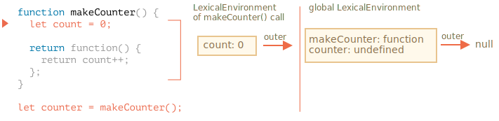

# 変数スコープ、クロージャ

JavaScript は非常に関数指向な言語であり、これにより多くの自由があります。ある時点で作成した関数を別の変数にコピーしたり別の関数に引数として渡し、後でまったく別の場所から呼ぶことができます。

私たちはすでに関数がその外（"外側" の変数）にアクセスできることを知っています

ですが、関数が作成されたあとで外側の変数を変更すると何が起きるでしょうか？関数は最新の値 or 古い値どちらを取得するのでしょうか？

また、関数がパラメータとして渡され、別のコード部分から呼び出される場合、新しい場所での外側の変数にアクセスできるのでしょうか？

これらのシナリオやより複雑なシナリオを理解するために、知識を広げていきましょう。

```smart header="ここでは `let/const` の変数について話します"
JavaScript では変数を宣言する方法が3通りあります: `let`, `const`（モダンな方法）,と`var` (過去の名残)です。

- この記事では、例には `let` を使用します。
- `const` で宣言された変数は同じように動作するため、この記事は `const` についても当てはまります。
- 古い `var` はいくつか大きな違いがあり、それらは <info:var> の記事で説明しています。
```

### コードブロック

変数がコードブロック `{...}` の中で宣言された場合は、そのブロックの中でだけ見えます。

例:

```js run
{
  // 外には見せる必要のない、ローカル変数で処理をする

  let message = "Hello"; // このコードブロックでだけ見えます。

  alert(message); // Hello
}

alert(message); // Error: message is not defined
```

これを使用して、独自のタスクを実行するコード部分を、そのタスクにのみ属する変数で分離することができます。:

```js run
{
  // メッセージを表示
  let message = "Hello";
  alert(message);
}

{
  // 別のメッセージを表示
  let message = "Goodbye";
  alert(message);
}
```

````smart header="ブロックがないとエラーが発生します"
存在する変数名で `let` を使用しようとすると、分離するブロックがないとエラーになることに注意してください。:

```js run
// メッセージヲ表示
let message = "Hello";
alert(message);

// 別のメッセージヲ表示
*!*
let message = "Goodbye"; // Error: variable already declared
*/!*
alert(message);
```
````

`if`, `for`, `while` などの場合も、`{...}` の中で宣言された変数は、その内側でだけ見えます:

```js run
if (true) {
  let phrase = "Hello!";

  alert(phrase); // Hello!
}

alert(phrase); // Error, そのような変数は有りません!
```

ここでは `if` が終わったあとで、次の `alert` は `phrase` は見えないため、エラーになります。

これにより、`if` 分岐固有のブロックレベルのローカル変数が作成できるので、素晴らしいことです。

同様のことが `for`ループと` while`ループにも当てはまります。

```js run
for (let i = 0; i < 3; i++) {
  // 変数 i はこの for の中でだけ見えます
  alert(i); // 0, 1, 2
}

alert(i); // Error, no such variable
```

視覚的には `let i` は `{...}` の外側に見えますが、ここでは `for` 構文は特別です。この中で宣言された変数はブロックの一部とみなされます。

## ネストされた関数 

別の関数の内部で作成される関数は、"ネストされた" 関数と呼ばれます。

JavaScript では簡単に実現できます。

これは、次のようにコードを整理するのに利用できます:

```js
function sayHiBye(firstName, lastName) {

  // 下で使うネストされたヘルパー関数です
  function getFullName() {
    return firstName + " " + lastName;
  }

  alert( "Hello, " + getFullName() );
  alert( "Bye, " + getFullName() );

}
```

ここでの *ネストされた* 関数 `getFullName()` は利便性のために作られています。それは外部変数にアクセスすることができるので、フルネームを返すことができます。

さらに興味深い点は、新しいオブジェクトのプロパティ（外部関数がメソッドを持つオブジェクトを作成する場合）またはその自身の結果として、ネストされた関数を返すことができることです:  それは他の場所で使うことができます。どこにいても、同じ外部変数には依然としてアクセスできます。

下記の `makeCounter` は実行ごとに次の数を返す "counter" 関数を作成します。

```js run
function makeCounter() {
  let count = 0;

  return function() {
    return count++;
  };
}

let counter = makeCounter();

alert( counter() ); // 0
alert( counter() ); // 1
alert( counter() ); // 2
```

単純ですが、このコードをわずかに変更したバリアントは実践で使用されています。例えば、自動テスト用の乱数を生成するための[乱数ジェネレータ(random number generator)](https://en.wikipedia.org/wiki/Pseudorandom_number_generator) があります。

これはどのように動作するでしょうか？複数の counter を作成する場合、これらは独立しますか？変数はどのようになっているでしょうか。

このようなことを理解するのは、JavaScriptの全体的な知識にとって素晴らしいことであり、より複雑なシナリオでは有益です。では、より詳しくみていきましょう。

## レキシカル/語彙環境(Lexical Environment) 

```warn header="Here be dragons!"
この先には詳細な技術的説明があります。

低水準言語の詳細は避けたいところですが、それを抜きにして理解することは不十分で不完全なものになるため、準備してください。
```

わかりやすくするために、複数のステップに分けて説明しています。

### Step 1. 変数

JavaScript では、実行中のすべて関数、コードブロック `{...}` およびスクリプト全体には、*レキシカル環境* と呼ばれる内部の（隠れた）関連オブジェクトがあります。

レキシカル環境オブジェクトは2つの部分から構成されます:

1. *環境レコード(Environment Record)* 。プロパティとしてすべてのローカル変数をもつオブジェクトです(`this` の値など、他の情報もいくらか持っています)。
2. *外部のレキシカル環境* への参照。通常、直近の外部のレキシカルなコードに関連付けられています（現在の波括弧の外側）。

**"変数" は単に、特別な内部オブジェクトである `環境レコード` のプロパティです。"変数を取得または変更する" とは、"そのオブジェクトのプロパティを取得または変更する" ことを意味します。**

例えば、この簡単なコードでは、レキシカル環境は1つだけあります。:


これは、スクリプト全体に関連付けられた、いわゆるグローバルレキシカル環境です。 

上の図の長方形は環境レコード(変数ストア)で、矢印(outerの部分)は外部参照を意味します。グローバルレキシカル環境は外部参照を持っていないので、 `null` です。

コードが実行されていくと、レキシカル環境は変化していきます。

ここでは少し長いコードを紹介します:


右側の長方形は、実行の間でどのようにグローバルレキシカル環境が変わるかを示しています。:

1. スクリプトを開始すると、レキシカル環境には宣言されたすべての変数があらかじめ用意されています。
    - 最初は、"未初期化" の状態です。これは特別な内部状態で、エンジンは変数は知っていますが、`let` で宣言されるまでは参照できないことを意味します。変数が存在しないのとほぼ同じです。
2. その後 `let phrase` 定義が現れました。今は初期値がないので、 `undefined` が格納されます。この時点からこの変数を使用することができます。
3. `phrase` に値が割り当てられます。
4. `phrase` の値を変更します。

今のところすべてシンプルに見えますね。

- 変数は特別な内部オブジェクトのプロパティで、現在の実行ブロック/関数/スクリプトと関連付けられています。
- 変数を使った作業は、実際にはそのオブジェクトのプロパティを使って作業しています。

```smart header="レキシカル環境は仕様上のオブジェクトです"
"レキシカル環境" は仕様上のオブジェクトです。これは [言語仕様](https://tc39.es/ecma262/#sec-lexical-environments) の中で動作の仕組みを説明するために、「理論的に」存在するものです。このオブジェクトをコード上で取得したり直接操作することはできません。

また、JavaScript エンジンは、目に見える振る舞いはそのままな上で、最適化したり、メモリを節約するために未使用の変数を破棄したり、他の内部的なトリックを実行することがあります。
```

### Step 2. 関数宣言

関数も変数のように値です。

**違いは、関数宣言は即座に完全に初期化されることです**

レキシカル環境が作られたとき、関数宣言はすぐに使用できる関数（宣言まで使用できない `let` とは異なります）になります。

そのため、宣言自体の前でも関数宣言として宣言された関数を呼び出すことができます。

例えば、以下は関数を追加したときのグローバルレキシカル環境の初期状態です:


当然、この動作は関数宣言にのみ適用され、`let say = function(name)...` のように変数に関数を割り当てる関数式にはあてはまりません。

### Step 3. 内外のレキシカル環境

関数が実行されると、呼び出しの先頭では新しいレキシカル環境が自動的に作られ、ローカル変数と呼び出しパラメータを格納します。

例えば、`say("John")` の場合、このようになります（実行は矢印でラベル付けされた行です）:

<!--
    ```js
    let phrase = "Hello";

    function say(name) {
     alert( `${phrase}, ${name}` );
    }

    say("John"); // Hello, John
    ```-->


関数呼び出し中は２つのレキシカル環境があります: 内部のもの（関数呼び出し用）と外部のもの(グローバル)です:

- 内部のレキシカル環境は現在の `say` の実行に対応しています。1つ変数(`name`)を持っており、それは関数の引数です。私たちは `say("John")` を呼び出したので、 `name` は `"John"` です。
- 外部のレキシカル環境はグローバルレキシカル環境で、変数 `phrase` と関数自身があります。 

内部のレキシカル環境は外部のものへの `外部` 参照を持っています。

**コードが変数にアクセスしたいとき、最初に内部のレキシカル環境を探します。その次に外側を探し、チェーンの最後になるまで繰り返します。**

もし変数がどこにもない場合、strict モードではエラーになります。`use strict` がなければ、未定義変数への代入は下位互換性のために新しいグローバル変数を作成します。

今回の例でどのように探索されるか見てみましょう:

- `say` の内側にある `alert` が `name` にアクセスしたいとき、関数のレキシカル環境の中からすぐに見つけます。
- `phrase` にアクセスしたいとき、ローカルには `phrase` がないので、続いて `外部` 参照を行い、グローバルでそれを見つけます。


### Step 4. 関数を返す

`makeCounter` の例に戻りましょう。

```js
function makeCounter() {
  let count = 0;

  return function() {
    return count++;
  };
}

let counter = makeCounter();
```

各 `makeCounter()` 呼び出しの最初に、新しいレキシカル環境オブジェクトが作成され、この `makeCounter` の実行のための変数が格納されます。

なので、ちょうど上の例のように、2つのネストしたレキシカル環境があります:



違いは、`makeCounter()` の実行中に `return count++` という1行だけの小さな入れ子の関数が作られることです。まだ実行はしていませんが、作成だけはしています。

すべての関数は、それらが作成されたレキシカル環境を記憶しています。すべての関数は `[[Environment]]` という名前の隠しプロパティをもち、その関数が作成されたレキシカル環境への参照を保持します。


なので、`counter.[[Environment]]` には `{count: 0}` レキシカル環境への参照があります。このようにして、関数はどこで呼ばれても、どこで作成されたかを覚えているのです。`[[Environment]]` への参照は，関数の生成時に一度だけ，そして永遠に設定されます．

その後、`counter()` が呼ばれたとき、その呼び出しに対する新たなレキシカル環境が作成され、その外部レキシカル環境の参照は `counter.[[Environment]]` から取得されます:


これで、`counter()` 内のコードが変数 `count` を探すとき、最初に自身のレキシカル環境を検索します（ここにはローカル変数はないので空です）。次に外部の `makeCounter()` 呼び出しのレキシカル環境を探し、変数を見つけ更新します。

**変数は、その変数が存在するレキシカル環境で更新されます。**

実行後の状態がこちらです:


`counter()` を何度も呼び出すと、変数 `count` は `2`, `3` と増えていきます。

```smart header="クロージャ"
開発者が一般的に知っておくべき、一般的なプログラミング用語 "クロージャ" があります。

[クロージャ(closure)](https://en.wikipedia.org/wiki/Closure_(computer_programming)) は外部変数を記憶し、それらにアクセスできる関数です。いくつかの言語ではそれは不可能、もしくはそれを実現するために特別な方法で関数を書く必要があります。しかし、上で説明したとおり、JavaScriptにおいては、すべての関数は自然にクロージャです(1つだけ例外があります。それについては <info:new-function> で説明します)。

つまり: それらは隠された `[[Environment]]`プロパティを使ってどこに作成されたのかを自動的に覚えていて、すべてが外部変数にアクセスできます。

面接でフロントエンドの開発者が「クロージャは何ですか？」という質問を受けたとき、有効な回答は、クロージャの定義と、JavaScriptにおいてはすべての関数がクロージャであること、また `[[Environment]]` プロパティとレキシカル環境の仕組みと言った技術的に詳細な用語です 。
```

## ガベージコレクション 

通常、関数呼び出しが終わった後、すべての変数のとともに、レキシカル環境はメモリから削除されます。これはそこへの参照が存在しないためです。他のJavaScriptオブジェクトと同様に、到達可能な間だけメモリに保持されます。

しかし、関数の終了後も依然として到達可能なネストされた関数がある場合、それはレキシカル環境への参照である `[[Environment]]` プロパティを持ちます。

この場合、レキシカル環境は関数の完了後も依然として到達可能なので、存在し続けます。

例:

```js
function f() {
  let value = 123;

  return function() {
    alert(value);
  }
}

let g = f(); // g.[[Environment]] は、対応する f() 呼び出しのレキシカル環境
// への参照を保持します
```

もし `f()` が何度も呼ばれ、結果の関数が保持される場合、対応するレキシカル環境オブジェクトもまたメモリに残ります。下のコードでは3つすべて:

```js
function f() {
  let value = Math.random();

  return function() { alert(value); };
}

// 配列に3つの関数があり、それぞれが対応する f() からの
// レキシカル環境と関連づいています
let arr = [f(), f(), f()];
```

レキシカル環境オブジェクトは到達不能になったときに死にます。つまり、少なくとも1つの入れ子になった関数がそれを参照している間だけ存在します。

下のコードでは、 ネストされた関数が削除された後、それを囲んでいたレキシカル環境（と `value`）はメモリからクリアされます:

```js
function f() {
  let value = 123;

  return function() {
    alert(value);
  }
}

let g = f(); // g が生きている間、値はメモリに残り続けます

g = null; // ...今、メモリはクリーンアップされます
```

### 現実の最適化(Real-life optimizations)

これまで見てきたように、理論的には関数が生きている間、すべての外部変数も保持されます。

しかし、実際にはJavaScriptエンジンはそれを最適化しようとします。変数の使用状況を分析し、外部変数が使用されていないことがわかりやすい場合は削除されます。

**V8(Chrome, Edge, Opera)の重要な副作用はこのような変数はデバッグでは利用できなくなることです。**

Chromeで Developer Tools を開いて下の例を実行してみてください。

一時停止したとき、console で `alert(value)` を入力してください。

```js run
function f() {
  let value = Math.random();

  function g() {
    debugger; // in console: type alert( value ); No such variable!
  }

  return g;
}

let g = f();
g();
```

ご覧の通り、このような変数はありません! 理論的にはアクセスできるはずですが、エンジンが最適化しています。

これは（それほど時間がかからないとしても）おかしなデバッグの問題につながる可能性があります。期待している変数の代わりに、同じ名前の外部変数が参照されます:

```js run global
let value = "Surprise!";

function f() {
  let value = "the closest value";

  function g() {
    debugger; // in console: type alert( value ); Surprise!
  }

  return g;
}

let g = f();
g();
```

V8 のこの機能は知っておくと良いです。もしも Chrome/Edge/Opera でデバッグしている場合、遅かれ早かれこれに遭遇するでしょう。

これはデバッガのバグではなく、V8の特別な機能です。時々変わるかもしれません。このページの例を実行することで、いつでもチェックすることができます。
