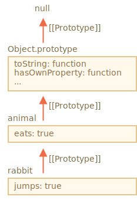

# プロトタイプ継承

プログラミングでは、何かを取得しそれを拡張することがしばしばあります。

例えば、プロパティとメソッドをもつ `user` オブジェクトがあるとします。そして、そのいくつかを僅かに変更した `admin` や `guest` を作りたいとします。メソッドのコピーや再実装ではなく、単にその上に新しいオブジェクトを作成することで、`user` が持っているものを再利用したいです。

*プロトタイプ継承* はそれを助ける言語の機能です。

## プロトタイプ [[Prototype]]

JavaScriptでは、オブジェクトは特別な隠しプロパティ `[[Prototype]]` （スペックにて命名されています）を持っており、それは `null` または別のオブジェクトを参照します。そのオブジェクトは "プロトタイプ" と呼ばれます。


`object` からプロパティを読んだときに存在しない場合、JavaScriptは自動的にプロトタイプからそれを取得します。プログラミングではこのようなことを "プロトタイプ継承" と呼びます。多くのクールな言語機能やプログラミングテクニックは、これがベースになっています。

プロパティ `[[Prototype]]` は内部であり隠されていますが、セットする多くの方法があります。

それらの１つは、次のように `__proto__` を使う方法です:

```js run
let animal = {
  eats: true
};
let rabbit = {
  jumps: true
};

*!*
rabbit.__proto__ = animal; // rabbit.[[Prototype]] = animal をセット
*/!*
```

`rabbit` のプロパティを読むときにそれがない場合、JavaScriptは自動で `animal` から取得します。

例:

```js run
let animal = {
  eats: true
};
let rabbit = {
  jumps: true
};

*!*
rabbit.__proto__ = animal; // (*)
*/!*

// 今、rabbit で両方のプロパティを見つけることができます:
*!*
alert( rabbit.eats ); // true (**)
*/!*
alert( rabbit.jumps ); // true
```

ここで、行 `(*)` は `rabbit` のプロトタイプに `animal` をセットしています。

次に、`alert` がプロパティ `rabbit.eats` `(**)` を読もうとしたとき、それは `rabbit` にはないので、JavaScriptは `[[Prototype]]` 参照に従って、`animal` の中でそれを見つけます(下から上に向かいます)。


ここでは、私たちは "`animal` は `rabbit` のプロトタイプ" または "`rabbit` がプロトタイプ的に `animal` を継承している" という事ができます。"

したがって、もし `animal` が多くの役立つプロパティやメソッドを持っている場合、それらは自動的に `rabbit` でも利用可能になります。このようなプロパティは "継承" と呼ばれます。

もし `animal` がメソッドを持っている場合、`rabbit` でもそれを呼ぶことができます:

```js run
let animal = {
  eats: true,
*!*
  walk() {
    alert("Animal walk");
  }
*/!*
};

let rabbit = {
  jumps: true,
  __proto__: animal
};

// walk は prototype から得られました
*!*
rabbit.walk(); // Animal walk
*/!*
```

メソッドは次のように自動的にプロトタイプから取られます。:


プロトタイプチェーンは長くても問題ありません。:

```js run
let animal = {
  eats: true,
  walk() {
    alert("Animal walk");
  }
};

let rabbit = {
  jumps: true,
*!*
  __proto__: animal
*/!*
};

let longEar = {
  earLength: 10,
*!*
  __proto__: rabbit
*/!*
};

// walk は prototype チェーンから取られました
longEar.walk(); // Animal walk
alert(longEar.jumps); // true (rabbit から)
```


ここで `longEar` から何かしらを読み取ろうとして、それが見つからなかった場合、JavaScript はまず `rabbit`、次に `animal` の順に探しに行きます。

実際には、2つの制限があります。:

1. 参照を循環させることはできません。JavaScriptは、循環するように `__proto__` を割り当てようとするとエラーになります。
2. `__proto__` の値はオブジェクトまたは `null` になります。プリミティブのような、それ以外のすべての値は無視されます。

また、明白かもしれませんが、1つの `[[Prototype]]` しか存在しません。 オブジェクトは2つの他のものから継承することはできません。


```smart header="`__proto__` は `[[Prototype]]` のための歴史的な getter/setter です。"
この2つの違いを知らないのは、初心者の開発者にありがちなミスです。

`__proto__` は内部の `[[Prototype]]` プロパティとは *同じではない* ことに注意してください。これは、`[[Prototype]]` のgetter/setter です。後でそれが重要な場面をみていきますが、今は JavaScript 言語を理解するために、このプロパティについて心に留めておいてください。

`__proto__` プロパティは少し時代遅れです。これは歴史的な理由から存在しており、モダンな JavaScript では、プロトタイプの get/set の代わりに、 `Object.getPrototypeOf/Object.setPrototypeOf` 関数を使用することが推奨されています。これらの関数についても、後ほど説明していきます。

スペックでは、`__proto__` はブラウザでのみサポートされなければなりません。ですが、実際にはサーバサイドを含むすべての環境で`__proto__` がサポートされています。ので、安全に使用することができます。

`__proto__` 記法は直感的でわかりやすいので、例ではこの記法を使います。
```

## 書き込みはプロトタイプを使用しません

プロトタイプは、プロパティを読むためだけに使われます。

書き込み/削除操作はオブジェクトで直接動作します。

下の例では、自身の `walk` メソッドを `rabbit` に割り当てています。:

```js run
let animal = {
  eats: true,
  walk() {
    /* このメソッドは rabbit では使われません */  
  }
};

let rabbit = {
  __proto__: animal
}

*!*
rabbit.walk = function() {
  alert("Rabbit! Bounce-bounce!");
};
*/!*

rabbit.walk(); // Rabbit! Bounce-bounce!
```

これ以降、`rabbit.walk()` 呼び出しは、プロトタイプを使うことなく、オブジェクトの中にすぐにメソッドを見つけ、それを実行します。


getter/setter の場合 -- もしプロパティの読み書きをすると、プロトタイプで参照されて呼び出されます。

例えば、以下のコードで `admin.fullName` プロパティをチェックしてください:

```js run
let user = {
  name: "John",
  surname: "Smith",

  set fullName(value) {
    [this.name, this.surname] = value.split(" ");
  },

  get fullName() {
    return `${this.name} ${this.surname}`;
  }
};

let admin = {
  __proto__: user,
  isAdmin: true
};

alert(admin.fullName); // John Smith (*)

// setter がトリガします!
admin.fullName = "Alice Cooper"; // (**)

alert(admin.fullName); // Alice Cooper, admin の状態が変更されました。
alert(user.fullName); // John Smith, user の状態はそのままです。
```

ここで、行 `(*)` では、プロパティ `admin.fullName` はプロトタイプである `user` が getter を持っているので、それが呼ばれます。同様に行 `(**)` では、プロパティはプロトタイプにある setter が呼ばれます。

## "this" の値 

上の例で、興味深い質問が起きるかもしれません。: `set fullName(value)` の内側での `this` の値はなんでしょうか？プロパティ `this.name` と `this.surname` が書かれているのはどこでしょうか？ `user` または `admin` ?

答えはシンプルです: `this` はプロトタイプによる影響を持ったく受けません。

**メソッドがどこにあるかは関係ありません：オブジェクトの中でも、そのプロトタイプ内でも。メソッド呼び出しでは、`this` は常にドットの前のオブジェクトです。**

したがって、setter は実際に `this` として `admin` となり、`user` ではありません。

多くのメソッドを持つ大きなオブジェクトを持ち、それを継承する場合があるため、これは実際には非常に重要なことです。継承したオブジェクトで継承したメソッドを実行すると、大きなオブジェクトではなく、継承したオブジェクトの状態を変更します。

例えば、ここでは `animal` は "メソッド格納域" を表現しており、`rabbit` はそれを使います。

呼び出し `rabbit.sleep()` は `rabbit` オブジェクトに `this.isSleeping` をセットします。:

```js run
// animal がメソッドを持っています
let animal = {
  walk() {
    if (!this.isSleeping) {
      alert(`I walk`);
    }
  },
  sleep() {
    this.isSleeping = true;
  }
};

let rabbit = {
  name: "White Rabbit",
  __proto__: animal
};

// rabbit.isSleeping を変更する
rabbit.sleep();

alert(rabbit.isSleeping); // true
alert(animal.isSleeping); // undefined (prototype にそのようなプロパティはありません)
```

結果の図は次のようになります:


もし `bird`, `snake` など `animal` から継承された他のオブジェクトを持っていた場合、それらもまた `animal` のメソッドへのアクセスができます。しかし各メソッドでの `this` は対応するオブジェクトであり、`animal` ではなく、呼び出し時に評価されます（前のドット）。 したがって、`this` にデータを書き込むとき、これらのオブジェクトに格納されます。

結果として、メソッドは共有されますが、オブジェクトの状態は共有されません。

## for..in loop

`for..in` ループは継承したプロパティも繰り返し処理します。

例:

```js run
let animal = {
  eats: true
};

let rabbit = {
  jumps: true,
  __proto__: animal
};

*!*
// Object.keys は実親のキーだけを返します
alert(Object.keys(rabbit)); // jumps
*/!*

*!*
// for..in は実親と継承したキー両方をループします
for(let prop in rabbit) alert(prop); // jumps, eats
*/!*
```

これは期待している動作ではなく、継承したプロパティは除きたい場合は組み込みのメソッド [obj.hasOwnProperty(key)](https://developer.mozilla.org/en-US/docs/Web/JavaScript/Reference/Global_Objects/Object/hasOwnProperty)が利用できます。これは `obj` が `key` という名前のプロパティをもつ場合（継承したものは含みません）、`true` を返します。

従って、継承したプロパティをフィルタする（あるいはそれらについて何かをする）ことが可能です。:

```js run
let animal = {
  eats: true
};

let rabbit = {
  jumps: true,
  __proto__: animal
};

for(let prop in rabbit) {
  let isOwn = rabbit.hasOwnProperty(prop);

  if (isOwn) {
    alert(`Our: ${prop}`); // Our: jumps
  } else {
    alert(`Inherited: ${prop}`); // Inherited: eats
  }
}
```

ここでは、次の継承チェーンがあります: `rabbit` は `animal` を継承し、`animal` は `Object.prototype` を継承しています（`animal` はリテラルオブジェクト `{...}` なので、これはデフォルトです）。その上は `null` です。:



興味深い点が1つあります。メソッド `rabbit.hasOwnProperty` はどこから来るのでしょうか？我々は定義していません。チェーンをみることで、メソッドは `Object.prototype.hasOwnProperty` で提供されていることがわかります。つまり、継承されたものです。

...ですが、なぜ `hasOwnProperty` は継承したプロパティもリストする `for..in` ループで `eats` や `jumps` のように登場しないのでしょう。

答えはシンプルです。これは列挙不可だからです。`Object.prototype` の他のすべてのプロパティと同様に、`enumerable:false` フラグを持ちます。そして、`for..in` は列挙可能なプロパティのみをリストします。そのため、`Object.prototype` のプロパティは列挙されません。

```smart header="ほぼすべての他のキー/バリュー取得メソッドは継承したプロパティを無視します"
`Object.keys`, `Object.values` などのほとんどの他のキー/バリュー取得メソッドは、継承したプロパティを無視します。

これらはオブジェクト自身の操作のみ行います。プロトタイプからのプロパティは考慮され *ません*。
```

## サマリ 

- JavaScriptでは、すべてのオブジェクトは隠れた `[[Prototype]]` プロパティを持っており、それは別のオブジェクトまたは `null` です。
- それにアクセスするために `obj.__proto__` を使うことができます(他の方法もあります。それらは後ほど学びます)。
- `[[Prototype]]` によるオブジェクトの参照は "プロトタイプ" と呼ばれます。
- もしも `obj` のプロパティを読みたい、またはメソッドを呼び出したいが、そこに存在しない場合、JavaScriptはプロトタイプの中で見つけようとします。
- 書き込み/削除操作はオブジェクトに対して直接動作し、プロトタイプを使いません(プロパティが setter でない限り)。
- `obj.method()` を呼び出し、`method` がプロトタイプから取られた場合も、`this` は依然として `obj` を参照します。したがって、メソッドはたとえ継承されていたとしても、常に現在のオブジェクトで動作します。
- `for..in` ループは自身と継承したプロパティ両方を繰り返し処理します。他のすべてのキー/バリュー取得メソッドはオブジェクト自身に対してのみ操作します。
