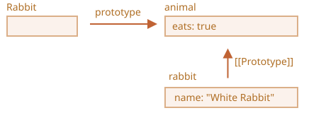
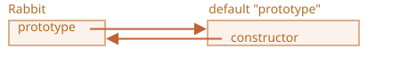
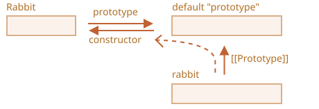

# F.prototype

<<<<<<< HEAD
思い出してください、新しいオブジェクトは `new F()` のように、コンストラクタ関数で生成できます。

`F.prototype` がオブジェクトの場合、`new` 演算子は新しいオブジェクトで `[[Prototype]]` をセットするためにそれを使用します。

```smart
JavaScriptは最初からプロトタイプの継承を持っています。 それは言語の中心的な特徴の1つでした。

しかし、昔は直接アクセスすることはできませんでした。確実に機能したのは、この章で説明する、コンストラクタ関数の `"prototype"` プロパティを使うことです。そして、それを使っているスクリプトはまだたくさんあります。
```

ここで `F.prototype` は `F` 上の `"prototype"` と名付けられた通常のプロパティを意味していることに注意してください。用語 "プロトタイプ" と似ていますが、ここでは本当にその名前をもつ通常のプロパティを意味しています。

ここではその例です:
=======
Remember, new objects can be created with a constructor function, like `new F()`.

If `F.prototype` is an object, then the `new` operator uses it to set `[[Prototype]]` for the new object.

```smart
JavaScript had prototypal inheritance from the beginning. It was one of the core features of the language.

But in the old times, there was no direct access to it. The only thing that worked reliably was a `"prototype"` property of the constructor function, described in this chapter. So there are many scripts that still use it.
```

Please note that `F.prototype` here means a regular property named `"prototype"` on `F`. It sounds something similar to the term "prototype", but here we really mean a regular property with this name.

Here's the example:
>>>>>>> 540d753e90789205fc6e75c502f68382c87dea9b

```js run
let animal = {
  eats: true
};

function Rabbit(name) {
  this.name = name;
}

*!*
Rabbit.prototype = animal;
*/!*

let rabbit = new Rabbit("White Rabbit"); //  rabbit.__proto__ == animal

alert( rabbit.eats ); // true
```

<<<<<<< HEAD
`Rabbit.prototype = animal` の設定は、文字通り次のことを述べています。: "`new Rabbit` が生成される時、その `[[Prototype]]` へ `animal` を割り当てます。"

これが結果のイメージです:



上記の図で、`"prototype"` は水平矢印で、通常のプロパティです。`[[Prototype]]` は縦矢印で、`animal` から `rabbit` の継承を意味しています。

```smart header="`F.prototype` は `new F` 時にだけ使用されます"
`F.prototype` プロパティは `new F` が呼ばれたときにだけ使用され、新しいオブジェクトの `[[Prototype]]` を割り当てます。

作成後に、`F.prototype` プロパティが変更された場合（`F.prototype = <別のオブジェクト>`）、`new F` によって生成された新しいオブジェクトは `[[Prototype]]` として別のオブジェクトを持ちますが、既に存在するオブジェクトは古いものを保持したままです。
```

## デフォルトの F.prototype, constructor プロパティ 

すべての関数は、たとえ明示的に提供されていなくても `"prototype"` プロパティを持っています。

デフォルトの `"prototype"` は `constructor` というプロパティだけを持つオブジェクトで、それは関数自体を指します。

こんな感じです:
=======
Setting `Rabbit.prototype = animal` literally states the following: "When a `new Rabbit` is created, assign its `[[Prototype]]` to `animal`".

That's the resulting picture:


On the picture, `"prototype"` is a horizontal arrow, meaning a regular property, and `[[Prototype]]` is vertical, meaning the inheritance of `rabbit` from `animal`.

```smart header="`F.prototype` only used at `new F` time"
`F.prototype` property is only used when `new F` is called, it assigns `[[Prototype]]` of the new object.

If, after the creation, `F.prototype` property changes (`F.prototype = <another object>`), then new objects created by `new F` will have another object as `[[Prototype]]`, but already existing objects keep the old one.
```

## Default F.prototype, constructor property

Every function has the `"prototype"` property even if we don't supply it.

The default `"prototype"` is an object with the only property `constructor` that points back to the function itself.

Like this:
>>>>>>> 540d753e90789205fc6e75c502f68382c87dea9b

```js
function Rabbit() {}

<<<<<<< HEAD
/* デフォルト prototype
=======
/* default prototype
>>>>>>> 540d753e90789205fc6e75c502f68382c87dea9b
Rabbit.prototype = { constructor: Rabbit };
*/
```



<<<<<<< HEAD
コードでそれを確認できます:

```js run
function Rabbit() {}
// デフォルトでは:
=======
We can check it:

```js run
function Rabbit() {}
// by default:
>>>>>>> 540d753e90789205fc6e75c502f68382c87dea9b
// Rabbit.prototype = { constructor: Rabbit }

alert( Rabbit.prototype.constructor == Rabbit ); // true
```

<<<<<<< HEAD
当然、何もしない場合、 `constructor` プロパティは `[[Prototype]]` を通じてすべての rabbit が利用できます。:

```js run
function Rabbit() {}
// デフォルトでは:
// Rabbit.prototype = { constructor: Rabbit }

let rabbit = new Rabbit(); // {constructor: Rabbit} の継承

alert(rabbit.constructor == Rabbit); // true (prototype から)
=======
Naturally, if we do nothing, the `constructor` property is available to all rabbits through  `[[Prototype]]`:

```js run
function Rabbit() {}
// by default:
// Rabbit.prototype = { constructor: Rabbit }

let rabbit = new Rabbit(); // inherits from {constructor: Rabbit}

alert(rabbit.constructor == Rabbit); // true (from prototype)
>>>>>>> 540d753e90789205fc6e75c502f68382c87dea9b
```



<<<<<<< HEAD
`constructor` プロパティを使って既存のものと同じコンストラクタを使って新しいオブジェクトを作成することができます。

このように:
=======
We can use `constructor` property to create a new object using the same constructor as the existing one.

Like here:
>>>>>>> 540d753e90789205fc6e75c502f68382c87dea9b

```js run
function Rabbit(name) {
  this.name = name;
  alert(name);
}

let rabbit = new Rabbit("White Rabbit");

*!*
let rabbit2 = new rabbit.constructor("Black Rabbit");
*/!*
```

<<<<<<< HEAD
これは、オブジェクトを持っているが、どのコンストラクタが使われたか分からない場合(例えばサードパーティーのライブラリが使われているなど)で、同じ種類のものを使って別のオブジェクトを作る必要がある場合に便利です。

しかし、おそらく `"constructor"` に関する最も重要なことは...

**...JavaScript 自体は正しい `"constructor"` 値を保証しません。**

はい、関数のためのデフォルトの `"prototype"` は存在しますが、それがすべてです。その後どうなるかは私たち次第です。

特に、もしデフォルトプロトタイプ全体を置き換えると、その中に `"constructor"` はなくなります。

例:
=======
That's handy when we have an object, don't know which constructor was used for it (e.g. it comes from a 3rd party library), and we need to create another one of the same kind.

But probably the most important thing about `"constructor"` is that...

**...JavaScript itself does not ensure the right `"constructor"` value.**

Yes, it exists in the default `"prototype"` for functions, but that's all. What happens with it later -- is totally on us.

In particular, if we replace the default prototype as a whole, then there will be no `"constructor"` in it.

For instance:
>>>>>>> 540d753e90789205fc6e75c502f68382c87dea9b

```js run
function Rabbit() {}
Rabbit.prototype = {
  jumps: true
};

let rabbit = new Rabbit();
*!*
alert(rabbit.constructor === Rabbit); // false
*/!*
```

<<<<<<< HEAD
したがって、正しい `"constructor"` を維持するためには、全体を上書きする代わりに、デフォルト `"prototype"` に対して追加/削除を行います。:
=======
So, to keep the right `"constructor"` we can choose to add/remove properties to the default `"prototype"` instead of overwriting it as a whole:
>>>>>>> 540d753e90789205fc6e75c502f68382c87dea9b

```js
function Rabbit() {}

<<<<<<< HEAD
// 完全に Rabbit.prototype を上書きはしません
// 単に追加するだけです
Rabbit.prototype.jumps = true
// デフォルト Rabbit.prototype.constructor は保持されます
```

もしくは、代替として手動で `constructor` プロパティを再び作ります。:
=======
// Not overwrite Rabbit.prototype totally
// just add to it
Rabbit.prototype.jumps = true
// the default Rabbit.prototype.constructor is preserved
```

Or, alternatively, recreate the `constructor` property manually:
>>>>>>> 540d753e90789205fc6e75c502f68382c87dea9b

```js
Rabbit.prototype = {
  jumps: true,
*!*
  constructor: Rabbit
*/!*
};

<<<<<<< HEAD
// 追加したので、これで constructor も正しいです
```


## サマリ 

このチャプターでは、constructor 関数を通して作成されたオブジェクトのための `[[Prototype]]` を設定方法について簡単に説明しました。後で、それに依存するより高度なプログラミングパターンを見ていきます。

すべてが非常にシンプルで、物事を明確にするための留意事項はほんの少しです。:

- `F.prototype` プロパティは `[[Prototype]]` と同じではありません。`F.prototype` がする唯一のことは: `new F()` が呼ばれたときに新しいオブジェクトの `[[Prototype]]` をセットすることです。
- `F.prototype` の値はオブジェクトまたは null でなければなりません。: 他の値では動作しません。
- `"prototype"` プロパティはコンストラクタ関数に設定され、`new` で呼び出されたときにのみ、特別な効果があります。

通常のオブジェクトでは、`prototype` は特別なものではありません。:
=======
// now constructor is also correct, because we added it
```


## Summary

In this chapter we briefly described the way of setting a `[[Prototype]]` for objects created via a constructor function. Later we'll see more advanced programming patterns that rely on it.

Everything is quite simple, just a few notes to make things clear:

- The `F.prototype` property (don't mistake it for `[[Prototype]]`) sets `[[Prototype]]` of new objects when `new F()` is called.
- The value of `F.prototype` should be either an object or `null`: other values won't work.
-  The `"prototype"` property only has such a special effect when set on a constructor function, and invoked with `new`.

On regular objects the `prototype` is nothing special:
>>>>>>> 540d753e90789205fc6e75c502f68382c87dea9b
```js
let user = {
  name: "John",
  prototype: "Bla-bla" // no magic at all
};
```

<<<<<<< HEAD
デフォルトでは、すべての関数は `F.prototype = { constructor: F }` を持っているので、その `"constructor"` プロパティへアクセスすることで、オブジェクトの constructor を取得することができます。
=======
By default all functions have `F.prototype = { constructor: F }`, so we can get the constructor of an object by accessing its `"constructor"` property.
>>>>>>> 540d753e90789205fc6e75c502f68382c87dea9b
