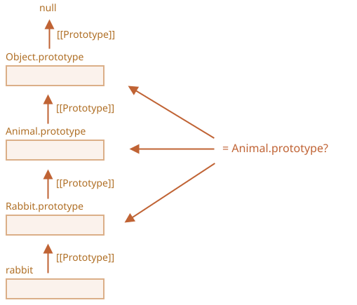

<<<<<<< HEAD
# クラスのチェック: "instanceof"

`instanceof` 演算子でオブジェクトが特定のクラスに属しているのかを確認することができます。また、継承も考慮されます。

このようなチェックが必要なケースは多々あるかもしれません。ここでは、その型に応じて引数を別々に扱う *多形(ポリモーフィック)* 関数を構築するために使用します。

## instanceof 演算子  [#ref-instanceof]

構文は次の通りです:
=======
# Class checking: "instanceof"

The `instanceof` operator allows to check whether an object belongs to a certain class. It also takes inheritance into account.

Such a check may be necessary in many cases. For example, it can be used for building a *polymorphic* function, the one that treats arguments differently depending on their type.

## The instanceof operator [#ref-instanceof]

The syntax is:
>>>>>>> 51bc6d3cdc16b6eb79cb88820a58c4f037f3bf19
```js
obj instanceof Class
```

<<<<<<< HEAD
それは `obj` が `Class` (または、それを継承しているクラス)に属している場合に `true` を返します。

例:
=======
It returns `true` if `obj` belongs to the `Class` or a class inheriting from it.

For instance:
>>>>>>> 51bc6d3cdc16b6eb79cb88820a58c4f037f3bf19

```js run
class Rabbit {}
let rabbit = new Rabbit();

<<<<<<< HEAD
// Rabbit クラスのオブジェクト？
=======
// is it an object of Rabbit class?
>>>>>>> 51bc6d3cdc16b6eb79cb88820a58c4f037f3bf19
*!*
alert( rabbit instanceof Rabbit ); // true
*/!*
```

<<<<<<< HEAD
コンストラクタ関数でも動作します。:

```js run
*!*
// class の代わり
=======
It also works with constructor functions:

```js run
*!*
// instead of class
>>>>>>> 51bc6d3cdc16b6eb79cb88820a58c4f037f3bf19
function Rabbit() {}
*/!*

alert( new Rabbit() instanceof Rabbit ); // true
```

<<<<<<< HEAD
...また `Array` のような組み込みクラスでも動作します。:
=======
...And with built-in classes like `Array`:
>>>>>>> 51bc6d3cdc16b6eb79cb88820a58c4f037f3bf19

```js run
let arr = [1, 2, 3];
alert( arr instanceof Array ); // true
alert( arr instanceof Object ); // true
```

<<<<<<< HEAD
`arr` は `Object` クラスにも属していることに留意してください。`Array` はプロトタイプ的に `Object` を継承しているためです。

通常、`instanceof` 演算子はチェックのためにプロトタイプチェーンを検査します。この動きに対して、静的メソッド `Symbol.hasInstance` でカスタムロジックが設定できます。

`obj instanceof Class` のアルゴリズムはおおまかに次のように動作します。:

1. もし静的メソッド `Symbol.hasInstance` があれば、それ（`Class[Symbol.hasInstance](obj)`）を使います。これは `true` または `false` を返す必要があり、これで `instanceof` の振る舞いがカスタマイズできます。:

    例:

    ```js run
    // catEat プロパティをもつものは animal と想定する
    // instanceOf チェックを設定
=======
Please note that `arr` also belongs to the `Object` class. That's because `Array` prototypically inherits from `Object`.

Normally, `instanceof` examines the prototype chain for the check. We can also set a custom logic in the static method `Symbol.hasInstance`.

The algorithm of `obj instanceof Class` works roughly as follows:

1. If there's a static method `Symbol.hasInstance`, then just call it: `Class[Symbol.hasInstance](obj)`. It should return either `true` or `false`, and we're done. That's how we can customize the behavior of `instanceof`.

    For example:

    ```js run
    // set up instanceof check that assumes that
    // anything with canEat property is an animal
>>>>>>> 51bc6d3cdc16b6eb79cb88820a58c4f037f3bf19
    class Animal {
      static [Symbol.hasInstance](obj) {
        if (obj.canEat) return true;
      }
    }

    let obj = { canEat: true };

<<<<<<< HEAD
    alert(obj instanceof Animal); // true: Animal[Symbol.hasInstance](obj)が呼ばれます
    ```

2. ほとんどのクラスは `Symbol.hasInstance` を持っていません。このケースでは、通常のロジックが使用されます: `obj instanceOf Class` は `Class.prototype` が `obj` のプロトタイプチェーンうちの1つと等しいかをチェックします。

    言い換えると、以下のような比較を行います:
    ```js
    obj.__proto__ == Class.prototype
    obj.__proto__.__proto__ == Class.prototype
    obj.__proto__.__proto__.__proto__ == Class.prototype
    ...
    // いずれかが true の場合、 true が返却されます
    // そうでない場合、チェーンの末尾に到達すると false を返します
    ```

    上の例では、``rabbit.__proto__ === Rabbit.prototype` なので、すぐに回答が得られます。

    継承のケースでは、2つめのステップでマッチします:
=======
    alert(obj instanceof Animal); // true: Animal[Symbol.hasInstance](obj) is called
    ```

2. Most classes do not have `Symbol.hasInstance`. In that case, the standard logic is used: `obj instanceof Class` checks whether `Class.prototype` is equal to one of the prototypes in the `obj` prototype chain.

    In other words, compare one after another:
    ```js
    obj.__proto__ === Class.prototype?
    obj.__proto__.__proto__ === Class.prototype?
    obj.__proto__.__proto__.__proto__ === Class.prototype?
    ...
    // if any answer is true, return true
    // otherwise, if we reached the end of the chain, return false
    ```

    In the example above `rabbit.__proto__ === Rabbit.prototype`, so that gives the answer immediately.

    In the case of an inheritance, the match will be at the second step:
>>>>>>> 51bc6d3cdc16b6eb79cb88820a58c4f037f3bf19

    ```js run
    class Animal {}
    class Rabbit extends Animal {}

    let rabbit = new Rabbit();
    *!*
    alert(rabbit instanceof Animal); // true
    */!*

<<<<<<< HEAD
    // rabbit.__proto__ == Rabbit.prototype
=======
    // rabbit.__proto__ === Animal.prototype (no match)
>>>>>>> 51bc6d3cdc16b6eb79cb88820a58c4f037f3bf19
    *!*
    // rabbit.__proto__.__proto__ === Animal.prototype (match!)
    */!*
    ```

<<<<<<< HEAD
これは、`rabbit instanceof Animal` と `Animal.prototype` を比較したものです。:



ところで、[objA.isPrototypeOf(objB)](mdn:js/object/isPrototypeOf) というメソッドもあります。これは `objA` が `objB` のプロトタイプチェーンのどこかにあれば `true` を返します。なので、`obj instanceof Class` のテストは `Class.prototype.isPrototypeOf(obj)` と言い換えることができます。

面白いことに、`Class` コンストラクタ自身はチェックには参加しません! プロトタイプと `Class.prototype`のチェーンだけです。

これは `prototype` が変更されたときに興味深い結果につながります。

このように:
=======
Here's the illustration of what `rabbit instanceof Animal` compares with `Animal.prototype`:


By the way, there's also a method [objA.isPrototypeOf(objB)](mdn:js/object/isPrototypeOf), that returns `true` if `objA` is somewhere in the chain of prototypes for `objB`. So the test of `obj instanceof Class` can be rephrased as `Class.prototype.isPrototypeOf(obj)`.

It's funny, but the `Class` constructor itself does not participate in the check! Only the chain of prototypes and `Class.prototype` matters.

That can lead to interesting consequences when a `prototype` property is changed after the object is created.

Like here:
>>>>>>> 51bc6d3cdc16b6eb79cb88820a58c4f037f3bf19

```js run
function Rabbit() {}
let rabbit = new Rabbit();

<<<<<<< HEAD
// prototype を変更します
Rabbit.prototype = {};

// ...もう rabbit ではありません
=======
// changed the prototype
Rabbit.prototype = {};

// ...not a rabbit any more!
>>>>>>> 51bc6d3cdc16b6eb79cb88820a58c4f037f3bf19
*!*
alert( rabbit instanceof Rabbit ); // false
*/!*
```

<<<<<<< HEAD
## おまけ: 型のための Object toString

私たちは通常の文字列は `[object Object]` という文字列に変換されることをすでに知っています。:
=======
## Bonus: Object.prototype.toString for the type

We already know that plain objects are converted to string as `[object Object]`:
>>>>>>> 51bc6d3cdc16b6eb79cb88820a58c4f037f3bf19

```js run
let obj = {};

alert(obj); // [object Object]
<<<<<<< HEAD
alert(obj.toString()); // 同じ
```

これが `toString` の実装です。しかし、実際にはそれよりもはるかに強力な `toString` を作る隠れた機能があります。それを拡張させて `typeof` または `instanceof` の代替として利用することができます。

奇妙に聞こえますか？たしかに。分かりやすく説明しましょう。

[スペック(specification)](https://tc39.github.io/ecma262/#sec-object.prototype.tostring)によって、組み込みの `toString` はオブジェクトから抽出し、任意の値のコンテキストで実行することができます。そして、その結果はその値に依存します。

- 数値の場合、それは `[object Number]` になります。
- 真偽値の場合、`[object Boolean]` になります。
- `null` の場合: `[object Null]`
- `undefined` の場合: `[object Undefined]`
- 配列の場合: `[object Array]`
- ...など (カスタマイズ可能).

デモを見てみましょう:

```js run
// 使いやすくするために toString メソッドを変数にコピー
let objectToString = Object.prototype.toString;

// これの型はなに?
let arr = [];

alert( objectToString.call(arr) ); // [object Array]
```

ここでは、コンテキスト `this=arr` で関数 `objectToString` を実行するため、[デコレータと転送, call/apply](info:call-apply-decorators) の章で説明した [call](mdn:js/function/call) を使いました。

内部的には、`toString` アルゴリズムは `this` を検査し、対応する結果を返します。ほかの例です。:
=======
alert(obj.toString()); // the same
```

That's their implementation of `toString`. But there's a hidden feature that makes `toString` actually much more powerful than that. We can use it as an extended `typeof` and an alternative for `instanceof`.

Sounds strange? Indeed. Let's demystify.

By [specification](https://tc39.github.io/ecma262/#sec-object.prototype.tostring), the built-in `toString` can be extracted from the object and executed in the context of any other value. And its result depends on that value.

- For a number, it will be `[object Number]`
- For a boolean, it will be `[object Boolean]`
- For `null`: `[object Null]`
- For `undefined`: `[object Undefined]`
- For arrays: `[object Array]`
- ...etc (customizable).

Let's demonstrate:

```js run
// copy toString method into a variable for convenience
let objectToString = Object.prototype.toString;

// what type is this?
let arr = [];

alert( objectToString.call(arr) ); // [object *!*Array*/!*]
```

Here we used [call](mdn:js/function/call) as described in the chapter [](info:call-apply-decorators) to execute the function `objectToString` in the context `this=arr`.

Internally, the `toString` algorithm examines `this` and returns the corresponding result. More examples:
>>>>>>> 51bc6d3cdc16b6eb79cb88820a58c4f037f3bf19

```js run
let s = Object.prototype.toString;

alert( s.call(123) ); // [object Number]
alert( s.call(null) ); // [object Null]
alert( s.call(alert) ); // [object Function]
```

### Symbol.toStringTag

<<<<<<< HEAD
Object `toString` の振る舞いは特別なオブジェクトプロパティ `Symbol.toStringTag` を使用してカスタマイズできます。

例:

```js run
let user = {
  [Symbol.toStringTag]: 'User'
=======
The behavior of Object `toString` can be customized using a special object property `Symbol.toStringTag`.

For instance:

```js run
let user = {
  [Symbol.toStringTag]: "User"
>>>>>>> 51bc6d3cdc16b6eb79cb88820a58c4f037f3bf19
};

alert( {}.toString.call(user) ); // [object User]
```

<<<<<<< HEAD
ほとんどの環境固有のオブジェクトには、このようなプロパティがあります。これはいくつかのブラウザ固有の例です。:

```js run
// 環境固有のオブジェクトとクラスのtoStringTag:
alert( window[Symbol.toStringTag]); // window
=======
For most environment-specific objects, there is such a property. Here are some browser specific examples:

```js run
// toStringTag for the environment-specific object and class:
alert( window[Symbol.toStringTag]); // Window
>>>>>>> 51bc6d3cdc16b6eb79cb88820a58c4f037f3bf19
alert( XMLHttpRequest.prototype[Symbol.toStringTag] ); // XMLHttpRequest

alert( {}.toString.call(window) ); // [object Window]
alert( {}.toString.call(new XMLHttpRequest()) ); // [object XMLHttpRequest]
```

<<<<<<< HEAD
ご覧の通り、結果は正確に `Symbol.toStringTag` (存在する場合)で、`[object ...]` の中にラップされています。

最終的には、プリミティブなデータ型だけでなく、組み込みオブジェクトのためにも機能し、カスタマイズすることもできる "強化された typeof" があります。

これは、型を文字列として取得するだけでなく、チェックするために、組み込みオブジェクトに対して `instanceof` の代わりに使用できます。

## サマリ 

私たちが知っている型チェックメソッドについて再確認しましょう:

|               | 対象   |  戻り値      |
|---------------|-------------|---------------|
| `typeof`      | プリミティブ  |  文字列       |
| `{}.toString` | プリミティブ, 組み込みオブジェクト, `Symbol.toStringTag` をもつオブジェクト  |       文字列 |
| `instanceof`  | オブジェクト     |  true/false   |

ご覧のように、`{}.toString` は技術的には "より高度な" `typeof` です。

そして、`instanceof` 演算子は、クラス階層を扱っていて継承を考慮したクラスのチェックをしたい場合に本当に輝きます。
=======
As you can see, the result is exactly `Symbol.toStringTag` (if exists), wrapped into `[object ...]`.

At the end we have "typeof on steroids" that not only works for primitive data types, but also for built-in objects and even can be customized.

We can use `{}.toString.call` instead of `instanceof` for built-in objects when we want to get the type as a string rather than just to check.

## Summary

Let's summarize the type-checking methods that we know:

|               | works for   |  returns      |
|---------------|-------------|---------------|
| `typeof`      | primitives  |  string       |
| `{}.toString` | primitives, built-in objects, objects with `Symbol.toStringTag`   |       string |
| `instanceof`  | objects     |  true/false   |

As we can see, `{}.toString` is technically a "more advanced" `typeof`.

And `instanceof` operator really shines when we are working with a class hierarchy and want to check for the class taking into account inheritance.
>>>>>>> 51bc6d3cdc16b6eb79cb88820a58c4f037f3bf19
