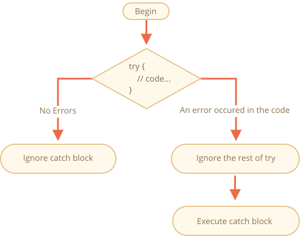

<<<<<<< HEAD
# エラーハンドリング, "try..catch"

どんなに我々のプログラミングが素晴らしくても、スクリプトがエラーになることはあります。それはミス、予期しないユーザ入力、間違ったサーバレスポンスやその他多くの理由により発生する可能性があります。

通常、エラーが発生するとスクリプトは "死" (即時に停止) に、それをコンソールに出力します。

しかし、エラーを "キャッチ" し、死ぬ代わりにより意味のあることをする構文構造 `try..catch` があります。

## "try..catch" 構文

`try..catch` 構造は2つのメインブロックを持っています: `try` と `catch` です。:
=======
# Error handling, "try...catch"

No matter how great we are at programming, sometimes our scripts have errors. They may occur because of our mistakes, an unexpected user input, an erroneous server response, and for a thousand other reasons.

Usually, a script "dies" (immediately stops) in case of an error, printing it to console.

But there's a syntax construct `try...catch` that allows us to "catch" errors so the script can, instead of dying, do something more reasonable.

## The "try...catch" syntax

The `try...catch` construct has two main blocks: `try`, and then `catch`:
>>>>>>> 1dce5b72b16288dad31b7b3febed4f38b7a5cd8a

```js
try {

  // code...

} catch (err) {

  // error handling

}
```

<<<<<<< HEAD
それは次のように動作します:

1. まず、`try {...}` のコードが実行されます。
2. エラーがなければ、`catch(err)` は無視されます: 実行が `try` の最後に到達した後、`catch` を飛び越えます。
3. エラーが発生した場合、`try`  の実行が停止し、コントロールフローは `catch(err)` の先頭になります。`err` 変数(任意の名前が使えます)は発生した事象に関する詳細をもつエラーオブジェクトを含んでいます。



従って、`try {…}` ブロックの内側のエラーはスクリプトを殺しません: `catch` の中でそれを扱う機会が持てます。

いくつか例を見てみましょう。

- エラーなしの例: `alert` `(1)` と `(2)` を表示します:
=======
It works like this:

1. First, the code in `try {...}` is executed.
2. If there were no errors, then `catch (err)` is ignored: the execution reaches the end of `try` and goes on, skipping `catch`.
3. If an error occurs, then the `try` execution is stopped, and control flows to the beginning of `catch (err)`. The `err` variable (we can use any name for it) will contain an error object with details about what happened.


So, an error inside the `try {...}` block does not kill the script -- we have a chance to handle it in `catch`.

Let's look at some examples.

- An errorless example: shows `alert` `(1)` and `(2)`:
>>>>>>> 1dce5b72b16288dad31b7b3febed4f38b7a5cd8a

    ```js run
    try {

      alert('Start of try runs');  // *!*(1) <--*/!*

<<<<<<< HEAD
      // ...ここではエラーはありません

      alert('End of try runs');   // *!*(2) <--*/!*

    } catch(err) {
=======
      // ...no errors here

      alert('End of try runs');   // *!*(2) <--*/!*

    } catch (err) {
>>>>>>> 1dce5b72b16288dad31b7b3febed4f38b7a5cd8a

      alert('Catch is ignored, because there are no errors'); // (3)

    }
    ```
<<<<<<< HEAD
- エラーの例: `(1)` と `(3)` を表示します:
=======
- An example with an error: shows `(1)` and `(3)`:
>>>>>>> 1dce5b72b16288dad31b7b3febed4f38b7a5cd8a

    ```js run
    try {

      alert('Start of try runs');  // *!*(1) <--*/!*

    *!*
<<<<<<< HEAD
      lalala; // エラー, 変数は宣言されていません!
=======
      lalala; // error, variable is not defined!
>>>>>>> 1dce5b72b16288dad31b7b3febed4f38b7a5cd8a
    */!*

      alert('End of try (never reached)');  // (2)

<<<<<<< HEAD
    } catch(err) {

      alert(`Error has occured!`); // *!*(3) <--*/!*
=======
    } catch (err) {

      alert(`Error has occurred!`); // *!*(3) <--*/!*
>>>>>>> 1dce5b72b16288dad31b7b3febed4f38b7a5cd8a

    }
    ```


<<<<<<< HEAD
````warn header="`try..catch` は実行時エラーにのみ作用します"
`try..catch` を動作させるために、コードは実行可能でなければなりません。つまり、有効なJavaScriptである必要があります。

もしコードが構文的に誤っている場合には動作しません。例えば次は角括弧の不一致です:
=======
````warn header="`try...catch` only works for runtime errors"
For `try...catch` to work, the code must be runnable. In other words, it should be valid JavaScript.

It won't work if the code is syntactically wrong, for instance it has unmatched curly braces:
>>>>>>> 1dce5b72b16288dad31b7b3febed4f38b7a5cd8a

```js run
try {
  {{{{{{{{{{{{
<<<<<<< HEAD
} catch(e) {
=======
} catch (err) {
>>>>>>> 1dce5b72b16288dad31b7b3febed4f38b7a5cd8a
  alert("The engine can't understand this code, it's invalid");
}
```

<<<<<<< HEAD
JavaScriptエンジンは最初にコードを読み、次にそれを実行します。読み込みのフェーズで発生したエラーは "解析時間(parse-time)" エラーと呼ばれ、回復不能です(コードの内部からは)。なぜなら、エンジンはそのコードを理解することができないからです。

そのため、`try..catch` は有効なコードの中で起きたエラーのみを扱うことができます。このようなエラーは "ランタイムエラー" または "例外" と呼ばれます。
````


````warn header="`try..catch` は同期的に動作します"
もし `setTimeout` の中のような "スケジュールされた" コードで例外が発生した場合、`try..catch` はそれをキャッチしません。:
=======
The JavaScript engine first reads the code, and then runs it. The errors that occur on the reading phase are called "parse-time" errors and are unrecoverable (from inside that code). That's because the engine can't understand the code.

So, `try...catch` can only handle errors that occur in valid code. Such errors are called "runtime errors" or, sometimes, "exceptions".
````


````warn header="`try...catch` works synchronously"
If an exception happens in "scheduled" code, like in `setTimeout`, then `try...catch` won't catch it:
>>>>>>> 1dce5b72b16288dad31b7b3febed4f38b7a5cd8a

```js run
try {
  setTimeout(function() {
<<<<<<< HEAD
    noSuchVariable; // スクリプトはここで死にます
  }, 1000);
} catch (e) {
=======
    noSuchVariable; // script will die here
  }, 1000);
} catch (err) {
>>>>>>> 1dce5b72b16288dad31b7b3febed4f38b7a5cd8a
  alert( "won't work" );
}
```

<<<<<<< HEAD
`try..catch` は実際には関数をスケジュールする `setTimeout` 呼び出しをラップするためです。しかし関数自身は後で実行され、その時エンジンはすでに `try..catch` 構造を抜けています。

スケジュールされた関数の内側の例外をキャッチするためには、その関数の中に `try..catch` が必要です。:
```js run
setTimeout(function() {
  try {    
    noSuchVariable; // try..catch がエラーをハンドリングします!
  } catch (e) {
=======
That's because the function itself is executed later, when the engine has already left the `try...catch` construct.

To catch an exception inside a scheduled function, `try...catch` must be inside that function:
```js run
setTimeout(function() {
  try {    
    noSuchVariable; // try...catch handles the error!
  } catch {
>>>>>>> 1dce5b72b16288dad31b7b3febed4f38b7a5cd8a
    alert( "error is caught here!" );
  }
}, 1000);
```
````

<<<<<<< HEAD
## エラーオブジェクト 

エラーが発生したとき、JavaScript はその詳細を含めたオブジェクトを生成します。そして `catch` の引数として渡されます。:
=======
## Error object

When an error occurs, JavaScript generates an object containing the details about it. The object is then passed as an argument to `catch`:
>>>>>>> 1dce5b72b16288dad31b7b3febed4f38b7a5cd8a

```js
try {
  // ...
<<<<<<< HEAD
} catch(err) { // <-- "エラーオブジェクト", err の代わりに別の名前を使うこともできます
=======
} catch (err) { // <-- the "error object", could use another word instead of err
>>>>>>> 1dce5b72b16288dad31b7b3febed4f38b7a5cd8a
  // ...
}
```

<<<<<<< HEAD
すべての組み込みのエラーに対して、`catch` ブロック内のエラーオブジェクトは2つの主なプロパティを持っています。:

`name`
: エラー名です。未定義変数の場合、それは `"ReferenceError"` です。

`message`
: エラー詳細に関するテキストメッセージです。

ほとんどの環境では、その他非標準のプロパティが利用可能です。最も広く使われ、サポートされているのは以下です:

`stack`
: 現在のコールスタックです: エラーに繋がったネスト呼び出しのシーケンスに関する情報を持つ文字列です。デバッグ目的で使われます。

例:
=======
For all built-in errors, the error object has two main properties:

`name`
: Error name. For instance, for an undefined variable that's `"ReferenceError"`.

`message`
: Textual message about error details.

There are other non-standard properties available in most environments. One of most widely used and supported is:

`stack`
: Current call stack: a string with information about the sequence of nested calls that led to the error. Used for debugging purposes.

For instance:
>>>>>>> 1dce5b72b16288dad31b7b3febed4f38b7a5cd8a

```js run untrusted
try {
*!*
<<<<<<< HEAD
  lalala; // エラー, 変数が宣言されていません!
*/!*
} catch(err) {
  alert(err.name); // ReferenceError
  alert(err.message); // lalala is not defined
  alert(err.stack); // ReferenceError: lalala is not defined at (...スタック呼び出し)

  // 全体としてエラーを表示する事もできます
  // エラーは "name: message" として文字列に変換されます
=======
  lalala; // error, variable is not defined!
*/!*
} catch (err) {
  alert(err.name); // ReferenceError
  alert(err.message); // lalala is not defined
  alert(err.stack); // ReferenceError: lalala is not defined at (...call stack)

  // Can also show an error as a whole
  // The error is converted to string as "name: message"
>>>>>>> 1dce5b72b16288dad31b7b3febed4f38b7a5cd8a
  alert(err); // ReferenceError: lalala is not defined
}
```

<<<<<<< HEAD
## 任意の "catch" バインディング

[recent browser=new]

エラーの詳細が必要ない場合、`catch` はそれを省略できます:
=======
## Optional "catch" binding

[recent browser=new]

If we don't need error details, `catch` may omit it:
>>>>>>> 1dce5b72b16288dad31b7b3febed4f38b7a5cd8a

```js
try {
  // ...
<<<<<<< HEAD
} catch { // <--  (err) なし
=======
} catch { // <-- without (err)
>>>>>>> 1dce5b72b16288dad31b7b3febed4f38b7a5cd8a
  // ...
}
```

<<<<<<< HEAD
## "try..catch" の利用

`try..catch` の実際のユースケースについて探索してみましょう。

既にご存知の通り、JavaScriptは JSONエンコードされた値を読むためのメソッド [JSON.parse(str)](mdn:js/JSON/parse) がサポートされています。

通常、それはネットワーク経由でサーバまたは別のソースから受信したデータをデコードするために使われます。

今、次のようにデータを受信し、`JSON.parse` を呼び出します。:

```js run
let json = '{"name":"John", "age": 30}'; // サーバからのデータ

*!*
let user = JSON.parse(json); // テキスト表現をJSオブジェクトに変換
*/!*

// 今、 user 文字列からプロパティを持つオブジェクトです
=======
## Using "try...catch"

Let's explore a real-life use case of `try...catch`.

As we already know, JavaScript supports the [JSON.parse(str)](mdn:js/JSON/parse) method to read JSON-encoded values.

Usually it's used to decode data received over the network, from the server or another source.

We receive it and call `JSON.parse` like this:

```js run
let json = '{"name":"John", "age": 30}'; // data from the server

*!*
let user = JSON.parse(json); // convert the text representation to JS object
*/!*

// now user is an object with properties from the string
>>>>>>> 1dce5b72b16288dad31b7b3febed4f38b7a5cd8a
alert( user.name ); // John
alert( user.age );  // 30
```

<<<<<<< HEAD
JSON に関する詳細な情報は、チャプター <info:json> を参照してください。

**`json` が不正な形式の場合、`JSON.parse` はエラーになるのでスクリプトは "死にます"。**

それで満足しますか？もちろん満足しません!

この方法だと、もしデータが何か間違っている場合、訪問者はそれを知ることができません(開発者コンソールを開かない限り)。また、人々は、エラーメッセージなしで何かが "単に死んでいる" ことを本当に本当に嫌います。

エラーを扱うために `try..catch` を使いましょう。:
=======
You can find more detailed information about JSON in the <info:json> chapter.

**If `json` is malformed, `JSON.parse` generates an error, so the script "dies".**

Should we be satisfied with that? Of course not!

This way, if something's wrong with the data, the visitor will never know that (unless they open the developer console). And people really don't like when something "just dies" without any error message.

Let's use `try...catch` to handle the error:
>>>>>>> 1dce5b72b16288dad31b7b3febed4f38b7a5cd8a

```js run
let json = "{ bad json }";

try {

*!*
<<<<<<< HEAD
  let user = JSON.parse(json); // <-- エラーが起きたとき...
*/!*
  alert( user.name ); // 動作しません

} catch (e) {
*!*
  // ...実行はここに飛びます
  alert( "Our apologies, the data has errors, we'll try to request it one more time." );
  alert( e.name );
  alert( e.message );
=======
  let user = JSON.parse(json); // <-- when an error occurs...
*/!*
  alert( user.name ); // doesn't work

} catch (err) {
*!*
  // ...the execution jumps here
  alert( "Our apologies, the data has errors, we'll try to request it one more time." );
  alert( err.name );
  alert( err.message );
>>>>>>> 1dce5b72b16288dad31b7b3febed4f38b7a5cd8a
*/!*
}
```

<<<<<<< HEAD
ここでは、メッセージを表示するためのだけに `catch` ブロックを使っていますが、より多くのことをすることができます。: 新たなネットワーク要求、訪問者への代替手段の提案、ロギング機構へエラーに関する情報の送信... すべて、単に死ぬよりははるかに良いです。

## 独自のエラーをスローする 

仮に `json` が構文的に正しいが、必須の `"name"` プロパティを持っていない場合どうなるでしょう？

このように:

```js run
let json = '{ "age": 30 }'; // 不完全なデータ

try {

  let user = JSON.parse(json); // <-- エラーなし
*!*
  alert( user.name ); // name はありません!
*/!*

} catch (e) {
=======
Here we use the `catch` block only to show the message, but we can do much more: send a new network request, suggest an alternative to the visitor, send information about the error to a logging facility, ... . All much better than just dying.

## Throwing our own errors

What if `json` is syntactically correct, but doesn't have a required `name` property?

Like this:

```js run
let json = '{ "age": 30 }'; // incomplete data

try {

  let user = JSON.parse(json); // <-- no errors
*!*
  alert( user.name ); // no name!
*/!*

} catch (err) {
>>>>>>> 1dce5b72b16288dad31b7b3febed4f38b7a5cd8a
  alert( "doesn't execute" );
}
```

<<<<<<< HEAD
ここで、`JSON.parse` は通常どおり実行しますが、`"name"` の欠落は実際には我々にとってはエラーです。

エラー処理を統一するために、`throw` 演算子を使います。

### "Throw" 演算子

`throw` 演算子はエラーを生成します。

構文は次の通りです:
=======
Here `JSON.parse` runs normally, but the absence of `name` is actually an error for us.

To unify error handling, we'll use the `throw` operator.

### "Throw" operator

The `throw` operator generates an error.

The syntax is:
>>>>>>> 1dce5b72b16288dad31b7b3febed4f38b7a5cd8a

```js
throw <error object>
```

<<<<<<< HEAD
技術的には、エラーオブジェクトとしてなんでも使うことができます。たとえ、数値や文字列のようなプリミティブでもOKです。しかし、`name` と `message` プロパティを持つオブジェクトを使うのがベターです(組み込みのエラーと互換性をいくらか保つために)。

JavaScriptは標準エラーのための多くの組み込みのコンストラクタを持っています: `Error`, `SyntaxError`, `ReferenceError`, `TypeError` などです。我々もエラーオブジェクトを作るのにそれらが使えます。

構文は次の通りです:
=======
Technically, we can use anything as an error object. That may be even a primitive, like a number or a string, but it's better to use objects, preferably with `name` and `message` properties (to stay somewhat compatible with built-in errors).

JavaScript has many built-in constructors for standard errors: `Error`, `SyntaxError`, `ReferenceError`, `TypeError` and others. We can use them to create error objects as well.

Their syntax is:
>>>>>>> 1dce5b72b16288dad31b7b3febed4f38b7a5cd8a

```js
let error = new Error(message);
// or
let error = new SyntaxError(message);
let error = new ReferenceError(message);
// ...
```

<<<<<<< HEAD
組み込みのエラー(任意のオブジェクトではなく、エラーのみ)では、`name` プロパティはコンストラクタの名前と全く同じになります。そして `message` は引数から取られます。

例:
=======
For built-in errors (not for any objects, just for errors), the `name` property is exactly the name of the constructor. And `message` is taken from the argument.

For instance:
>>>>>>> 1dce5b72b16288dad31b7b3febed4f38b7a5cd8a

```js run
let error = new Error("Things happen o_O");

alert(error.name); // Error
alert(error.message); // Things happen o_O
```

<<<<<<< HEAD
`JSON.parse` が生成するエラーの種類を見てみましょう:
=======
Let's see what kind of error `JSON.parse` generates:
>>>>>>> 1dce5b72b16288dad31b7b3febed4f38b7a5cd8a

```js run
try {
  JSON.parse("{ bad json o_O }");
<<<<<<< HEAD
} catch(e) {
*!*
  alert(e.name); // SyntaxError
*/!*
  alert(e.message); // Unexpected token o in JSON at position 0
}
```

ご覧の通り、それは `SyntaxError` です。

...そして、我々のケースでは、ユーザは必ず `"name"` を持っていると仮定するので、`name` の欠落もまた構文エラーとして扱います。

なので、それをスローするようにしましょう:

```js run
let json = '{ "age": 30 }'; // 不完全なデータ

try {

  let user = JSON.parse(json); // <-- エラーなし
=======
} catch (err) {
*!*
  alert(err.name); // SyntaxError
*/!*
  alert(err.message); // Unexpected token b in JSON at position 2
}
```

As we can see, that's a `SyntaxError`.

And in our case, the absence of `name` is an error, as users must have a `name`.

So let's throw it:

```js run
let json = '{ "age": 30 }'; // incomplete data

try {

  let user = JSON.parse(json); // <-- no errors
>>>>>>> 1dce5b72b16288dad31b7b3febed4f38b7a5cd8a

  if (!user.name) {
*!*
    throw new SyntaxError("Incomplete data: no name"); // (*)
*/!*
  }

  alert( user.name );

<<<<<<< HEAD
} catch(e) {
  alert( "JSON Error: " + e.message ); // JSON Error: Incomplete data: no name
}
```

行 `(*)` で、`throw` 演算子が与えられた `message` で `SyntaxError` を生成します。それは JavaScript が生成するのと同じ方法です。`try` の実行はすぐに停止し、制御フローは `catch` に移ります。

今や、`catch` は`JSON.parse` と他のケースすべてのエラーハンドリングのための1つの場所になりました。

## 再スロー 

上の例で、私たちは不正なデータを処理するために `try..catch` を使っています。しかし、`try {...}` ブロックの中で *別の予期しないエラー* が発生する可能性はあるでしょうか？ 変数が未定義、またはその他、単に "不正なデータ" ではない何か。

例:

```js run
let json = '{ "age": 30 }'; // 不完全なデータ

try {
  user = JSON.parse(json); // <-- user の前に "let" をつけ忘れた

  // ...
} catch(err) {
  alert("JSON Error: " + err); // JSON Error: ReferenceError: user is not defined
  // (実際にはJSONのエラーではありません)
}
```

もちろん、すべての可能性があります! プログラマはミスをするものです。何十年も何百万人もの人が使っているオープンソースのユーティリティであっても、突然酷いバグが発見され、ひどいハッキングにつながることがあります（ `ssh` ツールで起こったようなものです）。

私たちのケースでは、`try..catch` は "不正なデータ" エラーをキャッチすることを意図しています。しかし、その性質上、`catch` は `try` からの *すべての* エラーを取得します。ここでは予期しないエラーが発生しますが、同じ `"JSON Error"` メッセージが表示されます。これは誤りでコードのデバッグをより難しくします。

このような問題を避けるため、"再スロー" という手法が利用できます。ルールはシンプルです:

**キャッチはそれが知っているエラーだけを処理し、すべてのオブジェクトを "再スロー" するべきです**

"再スロー" テクニックの詳細は次のように説明できます:

1. すべてのエラーをキャッチします。
2. `catch(err) {...}` ブロックで、エラーオブジェクト `err` を解析します。
3. どう処理すればいいか分からなければ、`throw err` をします。

通常は、`instanceof` 演算子を使用してエラーの種類がチェックできます。:
=======
} catch (err) {
  alert( "JSON Error: " + err.message ); // JSON Error: Incomplete data: no name
}
```

In the line `(*)`, the `throw` operator generates a `SyntaxError` with the given `message`, the same way as JavaScript would generate it itself. The execution of `try` immediately stops and the control flow jumps into `catch`.

Now `catch` became a single place for all error handling: both for `JSON.parse` and other cases.

## Rethrowing

In the example above we use `try...catch` to handle incorrect data. But is it possible that *another unexpected error* occurs within the `try {...}` block? Like a programming error (variable is not defined) or something else, not just this "incorrect data" thing.

For example:

```js run
let json = '{ "age": 30 }'; // incomplete data

try {
  user = JSON.parse(json); // <-- forgot to put "let" before user

  // ...
} catch (err) {
  alert("JSON Error: " + err); // JSON Error: ReferenceError: user is not defined
  // (no JSON Error actually)
}
```

Of course, everything's possible! Programmers do make mistakes. Even in open-source utilities used by millions for decades -- suddenly a bug may be discovered that leads to terrible hacks.

In our case, `try...catch` is placed to catch "incorrect data" errors. But by its nature, `catch` gets *all* errors from `try`. Here it gets an unexpected error, but still shows the same `"JSON Error"` message. That's wrong and also makes the code more difficult to debug.

To avoid such problems, we can employ the "rethrowing" technique. The rule is simple:

**Catch should only process errors that it knows and "rethrow" all others.**

The "rethrowing" technique can be explained in more detail as:

1. Catch gets all errors.
2. In the `catch (err) {...}` block we analyze the error object `err`.
3. If we don't know how to handle it, we do `throw err`.

Usually, we can check the error type using the `instanceof` operator:
>>>>>>> 1dce5b72b16288dad31b7b3febed4f38b7a5cd8a

```js run
try {
  user = { /*...*/ };
} catch (err) {
*!*
  if (err instanceof ReferenceError) {
*/!*
<<<<<<< HEAD
    alert('ReferenceError'); // 未定義変数へのアクセスに対する "ReferenceError"
=======
    alert('ReferenceError'); // "ReferenceError" for accessing an undefined variable
>>>>>>> 1dce5b72b16288dad31b7b3febed4f38b7a5cd8a
  }
}
```

<<<<<<< HEAD
また、`erro.name` プロパティから、エラークラス名を取得することも可能です。すべてのネイティブエラーはエラークラス名があります。もう１つの選択肢は、`err.constructor.name` を参照することです。

下のコードでは、`catch` が `SyntaxError` だけを処理するよう再スローを使っています。:

```js run
let json = '{ "age": 30 }'; // 不完全なデータ
=======
We can also get the error class name from `err.name` property. All native errors have it. Another option is to read `err.constructor.name`.

In the code below, we use rethrowing so that `catch` only handles `SyntaxError`:

```js run
let json = '{ "age": 30 }'; // incomplete data
>>>>>>> 1dce5b72b16288dad31b7b3febed4f38b7a5cd8a
try {

  let user = JSON.parse(json);

  if (!user.name) {
    throw new SyntaxError("Incomplete data: no name");
  }

*!*
<<<<<<< HEAD
  blabla(); // 予期しないエラー
=======
  blabla(); // unexpected error
>>>>>>> 1dce5b72b16288dad31b7b3febed4f38b7a5cd8a
*/!*

  alert( user.name );

<<<<<<< HEAD
} catch(e) {

*!*
  if (e.name == "SyntaxError") {
    alert( "JSON Error: " + e.message );
  } else {
    throw e; // 再スロー (*)
=======
} catch (err) {

*!*
  if (err instanceof SyntaxError) {
    alert( "JSON Error: " + err.message );
  } else {
    throw err; // rethrow (*)
>>>>>>> 1dce5b72b16288dad31b7b3febed4f38b7a5cd8a
  }
*/!*

}
```

<<<<<<< HEAD
行 `(*)` での、`catch` ブロック内部からのエラーのスローは `try..catch` を "抜けて" 外部の `try..catch` 構造(存在する場合)でキャッチされる、またはスクリプトをキルします。

従って、`catch` ブロックは実際に扱い方を知っているエラーだけを処理しその他すべてを "スキップ" します。

下の例は、このようなエラーが1つ上のレベルの `try..catch` で捕捉されるデモです:
=======
The error throwing on line `(*)` from inside `catch` block "falls out" of `try...catch` and can be either caught by an outer `try...catch` construct (if it exists), or it kills the script.

So the `catch` block actually handles only errors that it knows how to deal with and "skips" all others.

The example below demonstrates how such errors can be caught by one more level of `try...catch`:
>>>>>>> 1dce5b72b16288dad31b7b3febed4f38b7a5cd8a

```js run
function readData() {
  let json = '{ "age": 30 }';

  try {
    // ...
*!*
    blabla(); // error!
*/!*
<<<<<<< HEAD
  } catch (e) {
    // ...
    if (e.name != 'SyntaxError') {
*!*
      throw e; // 再スロー (今のエラーの扱い方を知らない)
=======
  } catch (err) {
    // ...
    if (!(err instanceof SyntaxError)) {
*!*
      throw err; // rethrow (don't know how to deal with it)
>>>>>>> 1dce5b72b16288dad31b7b3febed4f38b7a5cd8a
*/!*
    }
  }
}

try {
  readData();
<<<<<<< HEAD
} catch (e) {
*!*
  alert( "External catch got: " + e ); // caught it!
=======
} catch (err) {
*!*
  alert( "External catch got: " + err ); // caught it!
>>>>>>> 1dce5b72b16288dad31b7b3febed4f38b7a5cd8a
*/!*
}
```

<<<<<<< HEAD
ここでは、`readData` は `SyntaxError` の処理の仕方だけ知っており、外部の `try..catch` はすべての処理の方法を知っています。

## try..catch..finally

待ってください、それですべてではありません。

`try..catch` 構造はもう1つのコード句: `finally` を持つ場合があります。

もし存在する場合、それはすべてのケースで実行します。:

- エラーが無かった場合は、`try` の後で。
- エラーがあった場合には `catch` の後で。

拡張された構文はこのようになります。:

```js
*!*try*/!* {
   ... コードを実行しようとします ...
} *!*catch*/!*(e) {
   ... エラーを処理します ...
} *!*finally*/!* {
   ... 常に実行します ...
}
```

このコードを実行してみましょう。:
=======
Here `readData` only knows how to handle `SyntaxError`, while the outer `try...catch` knows how to handle everything.

## try...catch...finally

Wait, that's not all.

The `try...catch` construct may have one more code clause: `finally`.

If it exists, it runs in all cases:

- after `try`, if there were no errors,
- after `catch`, if there were errors.

The extended syntax looks like this:

```js
*!*try*/!* {
   ... try to execute the code ...
} *!*catch*/!* (err) {
   ... handle errors ...
} *!*finally*/!* {
   ... execute always ...
}
```

Try running this code:
>>>>>>> 1dce5b72b16288dad31b7b3febed4f38b7a5cd8a

```js run
try {
  alert( 'try' );
  if (confirm('Make an error?')) BAD_CODE();
<<<<<<< HEAD
} catch (e) {
=======
} catch (err) {
>>>>>>> 1dce5b72b16288dad31b7b3febed4f38b7a5cd8a
  alert( 'catch' );
} finally {
  alert( 'finally' );
}
```

<<<<<<< HEAD
このコードは2つの実行方法があります。:

1. もし "Make an error" に "Yes" と答えると、`try -> catch -> finally` となります。
2. もし "No" と言えば、`try -> finally` となります。

`finally` 句は `try..catch` の前に何かを開始して、どのような結果であれファイナライズをしたいときに頻繁に使われます。

例えば、フィボナッチ数関数 `fib(n)` にかかる時間を計測したいとします。当然ながら、それを実行する前に計測を開始して、実行後に終了させることができます。しかし、仮に関数呼び出しの間でエラーが起きたらどうなるでしょう？特に下のコードの `fib(n)` の実装では、負の値または非整数値だとエラーを返します。

`finally` 句は何があっても計測を完了させるのに良い場所です。

ここで、`finally` は両方のシチュエーション -- `fib` の実行が成功するケースと失敗するケース -- で時間が正しく計測されることを保証します。:
=======
The code has two ways of execution:

1. If you answer "Yes" to "Make an error?", then `try -> catch -> finally`.
2. If you say "No", then `try -> finally`.

The `finally` clause is often used when we start doing something and want to finalize it in any case of outcome.

For instance, we want to measure the time that a Fibonacci numbers function `fib(n)` takes. Naturally, we can start measuring before it runs and finish afterwards. But what if there's an error during the function call? In particular, the implementation of `fib(n)` in the code below returns an error for negative or non-integer numbers.

The `finally` clause is a great place to finish the measurements no matter what.

Here `finally` guarantees that the time will be measured correctly in both situations -- in case of a successful execution of `fib` and in case of an error in it:
>>>>>>> 1dce5b72b16288dad31b7b3febed4f38b7a5cd8a

```js run
let num = +prompt("Enter a positive integer number?", 35)

let diff, result;

function fib(n) {
  if (n < 0 || Math.trunc(n) != n) {
    throw new Error("Must not be negative, and also an integer.");
  }
  return n <= 1 ? n : fib(n - 1) + fib(n - 2);
}

let start = Date.now();

try {
  result = fib(num);
<<<<<<< HEAD
} catch (e) {
=======
} catch (err) {
>>>>>>> 1dce5b72b16288dad31b7b3febed4f38b7a5cd8a
  result = 0;
*!*
} finally {
  diff = Date.now() - start;
}
*/!*

<<<<<<< HEAD
alert(result || "error occured");
=======
alert(result || "error occurred");
>>>>>>> 1dce5b72b16288dad31b7b3febed4f38b7a5cd8a

alert( `execution took ${diff}ms` );
```

<<<<<<< HEAD
コードを実行して `prompt` に `35` を入力することで確認できます -- 通常 `try` の後に `finally` を実行します。そして `-1` を入れると -- すぐにエラーになり、その実行は `0ms` となります。両方の計測は正しく行われています。

つまり、関数を終了するには方法が2つあります: `return` または `throw` です。 `finally` 句はそれら両方とも処理します。


```smart header="変数は `try..catch..finally` の内部でローカルです"
上のコードで `result` と `diff` 変数は `try..catch` の *前* で宣言されていることに注意してください。

そうでなく、`let` が `{...}` ブロックの中で作られている場合、その中でしか見えません。
```

````smart header="`finally` と `return`"
Finally 句は　`try..catch` からの *任意の* 終了に対して機能します。それは明白な `return` も含みます。

下の例では、`try` の中で `return` があります。この場合、`finally` は制御が外部コードに戻る前に実行されます。
=======
You can check by running the code with entering `35` into `prompt` -- it executes normally, `finally` after `try`. And then enter `-1` -- there will be an immediate error, and the execution will take `0ms`. Both measurements are done correctly.

In other words, the function may finish with `return` or `throw`, that doesn't matter. The `finally` clause executes in both cases.


```smart header="Variables are local inside `try...catch...finally`"
Please note that `result` and `diff` variables in the code above are declared *before* `try...catch`.

Otherwise, if we declared `let` in `try` block, it would only be visible inside of it.
```

````smart header="`finally` and `return`"
The `finally` clause works for *any* exit from `try...catch`. That includes an explicit `return`.

In the example below, there's a `return` in `try`. In this case, `finally` is executed just before the control returns to the outer code.
>>>>>>> 1dce5b72b16288dad31b7b3febed4f38b7a5cd8a

```js run
function func() {

  try {
*!*
    return 1;
*/!*

<<<<<<< HEAD
  } catch (e) {
=======
  } catch (err) {
>>>>>>> 1dce5b72b16288dad31b7b3febed4f38b7a5cd8a
    /* ... */
  } finally {
*!*
    alert( 'finally' );
*/!*
  }
}

<<<<<<< HEAD
alert( func() ); // 最初に finally の alert が動作し、次にこれが動作します
```
````

````smart header="`try..finally`"

`catch` 句がない `try..catch` 構造も役立ちます。私たちはここでエラーを正しく処理したくないが、開始した処理が完了したことを確認したいときに使います。

```js
function func() {
  // (計測など)完了させる必要のあるなにかを開始する
  try {
    // ...
  } finally {
    // すべてが死んでいても完了させる
  }
}
```
上のコードでは、`try` の内側のエラーは常に抜けます。なぜなら `catch` がないからです。しかし `finally` は実行フローが外部に移る前に機能します。
````

## グローバルな catch

```warn header="環境特有"
このセクションの情報はコアなJavaScriptの一部ではありません。
```

`try..catch` の外側で致命的なエラーが起きてスクリプトが死んだことをイメージしてください。プログラミングエラーやその他何か酷いものによって。

そのような出来事に反応する方法はありますか？ エラーをログに記録したり、ユーザーに何かを見せたり（通常はエラーメッセージが表示されません）。

仕様ではそのようなものはありませんが、通常、環境がそれを提供しています。なぜなら本当に有用だからです。例えば、Node.js はそのために [process.on('uncaughtException')](https://nodejs.org/api/process.html#process_event_uncaughtexception)を持っています。また、ブラウザでは関数を特別な [window.onerror](mdn:api/GlobalEventHandlers/onerror) プロパティに代入することができます。それはキャッチしていないエラーの場合に実行されます。

構文:
=======
alert( func() ); // first works alert from finally, and then this one
```
````

````smart header="`try...finally`"

The `try...finally` construct, without `catch` clause, is also useful. We apply it when we don't want to handle errors here (let them fall through), but want to be sure that processes that we started are finalized.

```js
function func() {
  // start doing something that needs completion (like measurements)
  try {
    // ...
  } finally {
    // complete that thing even if all dies
  }
}
```
In the code above, an error inside `try` always falls out, because there's no `catch`. But `finally` works before the execution flow leaves the function.
````

## Global catch

```warn header="Environment-specific"
The information from this section is not a part of the core JavaScript.
```

Let's imagine we've got a fatal error outside of `try...catch`, and the script died. Like a programming error or some other terrible thing.

Is there a way to react on such occurrences? We may want to log the error, show something to the user (normally they don't see error messages), etc.

There is none in the specification, but environments usually provide it, because it's really useful. For instance, Node.js has [`process.on("uncaughtException")`](https://nodejs.org/api/process.html#process_event_uncaughtexception) for that. And in the browser we can assign a function to the special [window.onerror](mdn:api/GlobalEventHandlers/onerror) property, that will run in case of an uncaught error.

The syntax:
>>>>>>> 1dce5b72b16288dad31b7b3febed4f38b7a5cd8a

```js
window.onerror = function(message, url, line, col, error) {
  // ...
};
```

`message`
<<<<<<< HEAD
: エラーメッセージ

`url`
: エラーが起きたスクリプトのURL

`line`, `col`
: エラーが起きた行と列番号

`error`
: エラーオブジェクト

例:
=======
: Error message.

`url`
: URL of the script where error happened.

`line`, `col`
: Line and column numbers where error happened.

`error`
: Error object.

For instance:
>>>>>>> 1dce5b72b16288dad31b7b3febed4f38b7a5cd8a

```html run untrusted refresh height=1
<script>
*!*
  window.onerror = function(message, url, line, col, error) {
    alert(`${message}\n At ${line}:${col} of ${url}`);
  };
*/!*

  function readData() {
<<<<<<< HEAD
    badFunc(); // おっと、何かがおかしいです!
=======
    badFunc(); // Whoops, something went wrong!
>>>>>>> 1dce5b72b16288dad31b7b3febed4f38b7a5cd8a
  }

  readData();
</script>
```

<<<<<<< HEAD
グローバルハンドラー `window.onerror` の役割は、通常スクリプトの実行の回復ではありません -- プログラミングエラーの場合、恐らくそれは不可能なので開発者にエラーメッセージを送ります。

このようなケースでエラーログを提供する web サービスもあります。https://errorception.com> や <http://www.muscula.com>。

それらは次のように動きます:

1. 私たちはサービスに登録し、ページに挿入するためのJSのピース(またはスクリプトのURL)をそれらから得ます。
2. そのJSスクリプトはカスタムの `window.onerror` 関数を持っています。
3. エラーが起きた時、そのサービスへネットワークリクエストを送ります。
4. 私たちはサービスのWebインタフェースにログインしてエラーを見ることができます。

## サマリ 

`try..catch` 構造はランタイムエラーを処理することができます。文字通りコードを実行しようと試みて、その中で起こるエラーをキャッチします。

構文は次の通りです:

```js
try {
  // コードを実行
} catch(err) {
  // エラーが起きた場合、ここにジャンプ
  // err はエラーオブジェクト
} finally {
  // すべてのケースで try/catch 後に実行する
}
```

`catch` セクションがない、または `finally` がない場合があります。なので `try..catch` と `try..finally` もまた有効です。

エラーオブジェクトは次のプロパティを持っています。:

- `message` -- 人が読めるエラーメッセージです。
- `name` -- エラー名を指す文字列です(エラーコンストラクタ名)
- `stack` (非標準) -- エラー生成時のスタックです。

エラーオブジェクトが不要であれば、`catch (err) {` の代わりに `catch {` とすることで省略できます。

また、`throw` 演算子を使って独自のエラーを生成することもできます。技術的には、`throw` の引数は何でもよいですが、通常は組み込みの `Error` クラスを継承しているエラーオブジェクトです。次のチャプターでエラーを拡張する方法について詳しく説明します。

*再スロー* はエラーハンドリングの非常に重要なパターンです。: `catch` ブロックは通常、特定のエラータイプを処理する方法を予期し、知っています。したがって、知らないエラーは再スローすべきです。

たとえ `try..catch` を持っていない場合でも、ほとんどの環境では "抜け出た" エラーをキャッチするために "グローバル" なエラーハンドラを設定することができます。ブラウザでは、それは `window.onerror` です。
=======
The role of the global handler `window.onerror` is usually not to recover the script execution -- that's probably impossible in case of programming errors, but to send the error message to developers.

There are also web-services that provide error-logging for such cases, like <https://errorception.com> or <https://www.muscula.com>.

They work like this:

1. We register at the service and get a piece of JS (or a script URL) from them to insert on pages.
2. That JS script sets a custom `window.onerror` function.
3. When an error occurs, it sends a network request about it to the service.
4. We can log in to the service web interface and see errors.

## Summary

The `try...catch` construct allows to handle runtime errors. It literally allows to "try" running the code and "catch" errors that may occur in it.

The syntax is:

```js
try {
  // run this code
} catch (err) {
  // if an error happened, then jump here
  // err is the error object
} finally {
  // do in any case after try/catch
}
```

There may be no `catch` section or no `finally`, so shorter constructs `try...catch` and `try...finally` are also valid.

Error objects have following properties:

- `message` -- the human-readable error message.
- `name` -- the string with error name (error constructor name).
- `stack` (non-standard, but well-supported) -- the stack at the moment of error creation.

If an error object is not needed, we can omit it by using `catch {` instead of `catch (err) {`.

We can also generate our own errors using the `throw` operator. Technically, the argument of `throw` can be anything, but usually it's an error object inheriting from the built-in `Error` class. More on extending errors in the next chapter.

*Rethrowing* is a very important pattern of error handling: a `catch` block usually expects and knows how to handle the particular error type, so it should rethrow errors it doesn't know.

Even if we don't have `try...catch`, most environments allow us to setup a "global" error handler to catch errors that "fall out". In-browser, that's `window.onerror`.
>>>>>>> 1dce5b72b16288dad31b7b3febed4f38b7a5cd8a
