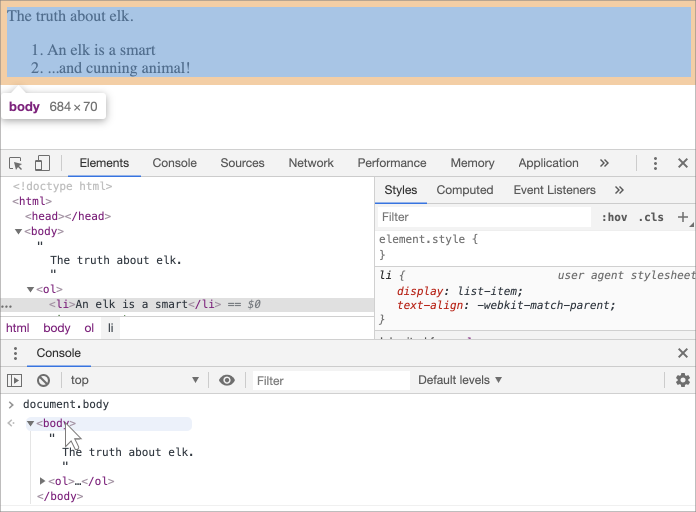

libs:
  - d3
  - domtree

---

# DOM ツリー

HTMLドキュメントのバックボーンはタグです。

<<<<<<< HEAD
ドキュメントオブジェクトモデル(DOM)によれば、すべてのHTMLタグはオブジェクトです。入れ子のタグはそれを囲った "子" と呼ばれます。タグの内側のテキストも同様にオブジェクトです。

これらすべてのオブジェクトは JavaScript でアクセス可能であり、これらを使用してページが変更できます。

例えば、`document.body` は `<body>` タグを表すオブジェクトです。

以下のコードを実行すると、3秒間 `<body>` が赤になります:

```js run
document.body.style.background = 'red'; // 背景を赤に変更

setTimeout(() => document.body.style.background = '', 3000); // 戻します
```

ここでは、`document.body` の背景色を変更するのに、`style.background` を使用していますが、以下のようにたに多くのプロパティがあります:

- `innerHTML` -- ノードの HTML コンテンツ
- `offsetWidth` -- ノードの幅(ピクセル)
- など

後ほど、DOMを操作するより多くの方法を学んでいきますが、最初に知っておく必要があるのは、その構造です。

## DOM の例 

例えば、このドキュメントに対する DOM を調べてみましょう:
=======
According to the Document Object Model (DOM), every HTML tag is an object. Nested tags are  "children" of the enclosing one. The text inside a tag is an object as well.

All these objects are accessible using JavaScript, and we can use them to modify the page.

For example, `document.body` is the object representing the `<body>` tag.

Running this code will make the `<body>` red for 3 seconds:

```js run
document.body.style.background = 'red'; // make the background red

setTimeout(() => document.body.style.background = '', 3000); // return back
```

Here we used `style.background` to change the background color of `document.body`, but there are many other properties, such as:

- `innerHTML` -- HTML contents of the node.
- `offsetWidth` -- the node width (in pixels)
- ...and so on.

Soon we'll learn more ways to manipulate the DOM, but first we need to know about its structure.

## An example of the DOM

Let's start with the following simple document:
>>>>>>> ea7738bb7c3616bb51ff14ae3db2a2747d7888ff

```html run no-beautify
<!DOCTYPE HTML>
<html>
<head>
  <title>About elk</title>
</head>
<body>
  The truth about elk.
</body>
</html>
```

DOM は HTMLをタグのツリー構造として表現します。それはこのように見えます:

<div class="domtree"></div>

<script>
let node1 = {"name":"HTML","nodeType":1,"children":[{"name":"HEAD","nodeType":1,"children":[{"name":"#text","nodeType":3,"content":"\n  "},{"name":"TITLE","nodeType":1,"children":[{"name":"#text","nodeType":3,"content":"About elk"}]},{"name":"#text","nodeType":3,"content":"\n"}]},{"name":"#text","nodeType":3,"content":"\n"},{"name":"BODY","nodeType":1,"children":[{"name":"#text","nodeType":3,"content":"\n  The truth about elk.\n"}]}]}

drawHtmlTree(node1, 'div.domtree', 690, 320);
</script>

```online
上の図では、要素をクリックすることで子要素を開閉できます。
```

<<<<<<< HEAD
すべてのツリーノードはオブジェクトです。
=======
Every tree node is an object.

Tags are *element nodes* (or just elements) and form the tree structure: `<html>` is at the root, then `<head>` and `<body>` are its children, etc.
>>>>>>> ea7738bb7c3616bb51ff14ae3db2a2747d7888ff

タグは *"要素ノード"* (もしくは単に要素) と呼ばれ、ツリー構造を形成します: `<html>` がルートで、`<head>`, `<body>` がその子、と言った構造です。

<<<<<<< HEAD
要素内のテキストは *テキストノード* を形成し、 `#text` とラベル付けされます。テキストノードは文字列だけを含み、子を持たず、常にツリーの葉になります。
=======
For instance, the `<title>` tag has the text `"About elk"`.
>>>>>>> ea7738bb7c3616bb51ff14ae3db2a2747d7888ff

例えば、`<title>` タグはテキスト `"About elks"` を持っています。

テキストノード中の特別な文字に注意してください:

<<<<<<< HEAD
- 改行: `↵` (JavaScript では `\n` として知られています)
- スペース: `␣`

スペースと改行は文字や数字と同様、完全に有効な文字です。これらはテキストノードを形成し、DOMの一部になります。従って、例えば、上の例では `<head>` タグは `<title>` の前にいくつかのスペースを含まれており、そのテキストは `#text` ノードになります(改行といくつかのスペースのみが含まれています)。

そこには2つだけ、トップレベルの除外があります:
1. `<head>` の前のスペースと改行は歴史的な理由から無視されます。
2. HTMLスペックではすべてのコンテンツが `<body>` の内側でなければならないため、`</body>` の後に何かをおいた場合、最後にそれらは自動的に `body` の中に移動されます。従って、`</body>` の後にスペースはないことがあります。
=======
Spaces and newlines are totally valid characters, like letters and digits. They form text nodes and become a part of the DOM. So, for instance, in the example above the `<head>` tag contains some spaces before `<title>`, and that text becomes a `#text` node (it contains a newline and some spaces only).

There are only two top-level exclusions:
1. Spaces and newlines before `<head>` are ignored for historical reasons.
2. If we put something after `</body>`, then that is automatically moved inside the `body`, at the end, as the HTML spec requires that all content must be inside `<body>`. So there can't be any spaces after `</body>`.

In other cases everything's straightforward -- if there are spaces (just like any character) in the document, then they become text nodes in the DOM, and if we remove them, then there won't be any.
>>>>>>> ea7738bb7c3616bb51ff14ae3db2a2747d7888ff

その他のケースはすべてが明快で、ドキュメント内にスペース（単に任意の文字のように）があれば、それらはDOMのテキストノードになります。もしそれらを削除すれば、何も存在しません。

これはスペースがないテキストノードです:

```html no-beautify
<!DOCTYPE HTML>
<html><head><title>About elk</title></head><body>The truth about elk.</body></html>
```

<div class="domtree"></div>

<script>
let node2 = {"name":"HTML","nodeType":1,"children":[{"name":"HEAD","nodeType":1,"children":[{"name":"TITLE","nodeType":1,"children":[{"name":"#text","nodeType":3,"content":"About elk"}]}]},{"name":"BODY","nodeType":1,"children":[{"name":"#text","nodeType":3,"content":"The truth about elk."}]}]}

drawHtmlTree(node2, 'div.domtree', 690, 210);
</script>

<<<<<<< HEAD
```smart header="端のスペースとその間にある空のテキストは、通常はツール内に隠されています"
DOMを使って動作するブラウザツール（この後説明します）は、通常、テキストの最初/最後のスペースを表示せず、またタグ間に空のテキストノード（改行）も表示しません。

これは、主にHTMLを装飾するために使用され、どのように表示されるかに（ほとんどの場合）影響を与えないからです。

さらにDOMの図では、物事を短く保つために、それらが無関係な場所で省略することがあります。
```

## 自動補正 

ブラウザが不正な形式のHTMLに遭遇した場合、DOM作成時に自動補正します。

例えば、トップのタグは常に `<html>` です。ブラウザは `<html>` を作成するので、たとえドキュメントの中になくても、DOMの中に存在することになります。`<body>` についても同じです。

例として、もしHTMLファイルが `"Hello"` という言葉のみだった場合、ブラウザはそれを `<html>` と `<body>` でラップし、必須の `<head>` を追加し、DOMは次のようになります:
=======
```smart header="Spaces at string start/end and space-only text nodes are usually hidden in tools"
Browser tools (to be covered soon) that work with DOM usually do not show spaces at the start/end of the text and empty text nodes (line-breaks) between tags.

Developer tools save screen space this way.

On further DOM pictures we'll sometimes omit them when they are irrelevant. Such spaces usually do not affect how the document is displayed.
```

## Autocorrection

If the browser encounters malformed HTML, it automatically corrects it when making the DOM.

For instance, the top tag is always `<html>`. Even if it doesn't exist in the document, it will exist in the DOM, because the browser will create it. The same goes for `<body>`.

As an example, if the HTML file is the single word `"Hello"`, the browser will wrap it into `<html>` and `<body>`, and add the required `<head>`, and the DOM will be:
>>>>>>> ea7738bb7c3616bb51ff14ae3db2a2747d7888ff


<div class="domtree"></div>

<script>
let node3 = {"name":"HTML","nodeType":1,"children":[{"name":"HEAD","nodeType":1,"children":[]},{"name":"BODY","nodeType":1,"children":[{"name":"#text","nodeType":3,"content":"Hello"}]}]}

drawHtmlTree(node3, 'div.domtree', 690, 150);
</script>

<<<<<<< HEAD
DOMを生成している間、ブラウザは自動的にドキュメント内のエラーを処理しタグを閉じます。

このような "無効な" ドキュメントの場合:
=======
While generating the DOM, browsers automatically process errors in the document, close tags and so on.

A document with unclosed tags:
>>>>>>> ea7738bb7c3616bb51ff14ae3db2a2747d7888ff

```html no-beautify
<p>Hello
<li>Mom
<li>and
<li>Dad
```

<<<<<<< HEAD
...も、ブラウザはタグを読みかけた部分を復元し、通常のDOMになります。:
=======
...will become a normal DOM as the browser reads tags and restores the missing parts:
>>>>>>> ea7738bb7c3616bb51ff14ae3db2a2747d7888ff

<div class="domtree"></div>

<script>
let node4 = {"name":"HTML","nodeType":1,"children":[{"name":"HEAD","nodeType":1,"children":[]},{"name":"BODY","nodeType":1,"children":[{"name":"P","nodeType":1,"children":[{"name":"#text","nodeType":3,"content":"Hello"}]},{"name":"LI","nodeType":1,"children":[{"name":"#text","nodeType":3,"content":"Mom"}]},{"name":"LI","nodeType":1,"children":[{"name":"#text","nodeType":3,"content":"and"}]},{"name":"LI","nodeType":1,"children":[{"name":"#text","nodeType":3,"content":"Dad"}]}]}]}

drawHtmlTree(node4, 'div.domtree', 690, 360);
</script>

<<<<<<< HEAD
````warn header="Tables は常に `<tbody>` を持ちます"
興味深い "特別なケース はテーブルです。DOM仕様によると、テーブルは `<tbody>` をもたなければなりませんが、HTMLテキストでは(公式に)それを省略することができます。そしてブラウザは DOM の中に自動的に `<tbody>` を生成します。
=======
````warn header="Tables always have `<tbody>`"
An interesting "special case" is tables. By DOM specification they must have `<tbody>` tag, but HTML text may omit it. Then the browser creates `<tbody>` in the DOM automatically.
>>>>>>> ea7738bb7c3616bb51ff14ae3db2a2747d7888ff

次のHTML:

```html no-beautify
<table id="table"><tr><td>1</td></tr></table>
```

DOM構造は次のようになります:
<div class="domtree"></div>

<script>
let node5 = {"name":"TABLE","nodeType":1,"children":[{"name":"TBODY","nodeType":1,"children":[{"name":"TR","nodeType":1,"children":[{"name":"TD","nodeType":1,"children":[{"name":"#text","nodeType":3,"content":"1"}]}]}]}]};

drawHtmlTree(node5,  'div.domtree', 600, 200);
</script>

<<<<<<< HEAD
分かりますか？ `<tbody>` はどこにも出現していません。このような驚きを避けるため、テーブルを使用する際は心に留めておくべきです。
=======
You see? The `<tbody>` appeared out of nowhere. We should keep this in mind while working with tables to avoid surprises.
>>>>>>> ea7738bb7c3616bb51ff14ae3db2a2747d7888ff
````

## 他の種類のノード 

要素とテキストノード以外にも、他の種類のノードがあります。

<<<<<<< HEAD
例えば、コメントです。
=======
There are some other node types besides elements and text nodes.

For example, comments:
>>>>>>> ea7738bb7c3616bb51ff14ae3db2a2747d7888ff

```html
<!DOCTYPE HTML>
<html>
<body>
  The truth about elk.
  <ol>
    <li>An elk is a smart</li>
*!*
    <!-- comment -->
*/!*
    <li>...and cunning animal!</li>
  </ol>
</body>
</html>
```

<div class="domtree"></div>

<script>
let node6 = {"name":"HTML","nodeType":1,"children":[{"name":"HEAD","nodeType":1,"children":[]},{"name":"BODY","nodeType":1,"children":[{"name":"#text","nodeType":3,"content":"\n  The truth about elk.\n  "},{"name":"OL","nodeType":1,"children":[{"name":"#text","nodeType":3,"content":"\n    "},{"name":"LI","nodeType":1,"children":[{"name":"#text","nodeType":3,"content":"An elk is a smart"}]},{"name":"#text","nodeType":3,"content":"\n    "},{"name":"#comment","nodeType":8,"content":"comment"},{"name":"#text","nodeType":3,"content":"\n    "},{"name":"LI","nodeType":1,"children":[{"name":"#text","nodeType":3,"content":"...and cunning animal!"}]},{"name":"#text","nodeType":3,"content":"\n  "}]},{"name":"#text","nodeType":3,"content":"\n\n\n"}]}]};

drawHtmlTree(node6, 'div.domtree', 690, 500);
</script>

<<<<<<< HEAD
ここでは新しい種類のツリーノードが見えます -- `#comment` とラベル付された *comment node(コメントノード)* です。

こう思うかもしれません -- なぜコメントが DOM に追加されるのでしょう？ コメントは視覚的表現には影響しません。が、ルールがあります。HTMLに何かがある場合は、DOMツリーにもなければなりません。

**HTML上のすべて、たとえコメントでも DOM の一部になります。**

HTMLの冒頭にある `<!DOCTYPE...>` ディレクティブでさえ DOM ノードです。`<html>`の直前のDOMツリーにあります。 そのノードに触れるつもりはないので図に描画していませんが、実際にはあります。
=======
We can see here a new tree node type -- *comment node*, labeled as `#comment`, between two text nodes.

We may think -- why is a comment added to the DOM? It doesn't affect the visual representation in any way. But there's a rule -- if something's in HTML, then it also must be in the DOM tree.

**Everything in HTML, even comments, becomes a part of the DOM.**

Even the `<!DOCTYPE...>` directive at the very beginning of HTML is also a DOM node. It's in the DOM tree right before `<html>`. Few people know about that. We are not going to touch that node, we even don't draw it on diagrams, but it's there.
>>>>>>> ea7738bb7c3616bb51ff14ae3db2a2747d7888ff

ドキュメント全体を表現する `document` オブジェクトは、正式には DOM ノードでもあります。

[12のノードタイプ](https://dom.spec.whatwg.org/#node)があります。実際には、通常それらのうち4つを使います: 

<<<<<<< HEAD
1. `document` -- DOM に入る "エントリーポイント"
2. 要素ノード -- HTMLタグ, ツリーのビルディングブロック
3. テキストノード -- テキストを含む
4. コメント -- 必要に応じて情報をおくことができ、これは表示されません。が JS はDOMからそれを読むことができます。

## 実際に見てみてください 

実際にDOM構造を見るために、[Live DOM Viewer](http://software.hixie.ch/utilities/js/live-dom-viewer/) にトライしてみましょう。ドキュメントに入力するだけで、すぐに DOM が表示されます。

また、DOM を調べる別の方法は、ブラウザの開発者ツールを使うことです。実際、開発するときに使います。

これをするには、web ページ [elks.html](elks.html) を開き、ブラウザ開発者ツールを開き、Elements タブに切り替えます。

このようになるはずです:


=======
1. `document` -- the "entry point" into DOM.
2. element nodes -- HTML-tags, the tree building blocks.
3. text nodes -- contain text.
4. comments -- sometimes we can put information there, it won't be shown, but JS can read it from the DOM.

## See it for yourself

To see the DOM structure in real-time, try [Live DOM Viewer](https://software.hixie.ch/utilities/js/live-dom-viewer/). Just type in the document, and it will show up as a DOM at an instant.

Another way to explore the DOM is to use the browser developer tools. Actually, that's what we use when developing.

To do so, open the web page [elk.html](elk.html), turn on the browser developer tools and switch to the Elements tab.

It should look like this:


>>>>>>> ea7738bb7c3616bb51ff14ae3db2a2747d7888ff

DOMを見ることができます、要素をクリックしその詳細をみたりすることができます。

<<<<<<< HEAD
開発者ツール上のDOM構造は簡略化されていることに注意してください。テキストノードは単にテキストとして表示されます。また、"空の" (スペースだけの) テキストノードはまったくありません。ほとんどの場合、要素のノードに興味があるのでそれは問題ありません。

左上隅の <span class="devtools" style="background-position:-328px -124px"></span> ボタンをクリックすると、マウス（または他のポインターデバイス）を使用してWebページからノードを選択できます。 それを "検査"します（Elements(要素) タブでスクロールします）。 巨大なHTMLページがあり、その中の特定の場所のDOMを見たいときに使用します。
=======
Please note that the DOM structure in developer tools is simplified. Text nodes are shown just as text. And there are no "blank" (space only) text nodes at all. That's fine, because most of the time we are interested in element nodes.

Clicking the <span class="devtools" style="background-position:-328px -124px"></span> button in the left-upper corner allows us to choose a node from the webpage using a mouse (or other pointer devices) and "inspect" it (scroll to it in the Elements tab). This works great when we have a huge HTML page (and corresponding huge DOM) and would like to see the place of a particular element in it.
>>>>>>> ea7738bb7c3616bb51ff14ae3db2a2747d7888ff

これを行う別の方法は、web ページ上で単に右クリックをして、コンテキストメニュー上で "Inspect(検査)" を選択することです。


<<<<<<< HEAD
ツールの右側には、次のようなサブのタブがあります:
- **Styles** - 組み込みルール（灰色）を含めて、ルール別に現在の要素ルールにCSSが適用されていることがわかります。 ほとんどすべては、下のボックスの大きさ/マージン/パディングを含めて編集できます。
- **Computed** - プロパティによって要素に適用されたCSSを表示する：各プロパティに対して、それを与える規則（CSSの継承などを含む）を見ることができます。
- **Event Listeners** - DOM要素に関連付けられたイベントリスナーを表示します（チュートリアルの次の部分で説明します）。
- ...など

これらを学ぶベストな方法は、クリックして回ることです。ほとんどの値はその場で変更可能です。

## コンソールでのインタラクション 
=======
At the right part of the tools there are the following subtabs:
- **Styles** -- we can see CSS applied to the current element rule by rule, including built-in rules (gray). Almost everything can be edited in-place, including the dimensions/margins/paddings of the box below.
- **Computed** -- to see CSS applied to the element by property: for each property we can see a rule that gives it (including CSS inheritance and such).
- **Event Listeners** -- to see event listeners attached to DOM elements (we'll cover them in the next part of the tutorial).
- ...and so on.

The best way to study them is to click around. Most values are editable in-place.
>>>>>>> ea7738bb7c3616bb51ff14ae3db2a2747d7888ff

DOM を調べるにつれて、DOMをに対して JavaScript を適用したいことがあります。例えば、ノードを取得して修正するコードを実行し、その結果を確認る、です。 ここでは、Elementsタブとコンソールの間を移動する tips をいくつか紹介します。

<<<<<<< HEAD
まず最初に:

1. Elements タブで最初の `<li>` を選択します。
2. `key:Esc` を押します。Elements タブのすぐ下にコンソールが開きます。
=======
As we work the DOM, we also may want to apply JavaScript to it. Like: get a node and run some code to modify it, to see the result. Here are few tips to travel between the Elements tab and the console.

For the start:

1. Select the first `<li>` in the Elements tab.
2. Press `key:Esc` -- it will open console right below the Elements tab.
>>>>>>> ea7738bb7c3616bb51ff14ae3db2a2747d7888ff

これで、最後に選択した要素は `$0` として利用可能で、以前に選択したものは `$1` です。

コンソールでコマンドが実行できます。例えば、`$0.style.background = 'red'` は選択されているリストアイテムを赤にします、このように:


That's how to get a node from Elements in Console.

<<<<<<< HEAD
これがコンソールで、要素からノードを取得する方法です。

逆もあります。DOMノードを参照している変数がある場合、`inspect(node)` コマンドを実行すると、Elements ペインで表示させることができます。

もしくは単にそれをコンソールに出力し、"その場" で調べることができます。したの `document.body` のように:
=======
There's also a road back. If there's a variable referencing a DOM node, then we can use the command `inspect(node)` in Console to see it in the Elements pane.

Or we can just output the DOM node in the console and explore "in-place", like `document.body` below:
>>>>>>> ea7738bb7c3616bb51ff14ae3db2a2747d7888ff



これはもちろんデバッグ目的のためです。次の章からはJavaScriptを使ってDOMにアクセスしたり修正したりします。

<<<<<<< HEAD
ブラウザの開発者ツールは、開発で大いに役立ちます: DOMを調べたり、何かを試みたり何が間違っているかを見たり。
=======
The browser developer tools are a great help in development: we can explore the DOM, try things and see what goes wrong.
>>>>>>> ea7738bb7c3616bb51ff14ae3db2a2747d7888ff

## サマリ 

HTML/XML ドキュメントはブラウザ内では DOM ツリーとして表現されます。

- タグは要素ノードになり、構造を形成します。
- テキストはテキストノードになります。
- ...等、HTML上のすべては DOM にも存在します。たとえコメントでも。

手動でDOMを検査したり修正するのに、開発者ツールが使えます。

<<<<<<< HEAD
ここでは、基本と、最もよく使われている重要なアクションについて説明しました。 Chrome開発者ツールに関する詳細なドキュメントは、<https://developers.google.com/web/tools/chrome-devtools> にあります。 ツールを学ぶ最も良い方法は、ここをクリックしてメニューを読むことです: ほとんどのオプションは明白です。 

DOMノードには、ノード間の移動やノードの変更、ページの遷移と言ったことを可能とするるプロパティとメソッドがあります。 次の章でそれらを見ていきましょう。
=======
Here we covered the basics, the most used and important actions to start with. There's an extensive documentation about Chrome Developer Tools at <https://developers.google.com/web/tools/chrome-devtools>. The best way to learn the tools is to click here and there, read menus: most options are obvious. Later, when you know them in general, read the docs and pick up the rest.

DOM nodes have properties and methods that allow us to travel between them, modify them, move around the page, and more. We'll get down to them in the next chapters.
>>>>>>> ea7738bb7c3616bb51ff14ae3db2a2747d7888ff
