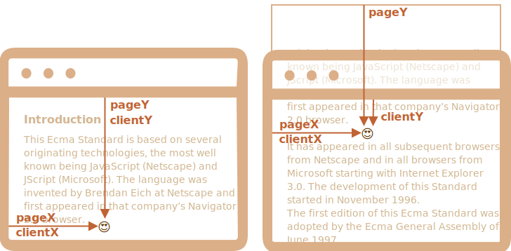

# 座標

要素を移動させるには、座標についてよく知っている必要があります。

ほとんどの JavaScript メソッドは２つの座標系のいずれかを扱います:

<<<<<<< HEAD
1. ウィンドウ(もしくは別のビューポート)の 上/左 を基準にします
2. ドキュメントの 上/左 を基準とします

違いを理解し、どのタイプがどこにあるかを理解することは重要です。
=======
1. **Relative to the window** - similar to `position:fixed`, calculated from the window top/left edge.
    - we'll denote these coordinates as `clientX/clientY`, the reasoning for such name will become clear later, when we study event properties.
2. **Relative to the document** - similar to `position:absolute` in the document root, calculated from the document top/left edge.
    - we'll denote them `pageX/pageY`.

When the page is scrolled to the very beginning, so that the top/left corner of the window is exactly the document top/left corner, these coordinates equal each other. But after the document shifts, window-relative coordinates of elements change, as elements move across the window, while document-relative coordinates remain the same.
>>>>>>> ea7738bb7c3616bb51ff14ae3db2a2747d7888ff

On this picture we take a point in the document and demonstrate its coordinates before the scroll (left) and after it (right):

<<<<<<< HEAD
## ウィンドウ座標: getBoundingClientRect 

ウィンドウ座標はウィンドウの左上端から始まります。

メソッド `elem.getBoundingClientRect()` はプロパティを持つオブジェクトとして `elem` に対するウィンドウ座標を返します。:

- `top` -- 要素の上端の Y-座標,
- `left` -- 要素の左端の X-座標,
- `right` -- 要素の右端の X-座標,
- `bottom` -- 要素の下端の Y-座標.

このようになります:
=======


When the document scrolled:
- `pageY` - document-relative coordinate stayed the same, it's counted from the document top (now scrolled out).
- `clientY` - window-relative coordinate did change (the arrow became shorter), as the same point became closer to window top.

## Element coordinates: getBoundingClientRect

The method `elem.getBoundingClientRect()` returns window coordinates for a minimal rectangle that encloses `elem` as an object of built-in [DOMRect](https://www.w3.org/TR/geometry-1/#domrect) class.

Main `DOMRect` properties:
>>>>>>> ea7738bb7c3616bb51ff14ae3db2a2747d7888ff

- `x/y` -- X/Y-coordinates of the rectangle origin relative to window,
- `width/height` -- width/height of the rectangle (can be negative).

Additionally, there are derived properties:

<<<<<<< HEAD
ウィンドウ座標はドキュメントのスクロールアウト部分を考慮せず、ウィンドウの左上端から計算されたものになります。

言い換えると、ページをスクロールするとき、要素は上下に移動し、*そのウィンドウ座標は変わります*。これはとても重要です。


```online
ボタンをクリックしてウィンドウ座標を見てみてください:

<input id="brTest" type="button" value="このボタンの  button.getBoundingClientRect() を表示する" onclick='showRect(this)'/>
=======
- `top/bottom` -- Y-coordinate for the top/bottom rectangle edge,
- `left/right` -- X-coordinate for the left/right rectangle edge.

```online
For instance click this button to see its window coordinates:

<p><input id="brTest" type="button" value="Get coordinates using button.getBoundingClientRect() for this button" onclick='showRect(this)'/></p>
>>>>>>> ea7738bb7c3616bb51ff14ae3db2a2747d7888ff

<script>
function showRect(elem) {
  let r = elem.getBoundingClientRect();
  alert(`x:${r.x}
y:${r.y}
width:${r.width}
height:${r.height}
top:${r.top}
bottom:${r.bottom}
left:${r.left}
right:${r.right}
`);
}
</script>

<<<<<<< HEAD
もしページをスクロールすると、ボタン位置は代わり、ウィンドウ座標も同様に変わります。
```

また:

- 座標は小数の場合があります。それは正常で、内部的にはブラウザは計算のためにそれを使用します。私たちは `style.position.left/top` へ設定するときにそれらを丸める必要はありません。ブラウザで小数は問題ありません。
- 座標は負の値になる場合があります。例えば、ページが下にスクロールされ、`elem` の上端がウィンドウの上にある場合、`elem.getBoundingClientRect().top` は負の値になります。
- Chromeような一部のブラウザでは、結果 `getBoundingClientRect` にプロパティ `width` と `height` も追加します。減算することでもそれらを取得することは可能です: `height=bottom-top`, `width=right-left`。

```warn header="座標 右/下 は CSS プロパティとは異なります"
ウィンドウ座標と CSSの配置を比較すると、`position:fixed` との明らかな類似点があります -- ビューポートを基準とした位置も同じです。

しかし、CSS では `right` プロパティは右端からの距離を意味し、`bottom` は -- 下端からの距離です。

上の図を見た時、JavaScriptではそうでないことが分かります。すべてのウィンドウ座標は左上隅から数えられます。
=======
If you scroll the page and repeat, you'll notice that as window-relative button position changes, its window coordinates (`y/top/bottom` if you scroll vertically) change as well.
```

Here's the picture of `elem.getBoundingClientRect()` output:


As you can see, `x/y` and `width/height` fully describe the rectangle. Derived properties can be easily calculated from them:

- `left = x`
- `top = y`
- `right = x + width`
- `bottom = y + height`

Please note:

- Coordinates may be decimal fractions, such as `10.5`. That's normal, internally browser uses fractions in calculations. We don't have to round them when setting to `style.left/top`.
- Coordinates may be negative. For instance, if the page is scrolled so that `elem` is now above the window, then `elem.getBoundingClientRect().top` is negative.

```smart header="Why derived properties are needed? Why does `top/left` exist if there's `x/y`?"
Mathematically, a rectangle is uniquely defined with its starting point `(x,y)` and the direction vector `(width,height)`. So the additional derived properties are for convenience.

Technically it's possible for `width/height` to be negative, that allows for "directed" rectangle, e.g. to represent mouse selection with properly marked start and end.

Negative `width/height` values mean that the rectangle starts at its bottom-right corner and then "grows" left-upwards.

Here's a rectangle with negative `width` and `height` (e.g. `width=-200`, `height=-100`):


As you can see, `left/top` do not equal `x/y` in such case.

In practice though, `elem.getBoundingClientRect()` always returns positive width/height, here we mention negative `width/height` only for you to understand why these seemingly duplicate properties are not actually duplicates.
```

```warn header="Internet Explorer: no support for `x/y`"
Internet Explorer doesn't support `x/y` properties for historical reasons.

So we can either make a polyfill (add getters in `DomRect.prototype`) or just use `top/left`, as they are always the same as `x/y` for positive `width/height`, in particular in the result of `elem.getBoundingClientRect()`.
```

```warn header="Coordinates right/bottom are different from CSS position properties"
There are obvious similarities between window-relative coordinates and CSS `position:fixed`.

But in CSS positioning, `right` property means the distance from the right edge, and `bottom` property means the distance from the bottom edge.

If we just look at the picture above, we can see that in JavaScript it is not so. All window coordinates are counted from the top-left corner, including these ones.
>>>>>>> ea7738bb7c3616bb51ff14ae3db2a2747d7888ff
```

## elementFromPoint(x, y) 

`document.elementFromPoint(x, y)` の呼び出しは、ウィンドウ座標 `(x, y)` で最もネストされた要素を返します。

構文は次の通りです:

```js
let elem = document.elementFromPoint(x, y);
```

例えば、下のコードは今ウィンドウの中央にある要素のタグを強調表示し、出力します。:

```js run
let centerX = document.documentElement.clientWidth / 2;
let centerY = document.documentElement.clientHeight / 2;

let elem = document.elementFromPoint(centerX, centerY);

elem.style.background = "red";
alert(elem.tagName);
```

ウィンドウ座標を使うので、要素は現在のスクロール位置に応じて異なります。

````warn header="ウィンドウ外の座標の場合、`elementFromPoint` は `null` を返します。"
メソッド `document.elementFromPoint(x,y)` は `(x,y)` が可視領域にある場合にのみ動作します。

もしある座標が負の値またはウィンドウの幅/高さを超えている場合、`null` を返します。

<<<<<<< HEAD
ほとんどの場合、このような振る舞いは問題ではありませんが、それを心に留めておく必要があります。

これは、それをチェックしない場合に発生する可能性のある典型的なエラーです:
=======
Here's a typical error that may occur if we don't check for it:
>>>>>>> ea7738bb7c3616bb51ff14ae3db2a2747d7888ff

```js
let elem = document.elementFromPoint(x, y);
// 座標がウィンドウ外の場合、elem = null
*!*
elem.style.background = ''; // エラー!
*/!*
```
````

<<<<<<< HEAD
## position:fixed を用いる 

多くの場合、何かを配置するために座標を必要とします。CSS ではビューポートを基準として要素を配置するために、`left/top` (または `right/bottom`) と一緒に `position:fixed` を使います。

私たちは、`getBoundingClientRect` を使って要素の座標を取得し、その近くに何かを表示することができます。
=======
## Using for "fixed" positioning

Most of time we need coordinates in order to position something.

To show something near an element, we can use `getBoundingClientRect` to get its coordinates, and then CSS `position` together with `left/top` (or `right/bottom`).
>>>>>>> ea7738bb7c3616bb51ff14ae3db2a2747d7888ff

例えば、下の関数 `createMessageUnder(elem, html)` は `elem` の下にメッセージを表示します。:

```js
let elem = document.getElementById("coords-show-mark");

function createMessageUnder(elem, html) {
  // メッセージ要素の作成
  let message = document.createElement('div');
  // ここでは、スタイルにCSSクラスを使う方が良いです
  message.style.cssText = "position:fixed; color: red";

*!*
  // 座標の設定, "px" を忘れないこと!
  let coords = elem.getBoundingClientRect();

  message.style.left = coords.left + "px";
  message.style.top = coords.bottom + "px";
*/!*

  message.innerHTML = html;

  return message;
}

// 使用例:
// ドキュメント上に５秒間追加します
let message = createMessageUnder(elem, 'Hello, world!');
document.body.append(message);
setTimeout(() => message.remove(), 5000);
```

```online
実行するにはボタンをクリックしてください:

<button id="coords-show-mark">id="coords-show-mark" のボタン, この下にメッセージが現れます</button>
```

このコードを変更して、メッセージを左、右、下に表示したり、"フェードイン" するための CSS アニメーションを適用することができます。私たちは要素のすべての座標とサイズを知っているので簡単にできます。

しかし、重要な点に注意してください: ページがスクロールされたとき、メッセージはボタンから離れていきます。

理由は明らかです: メッセージ要素は `position:fixed` に依存しているので、ページがスクロールしている間、ウィンドウの同じ場所にい続けます。

変更するためには、ドキュメントベースの座標を使い、`position:absolute` を使う必要があります。

<<<<<<< HEAD
## ドキュメント座標 

ドキュメント相対座標は、ウィンドウではなくドキュメントの左上端から始めます。
=======
## Document coordinates [#getCoords]

Document-relative coordinates start from the upper-left corner of the document, not the window.
>>>>>>> ea7738bb7c3616bb51ff14ae3db2a2747d7888ff

CSS では、ウィンドウ座標は `position:fixed` に対応する一方、ドキュメント座標は `position:absolute` に似ています。

`position:absolute` と `top/left` を使うことで、ドキュメント上の特定の場所に何かを置くことができます。なので、ページのスクロール時にそこに残ることができます。しかし、最初に正しい座標が必要です。

<<<<<<< HEAD
分かりやすくするために、ウィンドウ座標 `(clientX,clientY)` とドキュメント座標 `(pageX,pageY)` を呼び出します。

ページがスクロールされていないとき、ウィンドウ座標とドキュメント座標はまったく同じです。それらのゼロの点も一致します:


そして、スクロールをすると、`(clientX,clientY)` が変わります。なぜなら、それらはウィンドウに相対的なためです。しかし、`(pageX,pageY)` は同じままです。

これは縦スクロール後の同じページです:


- 要素は今ウィンドウの上部にあるので、ヘッダー `"From today's featured article"` の `clientY` は `0` になりました。
- 水平スクロールをしなかったため、`clientX` は変わりませんでした。
- 要素の `pageX` と `pageY` 座標は依然として同じです。なぜなら、それらはドキュメントに相対的だからです。

## ドキュメント座標の取得 

要素のドキュメント座標を取得するための標準メソッドはありません。しかし、簡単に書けます。
=======
There's no standard method to get the document coordinates of an element. But it's easy to write it.
>>>>>>> ea7738bb7c3616bb51ff14ae3db2a2747d7888ff

２つの座標系は次の式で繋がれます:
- `pageY` = `clientY` + ドキュメントのスクロールアウトした垂直部分の高さ
- `pageX` = `clientX` + ドキュメントのスクロールアウトした水平部分の幅

関数 `getCoords(elem)` は `elem.getBoundingClientRect()` からウィンドウ座標を取り、それらに現在のスクロールを加えます。:

```js
// 要素のドキュメント座標を取得
function getCoords(elem) {
  let box = elem.getBoundingClientRect();

  return {
    top: box.top + window.pageYOffset,
    right: box.right + window.pageXOffset,
    bottom: box.bottom + window.pageYOffset,
    left: box.left + window.pageXOffset
  };
}
```

<<<<<<< HEAD
## サマリ 
=======
If in the example above we used it with `position:absolute`, then the message would stay near the element on scroll.

The modified `createMessageUnder` function:

```js
function createMessageUnder(elem, html) {
  let message = document.createElement('div');
  message.style.cssText = "*!*position:absolute*/!*; color: red";

  let coords = *!*getCoords(elem);*/!*

  message.style.left = coords.left + "px";
  message.style.top = coords.bottom + "px";

  message.innerHTML = html;

  return message;
}
```

## Summary
>>>>>>> ea7738bb7c3616bb51ff14ae3db2a2747d7888ff

ページ上に任意の点は座標を持っています:

1. ウィンドウに相対的 -- `elem.getBoundingClientRect()`
2. ドキュメントに相対的 -- `elem.getBoundingClientRect()` + 現在のページスクロール

ウィンドウ座標は `position:fixed` と一緒に使用するのが賢明で、ドキュメント座標は `position:absolute` と上手くやります。

<<<<<<< HEAD
どちらの座標系も "長所" と "短所" を持っており、CSS の `position` `absolute` と `fixed` のように、どちらか一方が必要なときがあります。
=======
Both coordinate systems have their pros and cons; there are times we need one or the other one, just like CSS `position` `absolute` and `fixed`.
>>>>>>> ea7738bb7c3616bb51ff14ae3db2a2747d7888ff
