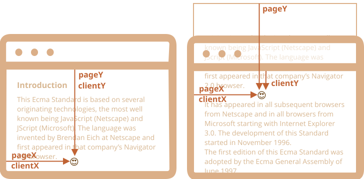
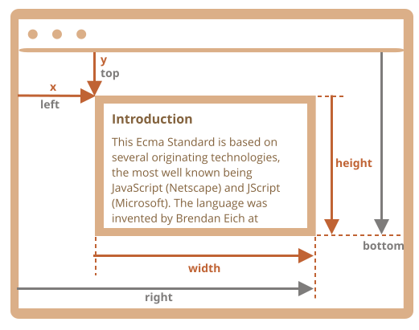
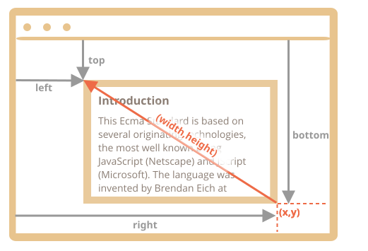

# 座標

要素を移動させるためには、座標系の仕組みを理解しておく必要があります。

ほとんどの JavaScript メソッドは２つの座標系のいずれかを扱います:

1. **ウィンドウ相対座標** - `position:fixed`と同様で、ウィンドウの上端/左端を基準として計算されます。
    - これらの座標は`clientX/clientY`と表記します。このような名前の理由については、イベントプロパティについて学習する際に明らかになります。
2. **ドキュメント座標** - ドキュメントルートにおける`position:absolute`と同様で、ドキュメントの上端/左端を基準として計算されます。
    - これらの座標は`pageX/pageY`と表記します。

ページを一番最初までスクロールして、ウィンドウの左上端がドキュメントの左上端と完全に一致した状態であれば、これらの座標は互いに等しくなります。しかし、ドキュメントがスクロールされると、要素がウィンドウ内を移動するため、要素のウィンドウ相対座標は変化しますが、ドキュメント相対座標は変わりません。

この画像では、ドキュメント内の特定の一点を、スクロール前（左）とスクロール後（右）の座標で示しています。



ドキュメントがスクロールされた場合：
- `pageY` – ドキュメント相対座標は変化しません。これはドキュメントの最上部（すでにスクロールアウトした部分）を基準に数えられています。
- `clientY` – ウィンドウ相対座標は変化します（矢印が短くなっています）。同じ点がウィンドウの最上部に近づいたためです。

## 要素の座標取得: `getBoundingClientRect()`

`elem.getBoundingClientRect()`メソッドは、`elem`を囲った最小の長方形のウィンドウ座標を、組み込みの [DOMRect](https://www.w3.org/TR/geometry-1/#domrect) クラスのオブジェクトとして返します。

`DOMRect`の主要なプロパティ：

- `x/y` -- ウィンドウに対する、長方形の原点のX/Y座標。
- `width/height` -- 長方形の幅/高さ（負の値も可）。

さらに、派生したプロパティもあります：

- `top/bottom` -- 長方形の上端/下端のY座標。
- `left/right` -- 長方形の左端/右端のX座標。

```online
例えば、このボタンをクリックして、そのウィンドウ座標を見てください。

<p><input id="brTest" type="button" style="max-width: 90vw;" value="このボタンからbutton.getBoundingClientRect()を使って座標を取得" onclick='showRect(this)'/></p>

<script>
function showRect(elem) {
  let r = elem.getBoundingClientRect();
  alert(`x:${r.x}
y:${r.y}
width:${r.width}
height:${r.height}
top:${r.top}
bottom:${r.bottom}
left:${r.left}
right:${r.right}
`);
}
</script>

繰り返しページをスクロールしていると、ウィンドウ内のボタンの位置が変化するにつれて、そのウィンドウ相対座標（縦方向にスクロールした場合は `y/top/bottom` 座標）も変化することに気づくでしょう。
```

以下が`elem.getBoundingClientRect()`の出力の図です：



ご覧のとおり、`x/y`と`width/height`で長方形を完全に表しています。これらから、派生プロパティを簡単に計算できます：

- `left = x`
- `top = y`
- `right = x + width`
- `bottom = y + height`

注意点：

- 座標は`10.5`のような小数になる場合があります。これは正常で、ブラウザは内部で計算に小数を使用しています。`style.left/top`を設定する際に、小数を丸める必要はありません。
- 座標が負の値になることもあります。例えば、ページをスクロールして`elem`がウィンドウの上部にある場合、`elem.getBoundingClientRect().top`は負の値になります。

```smart header="派生プロパティはなぜ必要ですか？ x/yが存在するのに、なぜtop/leftが存在するのですか？"
数学的には、長方形は開始点` (x, y)`と方向ベクトル` (width, height)`によって一意に定義されます。したがって、追加の派生プロパティは利便性のためのものです。

技術的には、`width/height`が負の値になることも可能であり、これにより「方向性を持った」長方形（例えば、適切にマークされた開始点と終了点を持つマウスの選択範囲など）を表現できます。

`width/height`の値が負の場合、長方形が右下端から始まり、左上に向かって「伸びる」ことを意味します。

以下に、負の`width`と`height`を持つ長方形（例：`width=-200`、`height=-100`）を示します：



ご覧の通り、このような場合、`left/top`は`x/y`と等しくありません。

ただし、実際には`elem.getBoundingClientRect()`は常に正の`width/height`を返します。ここで負の`width/height`に言及するのは、これらの一見重複しているプロパティが実際には重複していないことを理解していただくためです。
```

```warn header="Internet Explorer：x/yのサポートなし"
Internet Explorerは歴史的な理由から`x/y`プロパティをサポートしていません。

したがって、ポリフィルを作成する（`DomRect.prototype`にゲッターを追加する）か、単に`top/left`を使用することができます。なぜなら、`width/height`が正の値である場合、これらは常に`x/y`と等しいからです。特に`elem.getBoundingClientRect()`の結果がこれに該当します。
```

```warn header="座標 right/bottom はCSSのpositionプロパティとは異なります"
ウィンドウ相対座標とCSSの`position:fixed`の間には、明白な類似点があります。

しかし、CSSの配置において、`right`プロパティは右端からの距離を意味し、`bottom`プロパティは下端からの距離を意味します。

上記の図を見れば分かるように、JavaScriptではそうではありません。これらの座標も含め、すべてのウィンドウ座標は左上端から数えられます。
```

## elementFromPoint(x, y) 

`document.elementFromPoint(x, y)` の呼び出しは、ウィンドウ座標 `(x, y)` で最もネストされた要素を返します。

構文は次の通りです:

```js
let elem = document.elementFromPoint(x, y);
```

例えば、以下のコードは、現在ウィンドウの中央にある要素のタグを強調表示して出力します。:

```js run
let centerX = document.documentElement.clientWidth / 2;
let centerY = document.documentElement.clientHeight / 2;

let elem = document.elementFromPoint(centerX, centerY);

elem.style.background = "red";
alert(elem.tagName);
```

ウィンドウ座標を使うので、要素は現在のスクロール位置に応じて異なります。

````warn header="ウィンドウ外の座標の場合、`elementFromPoint` は `null` を返します。"
メソッド `document.elementFromPoint(x,y)` は `(x,y)` が可視領域にある場合にのみ動作します。

もし座標のいずれかが負の値であるか、ウィンドウの幅/高さを超えている場合、`null` を返します。

チェックを怠ると、以下のような典型的なエラーが発生する可能性があります：

```js
let elem = document.elementFromPoint(x, y);
// 座標がウィンドウ外の場合、elem = null
*!*
elem.style.background = ''; // エラー!
*/!*
```
````

## 「fixed」配置の使用

ほとんどの場合、何かを配置するには座標が必要です。

要素の近くに何かを表示するには、`getBoundingClientRect`を使用してその座標を取得し、次にCSSの`position`と`left/top`（または`right/bottom`）を組み合わせて使用します。

例えば、以下の`createMessageUnder(elem, html)`関数は、`elem`の下にメッセージを表示します。

```js
let elem = document.getElementById("coords-show-mark");

function createMessageUnder(elem, html) {
  // メッセージ要素の作成
  let message = document.createElement('div');
  // ここでは、スタイルにCSSクラスを使う方が良いです
  message.style.cssText = "position:fixed; color: red";

*!*
  // 座標の設定, "px" を忘れないこと!
  let coords = elem.getBoundingClientRect();

  message.style.left = coords.left + "px";
  message.style.top = coords.bottom + "px";
*/!*

  message.innerHTML = html;

  return message;
}

// 使用例:
// ドキュメントに5秒間追加する
let message = createMessageUnder(elem, 'Hello, world!');
document.body.append(message);
setTimeout(() => message.remove(), 5000);
```

```online
実行するにはボタンをクリックしてください:

<button id="coords-show-mark">id="coords-show-mark" のボタン, この下にメッセージが現れます</button>
```

このコードは、メッセージを左、右、下に表示したり、CSSアニメーションを適用して「フェードイン」させたりするように修正できます。要素のすべての座標とサイズが分かっているため、これは簡単です。

しかし、重要な点に注意してください。ページをスクロールすると、メッセージがボタンから離れていきます。

その理由は明白です。メッセージ要素が`position:fixed`に依存しているため、ページがスクロールしてもウィンドウの同じ位置に留まろうとするからです。

これを変えるには、ドキュメント基準の座標と`position:absolute`を使用する必要があります。

## ドキュメント座標

ドキュメント相対座標は、ウィンドウではなくドキュメントの左上端から始まります。

CSSでは、ウィンドウ座標は`position:fixed`に対応し、ドキュメント座標はそれに近い`position:absolute`に対応します。

`position:absolute` と `top/left` を使用すると、ドキュメント内の特定の位置に要素を配置し、ページをスクロールしてもその位置に留まるようにすることができます。ただし、そのためにはまず正しい座標が必要です。

要素のドキュメント座標を取得するための標準メソッドはありません。しかし、それを記述するのは簡単です。

これら2つの座標系は、以下の式で結びつけられます：
- `pageY` = `clientY` + ドキュメントのスクロールアウトした垂直部分の高さ。
- `pageX` = `clientX` + ドキュメントのスクロールアウトした水平部分の幅。

`getCoords(elem)`関数は、`elem.getBoundingClientRect()`からウィンドウ座標を取得し、現在のスクロール量を加算します：

```js
// 要素のドキュメント座標を取得
function getCoords(elem) {
  let box = elem.getBoundingClientRect();

  return {
    top: box.top + window.pageYOffset,
    right: box.right + window.pageXOffset,
    bottom: box.bottom + window.pageYOffset,
    left: box.left + window.pageXOffset
  };
}
```

もし上記の例でこれを`position:absolute`で使用した場合、メッセージはスクロールしても要素の近くに留まり続けます。

変更された`createMessageUnder`関数は以下の通りです：

```js
function createMessageUnder(elem, html) {
  let message = document.createElement('div');
  message.style.cssText = "*!*position:absolute*/!*; color: red";

  let coords = *!*getCoords(elem);*/!*

  message.style.left = coords.left + "px";
  message.style.top = coords.bottom + "px";

  message.innerHTML = html;

  return message;
}
```

## サマリ 

ページ上のあらゆる点は、座標を持っています:

1. ウィンドウに相対的 -- `elem.getBoundingClientRect()`
2. ドキュメントに相対的 -- `elem.getBoundingClientRect()` + 現在のページスクロール

ウィンドウ座標は`position:fixed`で使用するのが適しており、ドキュメント座標は`position:absolute`で使用するのが適しています。

どちらの座標系も長所と短所を持っており、CSS の `position` `absolute` と `fixed` のように、どちらか一方が必要なときがあります。
