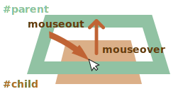

<<<<<<< HEAD
# 移動: mouseover/out, mouseenter/leave

マウスが要素間を移動するときに起こるイベントについての詳細を見ていきましょう。
=======
# Moving the mouse: mouseover/out, mouseenter/leave

Let's dive into more details about events that happen when the mouse moves between elements.
>>>>>>> ea7738bb7c3616bb51ff14ae3db2a2747d7888ff

## Events mouseover/mouseout, relatedTarget

`mouseoever` イベントはマウスポインタが要素の上に来るときに発生し、`mouseout` は -- そこを離れるときです。


<<<<<<< HEAD
これらのイベントは `relatedTarget` を持っているという点で特別です。
=======
These events are special, because they have property `relatedTarget`. This property complements `target`. When a mouse leaves one element for another, one of them becomes `target`, and the other one - `relatedTarget`.
>>>>>>> ea7738bb7c3616bb51ff14ae3db2a2747d7888ff

`mouseover` の場合:

<<<<<<< HEAD
- `event.target` -- はマウスが来た要素です。
- `event.relatedTarget` -- は、マウスが来た元の要素です(どこから来たか)。
=======
- `event.target` -- is the element where the mouse came over.
- `event.relatedTarget` -- is the element from which the mouse came (`relatedTarget` -> `target`).
>>>>>>> ea7738bb7c3616bb51ff14ae3db2a2747d7888ff

`mouseout` の場合はその逆です:

<<<<<<< HEAD
- `event.target` -- はマウスが離れた要素です。
- `event.relatedTarget` -- は新たなポインタの下の要素です(マウスが向かった要素)

```online
下の例では、それぞれの顔が要素です。マウスを移動させると、テキストエリアでイベントが見えます。

各イベントは要素が来た場所や、どこから来たかについての情報を持っています。
=======
- `event.target` -- is the element that the mouse left.
- `event.relatedTarget` -- is the new under-the-pointer element, that mouse left for (`target` -> `relatedTarget`).

```online
In the example below each face and its features are separate elements. When you move the mouse, you can see mouse events in the text area.

Each event has the information about both `target` and `relatedTarget`:
>>>>>>> ea7738bb7c3616bb51ff14ae3db2a2747d7888ff

[codetabs src="mouseoverout" height=280]
```

```warn header="`relatedTarget` は `null` の可能性があります"
`relatedTarget` プロパティは `null` の場合があります。

それは正常なことで、単にマウスが別の要素から来たのではなく、ウィンドウの外から来たことを意味します。もしくはウィンドウから出たことを意味します。

我々のコードで `event.relatedTarget` を使うときは，その可能性を心に留めておく必要があります。もし `event.relatedTarget.tagName` へアクセスすると、エラーになるでしょう。
```

<<<<<<< HEAD
## イベントの頻度 
=======
## Skipping elements
>>>>>>> ea7738bb7c3616bb51ff14ae3db2a2747d7888ff

`mousemove` イベントはマウスの移動時にトリガされます。しかし、すべてのピクセル単位の移動でイベントが発生する訳ではありません。

ブラウザは時々マウスの位置をチェックします。そして、もし変更に気づいた場合、イベントをトリガします。

<<<<<<< HEAD
つまり、訪問者がマウスをとても速く動かしている場合、DOM 要素はスキップされる可能性があることを意味します。:


もしもマウスが上に書いているように、 `#FROM` から `#TO` 要素へ非常に速く移動する場合、間にある `<div>` (やそれら) はスキップされる可能性があります。`mouseout` イベントは `#FROM` でトリガし、その後 `#TO` ですぐに `mouseover` をトリガするかもしれません。

実際には、これは間に多くの要素がある場合に役立ちます。 私たちは本当にそれぞれのIn/Outを処理したくはありません。

その反面、マウスがあるイベントから別のイベントへゆっくり移動することは想定できないことに留意する必要があります。そうではなく、それは "ジャンプ" できます。

特に、ウィンドウの外からページ中央にカーソルが移動することもあり得ます。そして、それは "どこからも" 来ていないので、`relatedTarget=null` です。:


=======
That means that if the visitor is moving the mouse very fast then some DOM-elements may be skipped:


If the mouse moves very fast from `#FROM` to `#TO` elements as painted above, then intermediate `<div>` elements (or some of them) may be skipped. The `mouseout` event may trigger on `#FROM` and then immediately `mouseover` on `#TO`.

That's good for performance, because there may be many intermediate elements. We don't really want to process in and out of each one.

On the other hand, we should keep in mind that the mouse pointer doesn't "visit" all elements along the way. It can "jump".

In particular, it's possible that the pointer jumps right inside the middle of the page from out of the window. In that case `relatedTarget` is `null`, because it came from "nowhere":
>>>>>>> ea7738bb7c3616bb51ff14ae3db2a2747d7888ff


```online
<<<<<<< HEAD
下のテストスタンドで、実際に確認してみてください。

HTMLは2つのネストされた `<div>` 要素です。もしマウスをすばやく移動させると、イベントはまったく起きないかもしれません。もしくは赤の div だけ、緑の div だけがイベントをトリガするかもしれません。

また、赤の `div` にポインタを移動させ、すばやく緑の `div` を通って下に移動してみてください。移動が十分速い場合、親要素は無視されます。
=======
You can check it out "live" on a teststand below.

Its HTML has two nested elements: the `<div id="child">` is inside the `<div id="parent">`. If you move the mouse fast over them, then maybe only the child div triggers events, or maybe the parent one, or maybe there will be no events at all.

Also move the pointer into the child `div`, and then move it out quickly down through the parent one. If the movement is fast enough, then the parent element is ignored. The mouse will cross the parent element without noticing it.
>>>>>>> ea7738bb7c3616bb51ff14ae3db2a2747d7888ff

[codetabs height=360 src="mouseoverout-fast"]
```

<<<<<<< HEAD
## 子へ向けて移動するときの "余分な" mouseout 

想像してください -- マウスポインタが要素に入りました。`mouseover` がトリガされました。その後、カーソルが子要素へ行きます。興味深いことは `mouseout` がその場合にトリガすることです。カーソルは依然として要素の中にありますが、`mouseout` が起きます!


奇妙に見えますが、簡単に説明する事ができます。

**ブラウザのロジックによれば、マウスカーソルは常に *単一の* 要素 -- 最もネストされた要素(及び z-index がトップ) -- の上にだけあります。**

したがって、別の要素(子孫だとしても)へ行く場合は前の要素を離れます。シンプルです。

下の例で見ることができる面白い結果があります。

赤の `<div>` は青の `<div>` にネストされています。青の `<div>` は以下のテキストにすべてのイベントを記録する `mouseover/out` ハンドラを持っています。

青要素に入って、次に赤要素にマウスを移動させてみてください -- そしてイベントを見てください。:
=======
```smart header="If `mouseover` triggered, there must be `mouseout`"
In case of fast mouse movements, intermediate elements may be ignored, but one thing we know for sure: if the pointer "officially" entered an element (`mouseover` event generated), then upon leaving it we always get `mouseout`.
```

## Mouseout when leaving for a child

An important feature of `mouseout` -- it triggers, when the pointer moves from an element to its descendant, e.g. from `#parent` to `#child` in this HTML:

```html
<div id="parent">
  <div id="child">...</div>
</div>
```

If we're on `#parent` and then move the pointer deeper into `#child`, we get `mouseout` on `#parent`!


That may seem strange, but can be easily explained.

**According to the browser logic, the mouse cursor may be only over a *single* element at any time -- the most nested one and top by z-index.**

So if it goes to another element (even a descendant), then it leaves the previous one.

Please note another important detail of event processing.

The `mouseover` event on a descendant bubbles up. So, if `#parent` has `mouseover` handler, it triggers:



```online
You can see that very well in the example below: `<div id="child">` is inside the `<div id="parent">`. There are `mouseover/out` handlers on `#parent` element that output event details.

If you move the mouse from `#parent` to `#child`, you see two events on `#parent`:
1. `mouseout [target: parent]` (left the parent), then
2. `mouseover [target: child]` (came to the child, bubbled).
>>>>>>> ea7738bb7c3616bb51ff14ae3db2a2747d7888ff

[codetabs height=360 src="mouseoverout-child"]
```

<<<<<<< HEAD
1. 青要素に入ると -- `mouseover [target: blue]` を得ます。
2. 次に、青から赤要素へ移動した後、 -- `mouseout [target: blue]` を得ます(親を離れます)。
3. ...そしてすぐに `mouseover [target: red]` です。

なので、`target` を考慮しないハンドラでは、`(2)` の `mouseout` で親を離れ、`(3)` の `mouseover` でそこへ戻ってきたように見えます。

要素の出入りの際にいくつかのアクションを実行する場合、多くの余分な "偽の" 実行が発生します。シンプルな物事に対して気づかない可能性があります。複雑な物事に対しては、望ましくない副作用を引き起こす可能性があります。

私たちは、代わりに `mouseenter/mouseleave` イベントを使用して修正できます。
=======
As shown, when the pointer moves from `#parent` element to `#child`, two handlers trigger on the parent element: `mouseout` and `mouseover`:

```js
parent.onmouseout = function(event) {
  /* event.target: parent element */
};
parent.onmouseover = function(event) {
  /* event.target: child element (bubbled) */
};
```

**If we don't examine `event.target` inside the handlers, then it may seem that the mouse pointer left `#parent` element, and then immediately came back over it.**

But that's not the case! The pointer is still over the parent, it just moved deeper into the child element.

If there are some actions upon leaving the parent element, e.g. an animation runs in `parent.onmouseout`, we usually don't want it when the pointer just goes deeper into `#parent`.

To avoid it, we can check `relatedTarget` in the handler and, if the mouse is still inside the element, then ignore such event.

Alternatively we can use other events: `mouseenter` and `mouseleave`, that we'll be covering now, as they don't have such problems.
>>>>>>> ea7738bb7c3616bb51ff14ae3db2a2747d7888ff

## イベント mouseenter と mouseleave 

<<<<<<< HEAD
イベント `mouseenter/mouseleave` は `mouseover/mouseout` のようなものです。それらもマウスポインタが要素を出入りするときにトリガされます。

違いが2つあります。:

1. 要素内の遷移はカウントされません。
2. イベント `mouseenter/mouseleave` はバブルしません。

これらのイベントは直感的に非常に明確です。

ポインタが要素に入るとき -- `mouseenter` をトリガし、次に要素内でどこに行こうと関係はありません。`mouseleave` イベントはカーソルがそこを離れるときにだけトリガします。

同じ例を作りますが、青の `<div>` に `mouseenter/mouseleave` を置き、同じことをすると -- 青の `<div>` を入ったり出たりするときのみイベントをトリガするのが分かります。赤の `<div>` に行くときや戻るときに余分なイベントはありません。子は無視されます。
=======
Events `mouseenter/mouseleave` are like `mouseover/mouseout`. They trigger when the mouse pointer enters/leaves the element.

But there are two important differences:

1. Transitions inside the element, to/from descendants, are not counted.
2. Events `mouseenter/mouseleave` do not bubble.

These events are extremely simple.

When the pointer enters an element -- `mouseenter` triggers. The exact location of the pointer inside the element or its descendants doesn't matter.

When the pointer leaves an element -- `mouseleave` triggers.

```online
This example is similar to the one above, but now the top element has `mouseenter/mouseleave` instead of `mouseover/mouseout`.

As you can see, the only generated events are the ones related to moving the pointer in and out of the top element. Nothing happens when the pointer goes to the child and back. Transitions between descendants are ignored
>>>>>>> ea7738bb7c3616bb51ff14ae3db2a2747d7888ff

[codetabs height=340 src="mouseleave"]
```

## イベント移譲 [$Event delegation]

イベント `mouseenter/leave` は非常にシンプルで使いやすいです。しかし、それらはバブルしません。そのため、それらにイベント移譲を使えません。

テーブルセルに対してマウスの出入りを処理したいと想像してください。そして、何百ものセルがあります。

<<<<<<< HEAD
自然な解決策は -- `<table>` にハンドラを設定し、そこでイベントを処理することです。しかし `mouseenter/leave` はバブルしません。したがって、`<td>` でこのようなイベントが起きる場合、その `<td>` のハンドラだけがそのイベントをキャッチできます。

`<table>` 上の `mouseenter/leave` に対するハンドラは、テーブル全体の出入りでのみトリガします。その内側の遷移に関する情報を取得することはできません。

問題はありません -- `mouseover/mouseout` を使ってみましょう。

次のようなシンプルなハンドラがあります:

```js
// マウスの下にあるセルをハイライトしましょう
=======
The natural solution would be -- to set the handler on `<table>` and process events there. But `mouseenter/leave` don't bubble. So if such event happens on `<td>`, then only a handler on that `<td>` is able to catch it.

Handlers for `mouseenter/leave` on `<table>` only trigger when the pointer enters/leaves the table as a whole. It's impossible to get any information about transitions inside it.

So, let's use `mouseover/mouseout`.

Let's start with simple handlers that highlight the element under mouse:

```js
// let's highlight an element under the pointer
>>>>>>> ea7738bb7c3616bb51ff14ae3db2a2747d7888ff
table.onmouseover = function(event) {
  let target = event.target;
  target.style.background = 'pink';
};

table.onmouseout = function(event) {
  let target = event.target;
  target.style.background = '';
};
```

```online
Here they are in action. As the mouse travels across the elements of this table, the current one is highlighted:

[codetabs height=480 src="mouseenter-mouseleave-delegation"]
```

<<<<<<< HEAD
これらのハンドラは、任意の要素からテーブルの内側で行くときに動作します。

しかし、全体として `<td>` に出入りする遷移のみを処理したいと考えています。 そしてセル全体を強調表示します。 私たちは `<td>` の子の間で起こる遷移を処理したくありません。

解決策の1つは次のようになります:

- 変数で、現在強調されている `<td>` を覚えます。
- `mouseover` では -- まだ現在の `<td>` の中にいる場合はイベントを無視します。
- `mouseout` では -- 現在の `<td>` を離れなかった場合には無視します。

それは、`<td>` の子の間を移動するときの "余分な" イベントをフィルタします。
=======
In our case we'd like to handle transitions between table cells `<td>`: entering a cell and leaving it. Other transitions, such as inside the cell or outside of any cells, don't interest us. Let's filter them out.

Here's what we can do:

- Remember the currently highlighted `<td>` in a variable, let's call it `currentElem`.
- On `mouseover` -- ignore the event if we're still inside the current `<td>`.
- On `mouseout` -- ignore if we didn't leave the current `<td>`.

Here's an example of code that accounts for all possible situations:
>>>>>>> ea7738bb7c3616bb51ff14ae3db2a2747d7888ff

[js src="mouseenter-mouseleave-delegation-2/script.js"]

Once again, the important features are:
1. It uses event delegation to handle entering/leaving of any `<td>` inside the table. So it relies on `mouseover/out` instead of `mouseenter/leave` that don't bubble and hence allow no delegation.
2. Extra events, such as moving between descendants of `<td>` are filtered out, so that `onEnter/Leave` runs only if the pointer leaves or enters `<td>` as a whole.

```online
すべての詳細を含む完全な例を次に示します。:

[codetabs height=460 src="mouseenter-mouseleave-delegation-2"]

<<<<<<< HEAD
カーソルを、テーブルセルやその内側の内外に移動させてみてください。以前の例とは異なり、全体として `<td>` だけが強調表示されています。
```


## サマリ 
=======
Try to move the cursor in and out of table cells and inside them. Fast or slow -- doesn't matter. Only `<td>` as a whole is highlighted, unlike the example before.
```

## Summary
>>>>>>> ea7738bb7c3616bb51ff14ae3db2a2747d7888ff

私たちはイベント `mouseover`, `mouseout`, `mousemove`, `mouseenter` と `mouseleave` を説明しました。

<<<<<<< HEAD
注目すべきことは:

- 速いマウス移動は `mouseover, mousemove, mouseout` に対し、中間要素をスキップすることができます。
- イベント `mouseover/out` と `mouserenter/leave` は `relatedTarget` という追加のターゲットを持っています。それは私たちが 来た/行く 要素であり、`target` と相補的な要素です。
- イベント `mouseover/out` は親要素から子要素に移動してもトリガされます。 マウスは、一度に1つの要素、つまり最も深い要素を想定します。
- イベント `mouserenter/leave` はバブルしないので、マウスが子要素に行くときにはトリガしません。それらは、マウスが要素全体の内側と外側のどちらに来るのかを追跡します。
=======
These things are good to note:

- A fast mouse move may skip intermediate elements.
- Events `mouseover/out` and `mouseenter/leave` have an additional property: `relatedTarget`. That's the element that we are coming from/to, complementary to `target`.

Events `mouseover/out` trigger even when we go from the parent element to a child element. The browser assumes that the mouse can be only over one element at one time -- the deepest one.

Events `mouseenter/leave` are different in that aspect: they only trigger when the mouse comes in and out the element as a whole. Also they do not bubble.
>>>>>>> ea7738bb7c3616bb51ff14ae3db2a2747d7888ff
