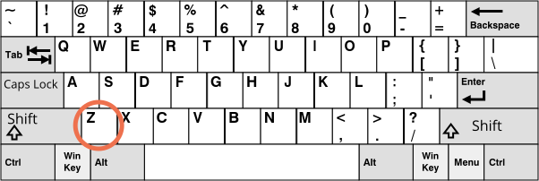
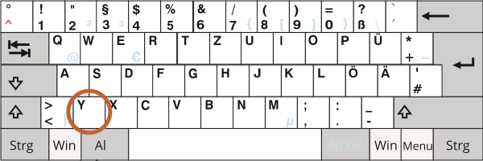

<<<<<<< HEAD
# キーボード: keydown と keyup

キーボードを学ぶ前に、現代のデバイスでは "何かを入力する" ために他の方法があることに留意してください。例えば、人々は音声認識(特にモバイルデバイスで)や、マウスによるコピーペーストを使います。
 
したがって、`<input>` フィールドへの任意の入力を追跡したい場合、キーボードイベントだけでは十分ではありません。`<input>` フィールドのどのような方法での変更も処理するために `input` と言う名前の別のイベントがあります。そしてこのようなタスクに対する良い選択である場合があります。それらに関しては、チャプター <info:events-change-input> で後ほど説明します。

キーボードイベントは、キーボードアクション(仮想キーボードも含む)を処理したいときに使われるべきです。例えば、矢印キー `key:Up` や `key:Down`、またはホットキー (キーの組み合わせを含む)に反応するために使います。


## テストスタンド [#keyboard-test-stand]

```offline
キーボードイベントをより良く理解するために、[テストスタンド](sandbox:keyboard-dump)が使えます。
```

```online
キーボードイベントをよりよく理解するために、下のテストスタンドがあります。

テキストフィールドの中で、様々なキーの組み合わせを試してみてください。
=======
# Keyboard: keydown and keyup

Before we get to keyboard, please note that on modern devices there are other ways to "input something". For instance, people use speech recognition (especially on mobile devices) or copy/paste with the mouse.

So if we want to track any input into an `<input>` field, then keyboard events are not enough. There's another event named `input` to track changes of an `<input>` field, by any means. And it may be a better choice for such task. We'll cover it later in the chapter <info:events-change-input>.

Keyboard events should be used when we want to handle keyboard actions (virtual keyboard also counts). For instance, to react on arrow keys `key:Up` and `key:Down` or hotkeys (including combinations of keys).


## Teststand [#keyboard-test-stand]

```offline
To better understand keyboard events, you can use the [teststand](sandbox:keyboard-dump).
```

```online
To better understand keyboard events, you can use the teststand below.

Try different key combinations in the text field.
>>>>>>> 20208769e528337949e946f526534d61d38bac47

[codetabs src="keyboard-dump" height=480]
```


<<<<<<< HEAD
## Keydown と keyup 

`keydown` イベントはキーが押された時に、そして `keyup` はそれが離されたときに発生します。

### event.code と event.key

イベントオブジェクトの `key` プロパティは、イベントオブジェクトの `code` プロパティが "物理的なキーコード" を取得できる一方、文字を取得することができます。

例えば、同じキー `key:Z` が `Shift` あり / なし で押される場合があります。それは２つの異なる文字を返します: 小文字の `z` と大文字の `Z` です。

`event.key` はまさに文字であり、それは異なるでしょう。しかし、`event.code`  は同じです:


| キー          | `event.key` | `event.code` |
|--------------|-------------|--------------|
| `key:Z`      |`z` (小文字)         |`KeyZ`        |
| `key:Shift+Z`|`Z` (大文字)          |`KeyZ`        |


ユーザが異なる言語で作業する場合、別の言語に切り替えると、`"Z"` の代わりに全く違う文字になります。これは `event.key` の文字になりますが、その一方で `event.code` は常に同じ `"KeyZ"` です。

```smart header="\"KeyZ\" とその他のキーコード"
すべてのキーは、キーボード上の位置に応じたコードを持っています。キーコードは[UI イベントコード仕様](https://www.w3.org/TR/uievents-code/)で記載されています。

例えば:
- 文字キーはコード `"Key<letter>"` です: `"KeyA"`, `"KeyB"` など。
- 数字キーはコード `"Digit<number>"` です:` "Digit0"`, `"Digit1"` など。
- 特別なキーは名前でコード化されています: `"Enter"`, `"Backspace"`, `"Tab"` など。 

いくつかの広く知られているキーボードレイアウトがあり、仕様はそれぞれに対してキーコードを提供します。

より多くのコードについては [alphanumeric section of the spec](https://www.w3.org/TR/uievents-code/#key-alphanumeric-section) を見てください、もしくは上の  [テストスタンド](#keyboard-test-stand) を試してみてください。
```

```warn header="大文字小文字の問題: `\"KeyZ\"` です, `\"keyZ\"` ではありません"
明らかですが、それでも間違えることがあります。

ミスタイプを避けてください: `keyZ` ではなく `KeyZ` です。`event.code=="keyZ"` のようなチェックは機能しません: `"Key"` の最初の文字は大文字でなければなりません。
```

もし仮に、キーが文字を持たないとどうなるでしょう？例えば、`key:Shift` or `key:F1` などです。これらのキーの場合、`event.key` は `event.code` とほぼ同じです。:


| キー          | `event.key` | `event.code` |
=======
## Keydown and keyup

The `keydown` events happens when a key is pressed down, and then `keyup` -- when it's released.

### event.code and event.key

The `key` property of the event object allows to get the character, while the `code` property of the event object allows to get the "physical key code".

For instance, the same key `key:Z` can be pressed with or without `key:Shift`. That gives us two different characters: lowercase `z` and uppercase `Z`.

The `event.key` is exactly the character, and it will be different. But `event.code` is the same:

| Key          | `event.key` | `event.code` |
|--------------|-------------|--------------|
| `key:Z`      |`z` (lowercase)         |`KeyZ`        |
| `key:Shift+Z`|`Z` (uppercase)          |`KeyZ`        |


If a user works with different languages, then switching to another language would make a totally different character instead of `"Z"`. That will become the value of `event.key`, while `event.code` is always the same: `"KeyZ"`.

```smart header="\"KeyZ\" and other key codes"
Every key has the code that depends on its location on the keyboard. Key codes described in the [UI Events code specification](https://www.w3.org/TR/uievents-code/).

For instance:
- Letter keys have codes `"Key<letter>"`: `"KeyA"`, `"KeyB"` etc.
- Digit keys have codes: `"Digit<number>"`: `"Digit0"`, `"Digit1"` etc.
- Special keys are coded by their names: `"Enter"`, `"Backspace"`, `"Tab"` etc.

There are several widespread keyboard layouts, and the specification gives key codes for each of them.

Read the [alphanumeric section of the spec](https://www.w3.org/TR/uievents-code/#key-alphanumeric-section) for more codes, or just press a key in the [teststand](#keyboard-test-stand) above.
```

```warn header="Case matters: `\"KeyZ\"`, not `\"keyZ\"`"
Seems obvious, but people still make mistakes.

Please evade mistypes: it's `KeyZ`, not `keyZ`. The check like `event.code=="keyZ"` won't work: the first letter of `"Key"` must be uppercase.
```

What if a key does not give any character? For instance, `key:Shift` or `key:F1` or others. For those keys, `event.key` is approximately the same as `event.code`:

| Key          | `event.key` | `event.code` |
>>>>>>> 20208769e528337949e946f526534d61d38bac47
|--------------|-------------|--------------|
| `key:F1`      |`F1`          |`F1`        |
| `key:Backspace`      |`Backspace`          |`Backspace`        |
| `key:Shift`|`Shift`          |`ShiftRight` or `ShiftLeft`        |

<<<<<<< HEAD
`event.code` は正確にどのキーが押されたかを特定することに注意してください。例えば、ほとんどのキーボードは2つの `key:Shift` キーを持っています: 左側と右側です。`event.code` は厳密にどちらが押されたのかを示し、`event.key` はキーの "意味" に対して責任を持っています: それは何か("Shift")です。

ここで、ホットキーを処理したいとしましょう: `key:Ctrl+Z` (Mac だと`key:Cmd+Z`)。多くのテキストエディタは "元に戻す" アクションをフックします。`keydown` にリスナーを設定して、どのキーが押されたか確認することができます -- ホットキーを検出するために。

ここにはジレンマがあります。:このようなリスナーにおいては、`event.key` または `event.code` どちらの値をチェックするべきでしょうか？

`event.key` の場合、値は文字であり、言語によって異なります。訪問者が OS で複数の言語をもち、切り替えた場合、同じキーで異なる文字になります。したがって、常に同じである `event.code` をチェックするのが理にかなっています。

次のようになります:
=======
Please note that `event.code` specifies exactly which key is pressed. For instance, most keyboards have two `key:Shift` keys: on the left and on the right side. The `event.code` tells us exactly which one was pressed, and `event.key` is responsible for the "meaning" of the key: what it is (a "Shift").

Let's say, we want to handle a hotkey: `key:Ctrl+Z` (or `key:Cmd+Z` for Mac). Most text editors hook the "Undo" action on it. We can set a listener on `keydown` and check which key is pressed.

There's a dilemma here: in such a listener, should we check the value of `event.key` or `event.code`?

On one hand, the value of `event.key` is a character, it changes depending on the language. If the visitor has several languages in OS and switches between them, the same key gives different characters. So it makes sense to check `event.code`, it's always the same.

Like this:
>>>>>>> 20208769e528337949e946f526534d61d38bac47

```js run
document.addEventListener('keydown', function(event) {
  if (event.code == 'KeyZ' && (event.ctrlKey || event.metaKey)) {
    alert('Undo!')
  }
});
```

<<<<<<< HEAD
その一方で、`event.code` を利用した場合の問題もあります。異なるキーボードレイアウトの場合、同じキーが異なる文字を持つ場合があります。

例えば、ここに US レイアウト ("QWERTY") とその下のドイツ語のレイアウト("QWERTZ")です(Wikipedia より)
=======
On the other hand, there's a problem with `event.code`. For different keyboard layouts, the same key may have different characters.

For example, here are US layout ("QWERTY") and German layout ("QWERTZ") under it (from Wikipedia):
>>>>>>> 20208769e528337949e946f526534d61d38bac47





<<<<<<< HEAD
同じキーに対して、US レイアウトは "Z" である一方、ドイツ語レイアウトは "Y" (文字が入れ替わっています)

文字通り、`key:Y` を押すと、ドイツ語のレイアウトを持つ人々の `event.code` は `KeyZ` と等しくなります。

もしコードで  `event.code == 'KeyZ'` というチェックをしている場合、ドイツ語レイアウトの人々は、`key:Y` を押すことでこの評価が通ります。

これはとても奇妙に思えますが、そのように動作します。[仕様](https://www.w3.org/TR/uievents-code/#table-key-code-alphanumeric-writing-system) でこのような振る舞いについて明示的に言及されています。

したがって、`event.code` は予期しないレイアウトの場合、間違った文字と一致する可能性があります。異なるレイアウトにおいて、同じ文字が異なる物理キーに割りあてられ、異なるコードに繋がる場合があります。幸いなことに、これはいくつかのコードでのみ起こりえます, 例: `keyA`, `keyQ`, `keyZ` (これまで見てきたように)。また、`Shift` のような特別なキーでは発生しません。[仕様](https://www.w3.org/TR/uievents-code/#table-key-code-alphanumeric-writing-system)で一覧を見ることができます。

レイアウトに依存する文字を確実に追跡するには、`event.key` のほうが適している場合があります。

一方、`event.code` は訪問者が言語を変えたとしても、物理キーにバインドされて、常に同じままであるという利点があります。したがって、これに依存するホットキーは、言語が切り替わった場合でもうまく機能します。

レイアウトに依存するキーを扱いたいたいですか？ その場合は `event.key` がよいです。

あるいは、言語を切り替えた後でもホットキーを機能させたいですか？それなら `event.code` のほうがよいかもしれません。

## 自動繰り返し 

もしキーが長時間押されていると、繰り返しを始めます: `keydown` は何度もトリガされ、その後キーが離されたとき、最終的に `keyup` を得ます。そのため、多くの `keydown` と単一の `keyup` をもつのは普通なことです。

すべての繰り返しキーに対して、イベントオブジェクトは `event.repeat` プロパティが `true` に設定されています。


## デフォルトアクション 

キーボードによって開始され得ることはたくさんあるので、デフォルトアクションさまざまです。

例えば:

- 画面に文字が現れる(もっとも明白な結果)
- 文字が削除される(`key:Delete` キー)
- ページがスクロールされる(`key:PageDown` キー)
- ブラウザが "保存" ダイアログを開く (`key:Ctrl+S`)
- などなど

`keydown` のデフォルトアクションを防ぐことは、OSベースの特別なキーを除き、それらのほとんどを取り消すことが可能です。例えば、Windows の `key:Alt+F4` は現在のブラウザウィンドウを閉じます。そして、JavaScript でデフォルトアクションを防ぐことでそれを止める方法はありません。

別の例で、下記の `<input>` は電話番号を期待しているので、数値, `+`, `()` または `-` 以外は許可しません。:
=======
For the same key, US layout has "Z", while German layout has "Y" (letters are swapped).

Literally, `event.code` will equal `KeyZ` for people with German layout when they press `key:Y`.

If we check `event.code == 'KeyZ'` in our code, then for people with German layout such test will pass when they press `key:Y`.

That sounds really odd, but so it is. The [specification](https://www.w3.org/TR/uievents-code/#table-key-code-alphanumeric-writing-system) explicitly mentions such behavior.

So, `event.code` may match a wrong character for unexpected layout. Same letters in different layouts may map to different physical keys, leading to different codes. Luckily, that happens only with several codes, e.g. `keyA`, `keyQ`, `keyZ` (as we've seen), and doesn't happen with special keys such as `Shift`. You can find the list in the [specification](https://www.w3.org/TR/uievents-code/#table-key-code-alphanumeric-writing-system).

To reliably track layout-dependent characters, `event.key` may be a better way.

On the other hand, `event.code` has the benefit of staying always the same, bound to the physical key location. So hotkeys that rely on it work well even in case of a language switch.

Do we want to handle layout-dependant keys? Then `event.key` is the way to go.

Or we want a hotkey to work even after a language switch? Then `event.code` may be better.

## Auto-repeat

If a key is being pressed for a long enough time, it starts to "auto-repeat": the `keydown` triggers again and again, and then when it's released we finally get `keyup`. So it's kind of normal to have many `keydown` and a single `keyup`.

For events triggered by auto-repeat, the event object has `event.repeat` property set to `true`.


## Default actions

Default actions vary, as there are many possible things that may be initiated by the keyboard.

For instance:

- A character appears on the screen (the most obvious outcome).
- A character is deleted (`key:Delete` key).
- The page is scrolled (`key:PageDown` key).
- The browser opens the "Save Page" dialog (`key:Ctrl+S`)
-  ...and so on.

Preventing the default action on `keydown` can cancel most of them, with the exception of OS-based special keys. For instance, on Windows `key:Alt+F4` closes the current browser window. And there's no way to stop it by preventing the default action in JavaScript.

For instance, the `<input>` below expects a phone number, so it does not accept keys except digits, `+`, `()` or `-`:
>>>>>>> 20208769e528337949e946f526534d61d38bac47

```html autorun height=60 run
<script>
function checkPhoneKey(key) {
<<<<<<< HEAD
  return (key >= '0' && key <= '9') || key == '+' || key == '(' || key == ')' || key == '-';
=======
  return (key >= '0' && key <= '9') || ['+','(',')','-'].includes(key);
>>>>>>> 20208769e528337949e946f526534d61d38bac47
}
</script>
<input *!*onkeydown="return checkPhoneKey(event.key)"*/!* placeholder="Phone, please" type="tel">
```

<<<<<<< HEAD
`key:Backspace`, `key:Left`, `key:Right`, `key:Ctrl+V` のような特別なキーはインプットでは動作しないことに注意してください。これは厳密なフィルタ `checkPhoneKey` の副作用です。

少しだけ緩めましょう。:

=======
The `onkeydown` handler here uses `checkPhoneKey` to check for the key pressed. If it's valid (from `0..9` or one of `+-()`), then it returns `true`, otherwise `false`.

As we know, the `false` value returned from the event handler, assigned using a DOM property or an attribute, such as above, prevents the default action, so nothing appears in the `<input>` for keys that don't pass the test. (The `true` value returned doesn't affect anything, only returning `false` matters)

Please note that special keys, such as `key:Backspace`, `key:Left`, `key:Right`, do not work in the input. That's a side effect of the strict filter `checkPhoneKey`. These keys make it return `false`.

Let's relax the filter a little bit by allowing arrow keys `key:Left`, `key:Right` and `key:Delete`, `key:Backspace`:
>>>>>>> 20208769e528337949e946f526534d61d38bac47

```html autorun height=60 run
<script>
function checkPhoneKey(key) {
<<<<<<< HEAD
  return (key >= '0' && key <= '9') || key == '+' || key == '(' || key == ')' || key == '-' ||
    key == 'ArrowLeft' || key == 'ArrowRight' || key == 'Delete' || key == 'Backspace';
=======
  return (key >= '0' && key <= '9') ||
    ['+','(',')','-',*!*'ArrowLeft','ArrowRight','Delete','Backspace'*/!*].includes(key);
>>>>>>> 20208769e528337949e946f526534d61d38bac47
}
</script>
<input onkeydown="return checkPhoneKey(event.key)" placeholder="Phone, please" type="tel">
```

<<<<<<< HEAD
今は矢印や削除も動作します。

...しかし、まだマウスや右クリック+貼り付けを使用してどのような値も入力することができます。なので、フィルタは 100% 信頼はできません。ただ、殆どの場合では動作するのでこのようにすることはできます。もしくは、代わりのアプローチは `input` イベントを追跡することです -- これはすべての変更のあとにトリガされます。そこでは新しい値をチェックし、それが無効であるときには強調/変更することができます。

## レガシー 

過去、`keypress` イベントや、`keyCode`, `charCode`, `which` と言ったイベントオブジェクトのプロパティがありました。

そこにはブラウザの非互換性が非常に多く、仕様の開発者はそれらのすべてを非推奨にすることに決めました。ブラウザがそれらをサポートし続けるので、古いコードはまだ動作しますが、それらをもう使用する必要は全くありません。

このチャプターに、それらの詳しい説明があった時期もありました。しかし、今のところ、私たちはそれらを忘れても問題ありません。

## サマリ 

キーを押すと、キーに応じたキーボードイベントが常に生成されます。唯一の例外は、ノートパソコンのキーボードに表示される `key:Fn` キーです。 それはOSよりも低いレベルで実装されることが多いため、キーボードイベントはありません。

キーボードイベント:

- `keydown` -- キーを押したとき（長押しの場合は自動的に繰り返されます）
- `keyup` -- キーを離したとき

主なキーボードイベントのプロパティ:

- `code` -- "キーコード" (`"KeyA"`, `"ArrowLeft"` など)。キーボード上のキーの物理的な位置に固有です。
- `key` -- 文字 (`"A"`, `"a"` など)。非文字のキーの場合は通常 `code` と同じ値を持っています。

過去、キーボードイベントはフォームフィールドで、ユーザ入力を追跡するために使われていました。しかし、入力は様々な方法で行われる可能性があるため、それは信頼できません。任意の入力を処理するために `input` と `change` イベントがあります (これらについてはチャプター <info:events-change-input> で後ほど説明します)。これらは任意の入力後にトリガされ、マウスや音声認識なども含みます。

本当にキーボードが必要なときにキーボードイベントを使うべきです。例えば、ホットキーや特別なキーに反応するため、などです。
=======
Now arrows and deletion works well.

Even though we have the key filter, one still can enter anything using a mouse and right-click + Paste. Mobile devices provide other means to enter values. So the filter is not 100% reliable.

The alternative approach would be to track the `oninput` event -- it triggers *after* any modification. There we can check the new `input.value` and modify it/highlight the `<input>` when it's invalid. Or we can use both event handlers together.

## Legacy

In the past, there was a `keypress` event, and also `keyCode`, `charCode`, `which` properties of the event object.

There were so many browser incompatibilities while working with them, that developers of the specification had no way, other than deprecating all of them and creating new, modern events (described above in this chapter). The old code still works, as browsers keep supporting them, but there's totally no need to use those any more.

## Mobile Keyboards

When using virtual/mobile keyboards, formally known as IME (Input-Method Editor), the W3C standard states that a KeyboardEvent's [`e.keyCode` should be `229`](https://www.w3.org/TR/uievents/#determine-keydown-keyup-keyCode) and [`e.key` should be `"Unidentified"`](https://www.w3.org/TR/uievents-key/#key-attr-values).

While some of these keyboards might still use the right values for `e.key`, `e.code`, `e.keyCode`... when pressing certain keys such as arrows or backspace, there's no guarantee, so your keyboard logic might not always work on mobile devices.

## Summary

Pressing a key always generates a keyboard event, be it symbol keys or special keys like `key:Shift` or `key:Ctrl` and so on. The only exception is `key:Fn` key that sometimes presents on a laptop keyboard. There's no keyboard event for it, because it's often implemented on lower level than OS.

Keyboard events:

- `keydown` -- on pressing the key (auto-repeats if the key is pressed for long),
- `keyup` -- on releasing the key.

Main keyboard event properties:

- `code` -- the "key code" (`"KeyA"`, `"ArrowLeft"` and so on), specific to the physical location of the key on keyboard.
- `key` -- the character (`"A"`, `"a"` and so on), for non-character keys, such as `key:Esc`, usually has the same value  as `code`.

In the past, keyboard events were sometimes used to track user input in form fields. That's not reliable, because the input can come from various sources. We have `input` and `change` events to handle any input (covered later in the chapter <info:events-change-input>). They trigger after any kind of input, including copy-pasting or speech recognition.

We should use keyboard events when we really want keyboard. For example, to react on hotkeys or special keys.
>>>>>>> 20208769e528337949e946f526534d61d38bac47
