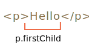

libs:
  - d3
  - domtree

---

<<<<<<< HEAD
# 選択（Selection） と 範囲（Range）

このチャプターではドキュメントでの選択と、`<input>` などのフォームフィールドでの選択について説明します。

JavaScript を利用して選択状態を取得したり、全体あるいは一部分の選択/選択解除、ドキュメントから選択した部分を削除、タグへのラップなどを行うことができます。

末尾の "サマリ" セクションでレシピが使用できます。が、チャプター全体を読むことでより多くのことを知ることができます。基礎となる `Range` と `Selection` オブジェクトは簡単に把握できるので、必要なことをするためのレシピは必要ありません。


## 範囲(Range)

選択の基本的な概念は [範囲(Range)](https://dom.spec.whatwg.org/#ranges) です。: 基本的には "境界点"(範囲の開始と終了) のペアです。

各点は、始点からの相対オフセットをもつ親DOMノードを表します。親ノードが要素ノードの場合、オフセットは子の番号であり、テキストノードの場合はテキスト内での位置です。以下、例を示します。

何かを選択しましょう。

まず、range　を作成します(コンストラクタにパラメータはありません):
=======
# Selection and Range

In this chapter we'll cover selection in the document, as well as selection in form fields, such as `<input>`.

JavaScript can access an existing selection, select/deselect DOM nodes as a whole or partially, remove the selected content from the document, wrap it into a tag, and so on.

You can find some recipes for common tasks at the end of the chapter, in "Summary" section. Maybe that covers your current needs, but you'll get much more if you read the whole text.

The underlying `Range` and `Selection` objects are easy to grasp, and then you'll need no recipes to make them do what you want.

## Range

The basic concept of selection is [Range](https://dom.spec.whatwg.org/#ranges), that is essentially a pair of "boundary points": range start and range end.

A `Range` object is created without parameters:
>>>>>>> ea7738bb7c3616bb51ff14ae3db2a2747d7888ff

```js
let range = new Range();
```

<<<<<<< HEAD
次に、`range.setStart(node, offset)` と `range.setEnd(node, offset)` を使用して選択の境界を設定します。

例として、この HTML の一部を考えます:

```html
<p id="p">Example: <i>italic</i> and <b>bold</b></p>
```

DOM構造は次の通りです。ここではテキストノードが重要です。:
=======
Then we can set the selection boundaries using `range.setStart(node, offset)` and `range.setEnd(node, offset)`.

As you might guess, further we'll use the `Range` objects for selection, but first let's create few such objects.

### Selecting the text partially

The interesting thing is that the first argument `node` in both methods can be either a text node or an element node, and the meaning of the second argument depends on that.

**If `node` is a text node, then `offset` must be the position in its text.**

For example, given the element `<p>Hello</p>`, we can create the range containing the letters "ll" as follows:

```html run
<p id="p">Hello</p>
<script>
  let range = new Range();
  range.setStart(p.firstChild, 2);
  range.setEnd(p.firstChild, 4);
  
  // toString of a range returns its content as text
  console.log(range); // ll
</script>
```

Here we take the first child of `<p>` (that's the text node) and specify the text positions inside it:



### Selecting element nodes

**Alternatively, if `node` is an element node, then `offset` must be the child number.** 

That's handy for making ranges that contain nodes as a whole, not stop somewhere inside their text.

For example, we have a more complex document fragment:

```html autorun
<p id="p">Example: <i>italic</i> and <b>bold</b></p>
```

Here's its DOM structure with both element and text nodes:
>>>>>>> ea7738bb7c3616bb51ff14ae3db2a2747d7888ff

<div class="select-p-domtree"></div>

<script>
let selectPDomtree = {
  "name": "P",
  "nodeType": 1,
  "children": [{
    "name": "#text",
    "nodeType": 3,
    "content": "Example: "
  }, {
    "name": "I",
    "nodeType": 1,
    "children": [{
      "name": "#text",
      "nodeType": 3,
      "content": "italic"
    }]
  }, {
    "name": "#text",
    "nodeType": 3,
    "content": " and "
  }, {
    "name": "B",
    "nodeType": 1,
    "children": [{
      "name": "#text",
      "nodeType": 3,
      "content": "bold"
    }]
  }]
}

drawHtmlTree(selectPDomtree, 'div.select-p-domtree', 690, 320);
</script>

<<<<<<< HEAD
`"Example: <i>italic</i>"` を選択しましょう。これは `<p>` の先頭から2つの子です(テキストノードのカウント):


=======
Let's make a range for `"Example: <i>italic</i>"`.

As we can see, this phrase consists of exactly two children of `<p>`, with indexes `0` and `1`:


- The starting point has `<p>` as the parent `node`, and `0` as the offset.

    So we can set it as `range.setStart(p, 0)`.
- The ending point also has `<p>` as the parent `node`, but `2` as the offset (it specifies the range up to, but not including `offset`).

    So we can set it as `range.setEnd(p, 2)`.

Here's the demo. If you run it, you can see that the text gets selected:

>>>>>>> ea7738bb7c3616bb51ff14ae3db2a2747d7888ff
```html run
<p id="p">Example: <i>italic</i> and <b>bold</b></p>

<script>
*!*
  let range = new Range();

  range.setStart(p, 0);
  range.setEnd(p, 2);
*/!*

<<<<<<< HEAD
  // range の toString はそのコンテンツをテキストとして(タグなし)返します
  alert(range); // Example: italic

  // この range をドキュメント選択に適用します（後で説明します）
=======
  // toString of a range returns its content as text, without tags
  console.log(range); // Example: italic

  // apply this range for document selection (explained later below)
>>>>>>> ea7738bb7c3616bb51ff14ae3db2a2747d7888ff
  document.getSelection().addRange(range);
</script>
```

<<<<<<< HEAD
- `range.setStart(p, 0)` -- `<p>` の 0番目の子を始点に設定します(テキストノード `"Example: "` です)。
- `range.setEnd(p, 2)` -- `<p>` の 2番目の子まで(2番目自体は含まない)広げます(２番目はテキストノード `" and "` ですが、それ自体は含まれないので、最後の選択されたノードは `<i>` です。

これはより柔軟な例で多くのパターンを試せます。:
=======
Here's a more flexible test stand where you can set range start/end numbers and explore other variants:
>>>>>>> ea7738bb7c3616bb51ff14ae3db2a2747d7888ff

```html run autorun
<p id="p">Example: <i>italic</i> and <b>bold</b></p>

From <input id="start" type="number" value=1> – To <input id="end" type="number" value=4>
<button id="button">Click to select</button>
<script>
  button.onclick = () => {
  *!*
    let range = new Range();

    range.setStart(p, start.value);
    range.setEnd(p, end.value);
  */!*

<<<<<<< HEAD
    // apply the selection, explained later
=======
    // apply the selection, explained later below
>>>>>>> ea7738bb7c3616bb51ff14ae3db2a2747d7888ff
    document.getSelection().removeAllRanges();
    document.getSelection().addRange(range);
  };
</script>
```

<<<<<<< HEAD
例. `1` から `4` を選択した場合の範囲は `<i>italic</i> and <b>bold</b>` です。


`setStart` と `setEnd` では同じノードを使用する必要はありません。範囲は多くの無関係のノードを跨ぐ場合もあります。重要なことは、終点は始点よりも前であるということだけです。

### テキストノードの部分選択

次のようにテキストを部分的に選択してみましょう:


もちろん可能です。テキストノード内の相対オフセットとして始点と終点を設定するだけです。

次のような範囲を作成します:
- `<p>` の最初の子の位置 2 から開始("Ex<b>ample:</b> " の最初の2文字を除くすべて)
- `<b>` の最初の子の位置 3 で終了("<b>bol</b>d" の最初の3文字):
=======
E.g. selecting in the same `<p>` from offset `1` to `4` gives us the range `<i>italic</i> and <b>bold</b>`:


```smart header="Starting and ending nodes can be different"
We don't have to use the same node in `setStart` and `setEnd`. A range may span across many unrelated nodes. It's only important that the end is after the start in the document.
```

### Selecting a bigger fragment

Let's make a bigger selection in our example, like this:


We already know how to do that. We just need to set the start and the end as a relative offset in text nodes.

We need to create a range, that:
- starts from position 2 in `<p>` first child (taking all but two first letters of "Ex<b>ample:</b> ")
- ends at the position 3 in `<b>` first child (taking first three letters of "<b>bol</b>d", but no more):
>>>>>>> ea7738bb7c3616bb51ff14ae3db2a2747d7888ff

```html run
<p id="p">Example: <i>italic</i> and <b>bold</b></p>

<script>
  let range = new Range();

  range.setStart(p.firstChild, 2);
  range.setEnd(p.querySelector('b').firstChild, 3);

<<<<<<< HEAD
  alert(range); // ample: italic and bol

  // 選択にこの範囲を使用します(後ほど説明します)
=======
  console.log(range); // ample: italic and bol

  // use this range for selection (explained later)
>>>>>>> ea7738bb7c3616bb51ff14ae3db2a2747d7888ff
  window.getSelection().addRange(range);
</script>
```

<<<<<<< HEAD
range オブジェクトは次のプロパティを持ちます:


- `startContainer`, `startOffset` -- 開始点のノードとオフセット
  - 上の例では、`p` 内の最初のテキストノートと `2` です。
- `endContainer`, `endOffset` -- 終了点のノードとオフセット
  - 上の例では、`<b>` 内の最初のテキストノードと `3` です。
- `collapsed` -- 真偽値, range の開始/終了点が同じ(つまり range 内にコンテンツがない)場合は `true` です。
  - 上の例では `false`　です。
- `commonAncestorContainer` -- range 内のすべてのノードの最も近い共通の祖先
  - 上の例では `<p>` です。

## 範囲(range) メソッド

範囲を操作するための便利なメソッドがたくさんあります。

範囲の開始を設定:

- `setStart(node, offset)` は `node` 内の `offset` の位置に開始点を設定します。
- `setStartBefore(node)` は `node` の直前を開始点に設定します。
- `setStartAfter(node)` は `node` の直後を開始点に設定します。

範囲の終了を設定(同様のメソッドです):

- `setEnd(node, offset)` は `node` 内の `offset` の位置に終了点を設定します。
- `setEndBefore(node)`  `node` の直前を終了点に設定します。
- `setEndAfter(node)` は `node` の直後を終了点に設定します。

**デモでお見せした通り、`node` はテキストまたは要素ノードの両方になれます。テキストノードの場合、`offset` は複数の文字を読み飛ばす一方、要素ノードは複数の子ノードを読み飛ばします。**

その他:
- `selectNode(node)` は `node` 全体を選択するような範囲を設定します。
- `selectNodeContents(node)` は `node` のコンテンツ全体を選択するような範囲を設定します
- `collapse(toStart)` は、`toStart=true` の場合 end=start 、そうでなければ start=end を設定します。範囲を折りたたみます。
- `cloneRange()` は同じ開始/終了点をもつ新しい範囲を作成します。

範囲内のコンテンツを操作する方法:

- `deleteContents()` - ドキュメントから範囲のコンテンツを削除します
- `extractContents()` - ドキュメントから範囲のコンテンツを削除し、[DocumentFragment](info:modifying-document#document-fragment) として返却します。
- `cloneContents()` - 範囲のコンテンツをクローンし、[DocumentFragment](info:modifying-document#document-fragment) として返却します。
- `insertNode(node)` -- ドキュメントの範囲の先頭に `node` を挿入します。
- `surroundContents(node)` -- `node` で範囲コンテンツをラップします。これが機能するには、範囲内にすべての要素の開始と終了タグが含まれている必要があります。`<i>abc` のような部分的な範囲では機能しません。

これらのメソッドを使用すると、選択したノードに対し基本的に何でもできます。

これは実際の動作が確認できる例です。:

```html run autorun height=260
ボタンクリックで選択範囲に対しメソッドを実行し、"resetExample" でリセットします。
=======
As you can see, it's fairly easy to make a range of whatever we want.

If we'd like to take nodes as a whole, we can pass elements in `setStart/setEnd`. Otherwise, we can work on the text level. 

## Range properties

The range object that we created in the example above has following properties:


- `startContainer`, `startOffset` -- node and offset of the start,
  - in the example above: first text node inside `<p>` and `2`.
- `endContainer`, `endOffset` -- node and offset of the end,
  - in the example above: first text node inside `<b>` and `3`.
- `collapsed` -- boolean, `true` if the range starts and ends on the same point (so there's no content inside the range),
  - in the example above: `false`
- `commonAncestorContainer` -- the nearest common ancestor of all nodes within the range,
  - in the example above: `<p>`


## Range selection methods

There are many convenient methods to manipulate ranges.

We've already seen `setStart` and `setEnd`, here are other similar methods.

Set range start:

- `setStart(node, offset)` set start at: position `offset` in `node`
- `setStartBefore(node)` set start at: right before `node`
- `setStartAfter(node)` set start at: right after `node`

Set range end (similar methods):

- `setEnd(node, offset)` set end at: position `offset` in `node`
- `setEndBefore(node)` set end at: right before `node`
- `setEndAfter(node)` set end at: right after `node`

Technically, `setStart/setEnd` can do anything, but more methods provide more convenience.

In all these methods, `node` can be both a text or element node: for text nodes `offset` skips that many of characters, while for element nodes that many child nodes.

Even more methods to create ranges:
- `selectNode(node)` set range to select the whole `node`
- `selectNodeContents(node)` set range to select the whole `node` contents
- `collapse(toStart)` if `toStart=true` set end=start, otherwise set start=end, thus collapsing the range
- `cloneRange()` creates a new range with the same start/end

## Range editing methods

Once the range is created, we can manipulate its content using these methods:

- `deleteContents()` -- remove range content from the document
- `extractContents()` -- remove range content from the document and return as [DocumentFragment](info:modifying-document#document-fragment)
- `cloneContents()` -- clone range content and return as [DocumentFragment](info:modifying-document#document-fragment)
- `insertNode(node)` -- insert `node` into the document at the beginning of the range
- `surroundContents(node)` -- wrap `node` around range content. For this to work, the range must contain both opening and closing tags for all elements inside it: no partial ranges like `<i>abc`.

With these methods we can do basically anything with selected nodes.

Here's the test stand to see them in action:

```html run refresh autorun height=260
Click buttons to run methods on the selection, "resetExample" to reset it.
>>>>>>> ea7738bb7c3616bb51ff14ae3db2a2747d7888ff

<p id="p">Example: <i>italic</i> and <b>bold</b></p>

<p id="result"></p>
<script>
  let range = new Range();

  // Each demonstrated method is represented here:
  let methods = {
    deleteContents() {
      range.deleteContents()
    },
    extractContents() {
      let content = range.extractContents();
      result.innerHTML = "";
      result.append("extracted: ", content);
    },
    cloneContents() {
      let content = range.cloneContents();
      result.innerHTML = "";
      result.append("cloned: ", content);
    },
    insertNode() {
      let newNode = document.createElement('u');
      newNode.innerHTML = "NEW NODE";
      range.insertNode(newNode);
    },
    surroundContents() {
      let newNode = document.createElement('u');
      try {
        range.surroundContents(newNode);
<<<<<<< HEAD
      } catch(e) { alert(e) }
=======
      } catch(e) { console.log(e) }
>>>>>>> ea7738bb7c3616bb51ff14ae3db2a2747d7888ff
    },
    resetExample() {
      p.innerHTML = `Example: <i>italic</i> and <b>bold</b>`;
      result.innerHTML = "";

      range.setStart(p.firstChild, 2);
      range.setEnd(p.querySelector('b').firstChild, 3);

      window.getSelection().removeAllRanges();  
      window.getSelection().addRange(range);  
    }
  };

  for(let method in methods) {
    document.write(`<div><button onclick="methods.${method}()">${method}</button></div>`);
  }

  methods.resetExample();
</script>
```

<<<<<<< HEAD
範囲を比較するメソッドも存在しますが、めったに使われることはありません。必要になったら、[仕様](https://dom.spec.whatwg.org/#interface-range) や [MDN マニュアル](https://developer.mozilla.org/en-US/docs/Web/API/Range)を参照してください。


## 選択(Selection)

`Range` は選択範囲を管理するための汎用オブジェクトです。このようなオブジェクトを作成し利用しますが-- それらは自身では視覚的には何も選択しません。

ドキュメントの選択は `Selection` オブジェクトで表現され、`window.getSelection()` あるいは `document.getSelection()` で取得することができます。

選択は 0 個以上の範囲を含めることができます。すくなくとも [Selection API 仕様](https://www.w3.org/TR/selection-api/) ではそのように述べています。ですが、実際には Firefox のみが `key:Ctrl+click` (Mac の場合は `key:Cmd+click`)を使用してドキュメント内の複数の範囲を選択することができます。

これは Firefox で 3つの範囲を選択しているスクリーンショットです。:


他のブラウザは最大1つの範囲だけサポートしています。後で見ていきますが、`Selection` メソッドによっては複数の範囲が存在する可能性があることを示唆しているものもあります。が、繰り返しになりますが Firefox 以外のブラウザは最大で 1 です。

## Selection プロパティ

range と同様、選択には始点と終点があり、それぞれ "anchor(アンカー))"、"focus(フォーカス))" と呼ばれます。

主な selection プロパティは次のものです:

- `anchorNode` -- selection の始点のある node です。
- `anchorOffset` -- selection の始点の `anchorNode` でのオフセットです。
- `focusNode` -- selection の終点のある node です。
- `focusOffset` -- selection の終点の `focusNode` でのオフセットです。
- `isCollapsed` -- selection が未選択(空の範囲) あるいは存在しない場合 `true` になります。
- `rangeCount` -- selection に含まれる range の数です。

````smart header="ドキュメント内で Selection の終点が始点の前にくることがあります"
ユーザエージェントによって、コンテンツを選択する多くの方法があります: マウス、ホットキー、モバイルでのタップなど。

マウスなど、そのうちのいくつかは同じ選択を "左から右" と "右から左" の2方向で作成できます。

もしドキュメント内の選択の始点（anchor）が終点(focus)の前にある場合、この選択は "正" 方向と呼ばれます。

E.g. ユーザがマウスで選択を開始し、"Example" から "italic" まで操作した場合:


そうでない場合、もし "italic" の終わりから "Example" に進む場合、選択は "後方" に向けられ、その focus は anchor の前になります。:


これは常に正方向を向く `Range` オブジェクトとは異なります。range の始点を終点の後に置くことはできません。
````

## Selection イベント

選択範囲を追跡するためのイベントがあります:

- `elem.onselectstart` -- `elem` で選択が開始されたとき。e.g. ユーザがボタンを押しながらマウスを動かし始めたとき。
    - デフォルトアクションを防いだ場合、選択は開始されません。
- `document.onselectionchange` -- 選択範囲が変更されたとき。
    - 注意: おのハンドラは `document` に対してのみ設定可能です。

### 選択範囲の追跡デモ

これは選択境界の変更に応じて動的に選択境界を表示する小さなデモです:
=======
There also exist methods to compare ranges, but these are rarely used. When you need them, please refer to the [spec](https://dom.spec.whatwg.org/#interface-range) or [MDN manual](mdn:/api/Range).


## Selection

`Range` is a generic object for managing selection ranges. Although, creating a `Range` doesn't mean that we see a selection on screen.

We may create `Range` objects, pass them around -- they do not visually select anything on their own.

The document selection is represented by `Selection` object, that can be obtained as `window.getSelection()` or `document.getSelection()`. A selection may include zero or more ranges. At least, the [Selection API specification](https://www.w3.org/TR/selection-api/) says so. In practice though, only Firefox allows to select multiple ranges in the document by using `key:Ctrl+click` (`key:Cmd+click` for Mac).

Here's a screenshot of a selection with 3 ranges, made in Firefox:


Other browsers support at maximum 1 range. As we'll see, some of `Selection` methods imply that there may be many ranges, but again, in all browsers except Firefox, there's at maximum 1.

Here's a small demo that shows the current selection (select something and click) as text:

<button onclick="alert(document.getSelection())">alert(document.getSelection())</button>

## Selection properties

As said, a selection may in theory contain multiple ranges. We can get these range objects using the method:

- `getRangeAt(i)` -- get i-th range, starting from `0`. In all browsers except Firefox, only `0` is used.

Also, there exist properties that often provide better convenience.

Similar to a range, a selection object has a start, called "anchor", and the end, called "focus".

The main selection properties are:

- `anchorNode` -- the node where the selection starts,
- `anchorOffset` -- the offset in `anchorNode` where the selection starts,
- `focusNode` -- the node where the selection ends,
- `focusOffset` -- the offset in `focusNode` where the selection ends,
- `isCollapsed` -- `true` if selection selects nothing (empty range), or doesn't exist.
- `rangeCount` -- count of ranges in the selection, maximum `1` in all browsers except Firefox.

```smart header="Selection end/start vs Range"

There's an important differences of a selection anchor/focus compared with a `Range` start/end.

As we know, `Range` objects always have their start before the end. 

For selections, that's not always the case.

Selecting something with a mouse can be done in both directions: either "left-to-right" or "right-to-left".

In other words, when the mouse button is pressed, and then it moves forward in the document, then its end (focus) will be after its start (anchor).

E.g. if the user starts selecting with mouse and goes from "Example" to "italic":


...But the same selection could be done backwards: starting from  "italic" to "Example" (backward direction), then its end (focus) will be before the start (anchor):


```

## Selection events

There are events on to keep track of selection:

- `elem.onselectstart` -- when a selection *starts* specifically on element `elem` (or inside it). For instance, when the user presses the mouse button on it and starts to move the pointer.
    - Preventing the default action cancels the selection start. So starting a selection from this element becomes impossible, but the element is still selectable. The visitor just needs to start the selection from elsewhere.
- `document.onselectionchange` -- whenever a selection changes or starts.
    - Please note: this handler can be set only on `document`, it tracks all selections in it.

### Selection tracking demo

Here's a small demo. It tracks the current selection on the `document` and shows its boundaries:
>>>>>>> ea7738bb7c3616bb51ff14ae3db2a2747d7888ff

```html run height=80
<p id="p">Select me: <i>italic</i> and <b>bold</b></p>

From <input id="from" disabled> – To <input id="to" disabled>
<script>
  document.onselectionchange = function() {
<<<<<<< HEAD
    let {anchorNode, anchorOffset, focusNode, focusOffset} = document.getSelection();

    from.value = `${anchorNode && anchorNode.data}:${anchorOffset}`;
    to.value = `${focusNode && focusNode.data}:${focusOffset}`;
=======
    let selection = document.getSelection();

    let {anchorNode, anchorOffset, focusNode, focusOffset} = selection;

    // anchorNode and focusNode are text nodes usually
    from.value = `${anchorNode?.data}, offset ${anchorOffset}`;
    to.value = `${focusNode?.data}, offset ${focusOffset}`;
>>>>>>> ea7738bb7c3616bb51ff14ae3db2a2747d7888ff
  };
</script>
```

<<<<<<< HEAD
### 選択範囲の取得デモ

選択範囲全体を取得するには:
- テキストとして: `document.getSelection().toString()` を呼ぶだけです。
- DOM ノードとして: 基底となる範囲を取得し、それらの `cloneContents()` を呼び出します(Firefox のマルチ選択をサポートしてない場合は最初の1つの range に対してのみ)。

そして、これはテキストとDOM ノード両方で選択範囲を取得するデモです:
=======
### Selection copying demo

There are two approaches to copying the selected content:

1. We can use `document.getSelection().toString()` to get it as text.
2. Otherwise, to copy the full DOM, e.g. if we need to keep formatting, we can get the underlying ranges with `getRangeAt(...)`. A `Range` object, in turn, has `cloneContents()` method that clones its content and returns as `DocumentFragment` object, that we can insert elsewhere.

Here's the demo of copying the selected content both as text and as DOM nodes:
>>>>>>> ea7738bb7c3616bb51ff14ae3db2a2747d7888ff

```html run height=100
<p id="p">Select me: <i>italic</i> and <b>bold</b></p>

Cloned: <span id="cloned"></span>
<br>
As text: <span id="astext"></span>

<script>
  document.onselectionchange = function() {
    let selection = document.getSelection();

    cloned.innerHTML = astext.innerHTML = "";

<<<<<<< HEAD
    // range から DOM ノードをクローンします(ここでは multiselect をサポートしています)
=======
    // Clone DOM nodes from ranges (we support multiselect here)
>>>>>>> ea7738bb7c3616bb51ff14ae3db2a2747d7888ff
    for (let i = 0; i < selection.rangeCount; i++) {
      cloned.append(selection.getRangeAt(i).cloneContents());
    }

<<<<<<< HEAD
    // テキストとして取得
=======
    // Get as text
>>>>>>> ea7738bb7c3616bb51ff14ae3db2a2747d7888ff
    astext.innerHTML += selection;
  };
</script>
```

<<<<<<< HEAD
## Selection メソッド

range の追加/削除をするための Selection メソッド:

- `getRangeAt(i)` -- `0` から始まる i 番目の range を取得します。firefox 以外のブラウザは `0` だけが使用されます。
- `addRange(range)` -- 選択範囲に `range` を追加します。すでに range が関連付けられている場合、firefox 以外のブラウザは呼び出しを無視します。
- `removeRange(range)` -- selection から `range` を削除します。
- `removeAllRanges()` -- すべての range を削除します。
- `empty()` -- `removeAllRanges` のエイリアスです。

また、`Range` なしで選択範囲をを直接操作するための便利なメソッドがあります:

- `collapse(node, offset)` -- 選択された range を、指定された `node` の位置 `offset` で開始及び終了する新しい range に置き換えます。
- `setPosition(node, offset)` -- `collapse` のエイリアスです。
- `collapseToStart()` - 選択範囲の始点に折りたたみます(空の range に置き換えます)
- `collapseToEnd()` - 選択範囲の終点に折りたたみます
- `extend(node, offset)` - 選択範囲の focus を指定された `node` の位置 `offset` に移動します。 
- `setBaseAndExtent(anchorNode, anchorOffset, focusNode, focusOffset)` - 選択範囲の range を、指定された始点 `anchorNode/anchorOffset` と終点 `focusNode/focusOffset` に置き換えます。これらの間にあるすべてのコンテンツが選択されます。
- `selectAllChildren(node)` -- `node` のすべての子を選択します。
- `deleteFromDocument()` -- ドキュメントから選択されたコンテンツを削除します。
- `containsNode(node, allowPartialContainment = false)` -- 選択範囲が `node` を含むかチェックします(2番めの引数が `true` の場合は部分的に含む、を許可する)。

したがって、多くのタスクで `Selection` メソッドを呼び出すことができ、基礎となる `Range` オブジェクトにアクセスする必要はありません。 

例えば、段落 `<p>` のコンテンツ全体を選択するには次のようにします:
=======
## Selection methods

We can work with the selection by adding/removing ranges:

- `getRangeAt(i)` -- get i-th range, starting from `0`. In all browsers except Firefox, only `0` is used.
- `addRange(range)` -- add `range` to selection. All browsers except Firefox ignore the call, if the selection already has an associated range.
- `removeRange(range)` -- remove `range` from the selection.
- `removeAllRanges()` -- remove all ranges.
- `empty()` -- alias to `removeAllRanges`.

There are also convenience methods to manipulate the selection range directly, without intermediate `Range` calls:

- `collapse(node, offset)` -- replace selected range with a new one that starts and ends at the given `node`, at position `offset`.
- `setPosition(node, offset)` -- alias to `collapse`.
- `collapseToStart()` - collapse (replace with an empty range) to selection start,
- `collapseToEnd()` - collapse to selection end,
- `extend(node, offset)` - move focus of the selection to the given `node`, position `offset`,
- `setBaseAndExtent(anchorNode, anchorOffset, focusNode, focusOffset)` - replace selection range with the given start `anchorNode/anchorOffset` and end `focusNode/focusOffset`. All content in-between them is selected.
- `selectAllChildren(node)` -- select all children of the `node`.
- `deleteFromDocument()` -- remove selected content from the document.
- `containsNode(node, allowPartialContainment = false)` -- checks whether the selection contains `node` (partially if the second argument is `true`)

For most tasks these methods are just fine, there's no need to access the underlying `Range` object.

For example, selecting the whole contents of the paragraph `<p>`:
>>>>>>> ea7738bb7c3616bb51ff14ae3db2a2747d7888ff

```html run
<p id="p">Select me: <i>italic</i> and <b>bold</b></p>

<script>
<<<<<<< HEAD
  // <p> の 0 番目の子から最後の子までを選択
=======
  // select from 0th child of <p> to the last child
>>>>>>> ea7738bb7c3616bb51ff14ae3db2a2747d7888ff
  document.getSelection().setBaseAndExtent(p, 0, p, p.childNodes.length);
</script>
```

The same thing using ranges:

```html run
<p id="p">Select me: <i>italic</i> and <b>bold</b></p>

<script>
  let range = new Range();
<<<<<<< HEAD
  range.selectNodeContents(p); // or selectNode(p) で <p> タグも選択します

  document.getSelection().removeAllRanges(); // 存在する選択範囲をクリアします
=======
  range.selectNodeContents(p); // or selectNode(p) to select the <p> tag too

  document.getSelection().removeAllRanges(); // clear existing selection if any
>>>>>>> ea7738bb7c3616bb51ff14ae3db2a2747d7888ff
  document.getSelection().addRange(range);
</script>
```

<<<<<<< HEAD
```smart header="選択するには、最初に既存の選択範囲を削除してください"
選択範囲がすでに存在する場合、`removeAllRanges()` で最初に空にし、その後 range を追加してください。そうでない場合、Firefox 以外のブラウザは新しい range を無視します。

`setBaseAndExtent` などのいくつかの selection メソッドは例外で、既存の選択範囲を置き換えます。
```

## フォームコントロールでの選択

`input` や `textarea` と行ったフォーム要素は `Selection` や `Range` オブジェクトなしで、[選択のための特別なAPI](https://html.spec.whatwg.org/#textFieldSelection) を提供します。入力値は HTML ではなく純粋なテキストなので、このようなオブジェクトは必要なく、すべてがよりシンプルです。

プロパティ:
- `input.selectionStart` -- 選択開始位置（書き込み可能）
- `input.selectionEnd` -- 選択終了位置（書き込み可能）
- `input.selectionDirection` -- 選択方向。次のいずれかです: "forward", "backward" あるいは "none" (例 マウスのダブルクリックで選択した場合 ) です。

イベント:
- `input.onselect` -- 何かが選択されたときに発生します。

メソッド:

- `input.select()` -- テキストコントロール内のすべてを選択します（`input` の代わりに `textarea` も OK です）。
- `input.setSelectionRange(start, end, [direction])` -- 選択範囲を、`start` 位置から `end` 位置まで、指定された方向(任意)に広げます。
- `input.setRangeText(replacement, [start], [end], [selectionMode])` -- テキストの範囲を新しいテキストに置き換えます。

    任意の引数 `start` と `end` が指定された場合は開始/終了の範囲を設定します。そうでない場合はユーザの選択を使用されます。

    最後の引数 `selectionMode` はテキストが置換されたあとの選択方法を決定します。次の値が指定できます: 

    - `"select"` -- 新たに挿入されたテキストが選択されます。
    - `"start"` -- 選択範囲は挿入されたテキストの直前に折りたたまれます(カーソルはその直前になります)。
    - `"end"` -- 選択範囲は挿入されたテキストの直後に折りたたまれます(カーソルはその直後になります)。
    - `"preserve"` -- 選択範囲を保とうとします。デフォルトはこの動作になります。

それでは、これらのメソッドの動作を見てみましょう。

### 例: 選択の追跡

例えば、このコードは `onselect` イベントを使用して選択を追跡します:
=======
```smart header="To select something, remove the existing selection first"
If a document selection already exists, empty it first with `removeAllRanges()`. And then add ranges. Otherwise, all browsers except Firefox ignore new ranges.

The exception is some selection methods, that replace the existing selection, such as `setBaseAndExtent`.
```

## Selection in form controls

Form elements, such as `input` and `textarea` provide [special API for selection](https://html.spec.whatwg.org/#textFieldSelection), without `Selection` or `Range` objects. As an input value is a pure text, not HTML, there's no need for such objects, everything's much simpler.

Properties:
- `input.selectionStart` -- position of selection start (writeable),
- `input.selectionEnd` -- position of selection end (writeable),
- `input.selectionDirection` -- selection direction, one of: "forward", "backward" or "none" (if e.g. selected with a double mouse click),

Events:
- `input.onselect` -- triggers when something is selected.

Methods:

- `input.select()` -- selects everything in the text control (can be `textarea` instead of `input`),
- `input.setSelectionRange(start, end, [direction])` -- change the selection to span from position `start` till `end`, in the given direction (optional).
- `input.setRangeText(replacement, [start], [end], [selectionMode])` -- replace a range of text with the new text.

    Optional arguments `start` and `end`, if provided, set the range start and end, otherwise user selection is used.

    The last argument, `selectionMode`, determines how the selection will be set after the text has been replaced. The possible values are:

    - `"select"` -- the newly inserted text will be selected.
    - `"start"` -- the selection range collapses just before the inserted text (the cursor will be immediately before it).
    - `"end"` -- the selection range collapses just after the inserted text (the cursor will be right after it).
    - `"preserve"` -- attempts to preserve the selection. This is the default.

Now let's see these methods in action.

### Example: tracking selection

For example, this code uses `onselect` event to track selection:
>>>>>>> ea7738bb7c3616bb51ff14ae3db2a2747d7888ff

```html run autorun
<textarea id="area" style="width:80%;height:60px">
Selecting in this text updates values below.
</textarea>
<br>
From <input id="from" disabled> – To <input id="to" disabled>

<script>
  area.onselect = function() {
    from.value = area.selectionStart;
    to.value = area.selectionEnd;
  };
</script>
```

<<<<<<< HEAD
注意してください:
- `onselect` はなにかが選択されたときに発生しますが、選択が除去されたときには発生しません。
- `document.onselectionchange` イベントは、[仕様](https://w3c.github.io/selection-api/#dfn-selectionchange)によると `document` の選択や範囲とは関係ないため、フォームコントロール内の選択では発生すべきではありません。一部のブラウザにはイベントを生成しますが、それに頼るべきではありません。

### 例: カーソルの移動

選択範囲を設定する `selectionStart` と `selectionEnd` を変更することができます。

重要なエッジケースは `selectionStart` と `selectionEnd` が互いに等しい場合です。そのとき、それはまさにカーソル位置になります。あるいは何も選択されていない場合は、選択はカーソル位置で折りたたまれます。

したがって、`selectionStart` と `selectionEnd` を同じ値に設定することでカーソルを移動させることができます。

例:
=======
Please note:
- `onselect` triggers when something is selected, but not when the selection is removed.
- `document.onselectionchange` event should not trigger for selections inside a form control, according to the [spec](https://w3c.github.io/selection-api/#dfn-selectionchange), as it's not related to `document` selection and ranges. Some browsers generate it, but we shouldn't rely on it.


### Example: moving cursor

We can change `selectionStart` and `selectionEnd`, that sets the selection.

An important edge case is when `selectionStart` and `selectionEnd` equal each other. Then it's exactly the cursor position. Or, to rephrase, when nothing is selected, the selection is collapsed at the cursor position.

So, by setting `selectionStart` and `selectionEnd` to the same value, we move the cursor.

For example:
>>>>>>> ea7738bb7c3616bb51ff14ae3db2a2747d7888ff

```html run autorun
<textarea id="area" style="width:80%;height:60px">
Focus on me, the cursor will be at position 10.
</textarea>

<script>
  area.onfocus = () => {
<<<<<<< HEAD
    // ブラウザの "focus" アクションが終了したあとに実行させるためのゼロ遅延の setTimeout
    setTimeout(() => {
      // 任意の選択を設定できます
      // 開始 = 終了 の場合、カーソルはまさにその場所です
=======
    // zero delay setTimeout to run after browser "focus" action finishes
    setTimeout(() => {
      // we can set any selection
      // if start=end, the cursor is exactly at that place
>>>>>>> ea7738bb7c3616bb51ff14ae3db2a2747d7888ff
      area.selectionStart = area.selectionEnd = 10;
    });
  };
</script>
```

<<<<<<< HEAD
### 例: 選択の変更

選択内容を変更するには、`input.setRangeText()` メソッドが利用できます。もちろん、`selectionStart/End` を読み取り、選択に関する知識があれば `value` の対応する部分文字列を変更することはできますが、`setRangeText` はより強力で、多くの場合より便利です。

これはいくらか複雑なメソッドです。最もシンプルな単一引数のフォームでは、ユーザの選択した範囲を置き換え、選択を削除します。

例えば、ここではユーザの選択は `*...*` で囲まれます:
=======
### Example: modifying selection

To modify the content of the selection, we can use `input.setRangeText()` method. Of course, we can read `selectionStart/End` and, with the knowledge of the selection, change the corresponding substring of `value`, but `setRangeText` is more powerful and often more convenient.

That's a somewhat complex method. In its simplest one-argument form it replaces the user selected range and removes the selection.

For example, here the user selection will be wrapped by `*...*`:
>>>>>>> ea7738bb7c3616bb51ff14ae3db2a2747d7888ff

```html run autorun
<input id="input" style="width:200px" value="Select here and click the button">
<button id="button">Wrap selection in stars *...*</button>

<script>
button.onclick = () => {
  if (input.selectionStart == input.selectionEnd) {
<<<<<<< HEAD
    return; // 何も選択されていない
=======
    return; // nothing is selected
>>>>>>> ea7738bb7c3616bb51ff14ae3db2a2747d7888ff
  }

  let selected = input.value.slice(input.selectionStart, input.selectionEnd);
  input.setRangeText(`*${selected}*`);
};
</script>
```

<<<<<<< HEAD
引数を増やすことで、範囲の `start` と `end` を設定することができます。

この例では、入力テキストから `"THIS"` を見つけ、それを置き換え、置換された選択範囲を維持します:
=======
With more arguments, we can set range `start` and `end`.

In this example we find `"THIS"` in the input text, replace it and keep the replacement selected:
>>>>>>> ea7738bb7c3616bb51ff14ae3db2a2747d7888ff

```html run autorun
<input id="input" style="width:200px" value="Replace THIS in text">
<button id="button">Replace THIS</button>

<script>
button.onclick = () => {
  let pos = input.value.indexOf("THIS");
  if (pos >= 0) {
    input.setRangeText("*THIS*", pos, pos + 4, "select");
<<<<<<< HEAD
    input.focus(); // 選択を見えるようにするための focus
=======
    input.focus(); // focus to make selection visible
>>>>>>> ea7738bb7c3616bb51ff14ae3db2a2747d7888ff
  }
};
</script>
```

<<<<<<< HEAD
### 例: カーソル位置に挿入

何も選択されていない場合、あるいは `setRangeText` で `start` と `end` を等しくした場合、新しいテキストが単に挿入されるだけで何も削除はされません。

`setRangeText` を使用して "カーソル位置" に挿入することもできます。

これはカーソル位置に `"HELLO"` を挿入し、その直後にカーソルを置くボタンです。選択が空でない場合は置き換えられます(`selectionStart!=selectionEnd` を比較することでこれを検知し、代わりになにかを行うことができます):
=======
### Example: insert at cursor

If nothing is selected, or we use equal `start` and `end` in `setRangeText`, then the new text is just inserted, nothing is removed.

We can also insert something "at the cursor" using `setRangeText`.

Here's a button that inserts `"HELLO"` at the cursor position and puts the cursor immediately after it. If the selection is not empty, then it gets replaced (we can detect it by comparing `selectionStart!=selectionEnd` and do something else instead):
>>>>>>> ea7738bb7c3616bb51ff14ae3db2a2747d7888ff

```html run autorun
<input id="input" style="width:200px" value="Text Text Text Text Text">
<button id="button">Insert "HELLO" at cursor</button>

<script>
  button.onclick = () => {
    input.setRangeText("HELLO", input.selectionStart, input.selectionEnd, "end");
    input.focus();
  };    
</script>
```


<<<<<<< HEAD
## 選択不可にする

選択不可にするための３つの方法があります:

1. CSS プロパティ `user-select: none` を使用します.
=======
## Making unselectable

To make something unselectable, there are three ways:

1. Use CSS property `user-select: none`.
>>>>>>> ea7738bb7c3616bb51ff14ae3db2a2747d7888ff

    ```html run
    <style>
    #elem {
      user-select: none;
    }
    </style>
    <div>Selectable <div id="elem">Unselectable</div> Selectable</div>
    ```

<<<<<<< HEAD
    これは `elem` から始まる選択を許可しません。ですが、ユーザは別の場所から選択を開始して、その中に `elem` を含むかもしれません。

    すると、`elem` は`document.getSelection()` の一部になるので、選択は実際には起こります。が、その中身は通常コピー/貼り付けでは無視されます。


2. `onselectstart` または `mousedown` イベントで、デフォルト動作を防止します。
=======
    This doesn't allow the selection to start at `elem`. But the user may start the selection elsewhere and include `elem` into it.

    Then `elem` will become a part of `document.getSelection()`, so the selection actually happens, but its content is usually ignored in copy-paste.


2. Prevent default action in `onselectstart` or `mousedown` events.
>>>>>>> ea7738bb7c3616bb51ff14ae3db2a2747d7888ff

    ```html run
    <div>Selectable <div id="elem">Unselectable</div> Selectable</div>

    <script>
      elem.onselectstart = () => false;
    </script>
    ```

<<<<<<< HEAD
    これにより `elem` から選択を開始するのことはできなくなりますが、訪問者は別の要素で選択を開始して `elem` まで広げることができます。

    これは、選択をトリガーする同じアクションに別のイベントハンドラーがある場合に便利です(例. `mousedown`)。そのため、競合を避けるために選択を無効にしつつ、依然として `elem` の内容はコピーできるようにします。

3. `document.getSelection().empty()` が発生したあと、事後の選択をクリアすることもできます。これは選択が表示されて消えるときに不要な点滅を引き起こすため、めったに使われません。

## リファレンス

- [DOM 仕様: Range](https://dom.spec.whatwg.org/#ranges)
- [Selection API](https://www.w3.org/TR/selection-api/#dom-globaleventhandlers-onselectstart)
- [HTML 仕様: テキストコントロール選択用 API](https://html.spec.whatwg.org/multipage/form-control-infrastructure.html#textFieldSelection)


## サマリ

選択のための２つの異なる API について説明しました:

1. document に対して: `Selection` と `Range` オブジェクト
2. `input`, `textarea` に対して: 追加のメソッドとプロパティ

２つ目のAPIはテキストに対してのみ動作するのでとてもシンプルです。

最もよく使用されるレシピはおそらく次のものです:

1. 選択を取得する:
    ```js run
    let selection = document.getSelection();

    let cloned = /* 選択したノードのクローンを作成する要素 */;

    // 次に selection.getRangeAt(0) に対して Range メソッドを適用します。
    // あるいは、ここのように複数選択をサポートするためにすべての範囲に適用します。
=======
    This prevents starting the selection on `elem`, but the visitor may start it at another element, then extend to `elem`.

    That's convenient when there's another event handler on the same action that triggers the select (e.g. `mousedown`). So we disable the selection to avoid conflict, still allowing `elem` contents to be copied.

3. We can also clear the selection post-factum after it happens with `document.getSelection().empty()`. That's rarely used, as this causes unwanted blinking as the selection appears-disappears.

## References

- [DOM spec: Range](https://dom.spec.whatwg.org/#ranges)
- [Selection API](https://www.w3.org/TR/selection-api/#dom-globaleventhandlers-onselectstart)
- [HTML spec: APIs for the text control selections](https://html.spec.whatwg.org/multipage/form-control-infrastructure.html#textFieldSelection)


## Summary

We covered two different APIs for selections:

1. For document: `Selection` and `Range` objects.
2. For `input`, `textarea`: additional methods and properties.

The second API is very simple, as it works with text.

The most used recipes are probably:

1. Getting the selection:
    ```js
    let selection = document.getSelection();

    let cloned = /* element to clone the selected nodes to */;

    // then apply Range methods to selection.getRangeAt(0)
    // or, like here, to all ranges to support multi-select
>>>>>>> ea7738bb7c3616bb51ff14ae3db2a2747d7888ff
    for (let i = 0; i < selection.rangeCount; i++) {
      cloned.append(selection.getRangeAt(i).cloneContents());
    }
    ```
<<<<<<< HEAD
2. 選択を設定する:
    ```js run
    let selection = document.getSelection();

    // 直接:
    selection.setBaseAndExtent(...from...to...);

    // あるいは range　を作成し設定します:
=======
2. Setting the selection:
    ```js
    let selection = document.getSelection();

    // directly:
    selection.setBaseAndExtent(...from...to...);

    // or we can create a range and:
>>>>>>> ea7738bb7c3616bb51ff14ae3db2a2747d7888ff
    selection.removeAllRanges();
    selection.addRange(range);
    ```

<<<<<<< HEAD
そして、最後にカーソルについてです。`<textarea>` のような編集可能な要素のカーソル位置は常に選択範囲の先頭あるいは末尾になります。これを使用して、`elem.selectionStart` や `elem.selectionEnd` を設定することでカーソル位置を取得したりカーソルを移動させることができます。
=======
And finally, about the cursor. The cursor position in editable elements, like `<textarea>` is always at the start or the end of the selection. We can use it  to get cursor position or to move the cursor by setting `elem.selectionStart` and `elem.selectionEnd`.
>>>>>>> ea7738bb7c3616bb51ff14ae3db2a2747d7888ff
