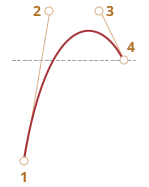

<<<<<<< HEAD
このアニメーションに対する正しいベジェ曲線を選ぶ必要があります。"飛び出す" ようにするため、どこかで `y>1` となるタイミングが必要です。

例えば、`cubic-bezier(0.25, 1.5, 0.75, 1.5)` のように、両方の制御点が `y>1` を取ることができます。

グラフは次の通りです:
=======
We need to choose the right Bezier curve for that animation. It should have `y>1` somewhere for the plane to "jump out".

For instance, we can take both control points with `y>1`, like: `cubic-bezier(0.25, 1.5, 0.75, 1.5)`.

The graph:
>>>>>>> 5e893cffce8e2346d4e50926d5148c70af172533

