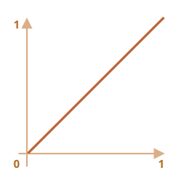
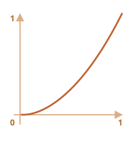
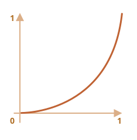
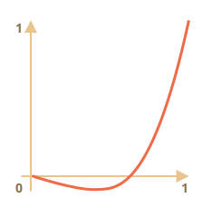
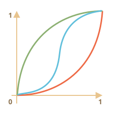

<<<<<<< HEAD
# JavaScript アニメーション

JavaScript アニメーションは CSS ではできないことを扱うことができます。

例えば、ベジェ曲線とは異なるタイミング関数を用いて複雑な経路に沿って移動したり、canvas 上でのアニメーションなどです。

[cut]

## setInterval

HTML/CSS の観点からは、アニメーションはスタイルプロパティの段階的な変更です。例えば、`style.left` を `0px` から `100px` に変更すると、要素が移動します。

そして、もしそれを `setInterval` の中で増加させるとき、毎秒 50 回の小さな変更を加えることによって、その変化はなめらかに見えます。これは映画館と同じ原理です。: 毎秒 24 以上のフレームがあれば十分に滑らかに見えます。

疑似コードは次のようになります:

```js
let delay = 1000 / 50; // 1 秒で 50 フレーム
let timer = setInterval(function() {
  if (animation complete) clearInterval(timer);
  else increase style.left
}, delay)
```

より複雑なアニメーションの例:

```js
let start = Date.now(); // 開始時間を覚える

let timer = setInterval(function() {
  // 開始からの経過時間は？
  let timePassed = Date.now() - start;

  if (timePassed >= 2000) {
    clearInterval(timer); // 2秒後にアニメーションが終了
    return;
  }

  // timePassed 時点のアニメーションを描画
=======
# JavaScript animations

JavaScript animations can handle things that CSS can't.

For instance, moving along a complex path, with a timing function different from Bezier curves, or an animation on a canvas.

## Using setInterval

An animation can be implemented as a sequence of frames -- usually small changes to HTML/CSS properties.

For instance, changing `style.left` from `0px` to `100px` moves the element. And if we increase it in `setInterval`, changing by `2px` with a tiny delay, like 50 times per second, then it looks smooth. That's the same principle as in the cinema: 24 frames per second is enough to make it look smooth.

The pseudo-code can look like this:

```js
let timer = setInterval(function() {
  if (animation complete) clearInterval(timer);
  else increase style.left by 2px
}, 20); // change by 2px every 20ms, about 50 frames per second
```

More complete example of the animation:

```js
let start = Date.now(); // remember start time

let timer = setInterval(function() {
  // how much time passed from the start?
  let timePassed = Date.now() - start;

  if (timePassed >= 2000) {
    clearInterval(timer); // finish the animation after 2 seconds
    return;
  }

  // draw the animation at the moment timePassed
>>>>>>> 540d753e90789205fc6e75c502f68382c87dea9b
  draw(timePassed);

}, 20);

<<<<<<< HEAD
// timePassed は 0 から 2000 まで進む
// なので、left は 0px から 400px になります
=======
// as timePassed goes from 0 to 2000
// left gets values from 0px to 400px
>>>>>>> 540d753e90789205fc6e75c502f68382c87dea9b
function draw(timePassed) {
  train.style.left = timePassed / 5 + 'px';
}
```

<<<<<<< HEAD
デモです。電車をクリックしてみてください:

[codetabs height=200 src="move"]

## requestAnimationFrame

複数のアニメーションが同時に実行されているとしましょう。

もしそれらを別々に実行し、それぞれが個別に `setInterval(..., 20)` を持っていると、ブラウザは `20ms` 間隔よりもっと頻繁に再描画をする必要があります。

各 `setInterval` は `20ms` 毎に一回トリガしますが、独立しているので `20ms` の中に複数の独立した実行があることになります。

これらの複数の独立した再描画は、ブラウザの再描画を簡単にし、CPUの負荷を減らしてよりなめらかに見せるためにグループ化すべきです。

言い換えると、次のコード:
=======
Click for the demo:

[codetabs height=200 src="move"]

## Using requestAnimationFrame

Let's imagine we have several animations running simultaneously.

If we run them separately, then even though each one has `setInterval(..., 20)`, then the browser would have to repaint much more often than every `20ms`.

That's because they have different starting time, so "every 20ms" differs between different animations. The intervals are not aligned. So we'll have several independent runs within `20ms`.

In other words, this:
>>>>>>> 540d753e90789205fc6e75c502f68382c87dea9b

```js
setInterval(function() {
  animate1();
  animate2();
  animate3();
}, 20)
```

<<<<<<< HEAD
...は以下のコードよりも軽量です:

```js
setInterval(animate1, 20);
setInterval(animate2, 20);
setInterval(animate3, 20);
```

心に留めておくべきことがもう一つあります。CPUが過負荷になっている場合や、その他再描画をあまりしなくて良い場合があります(ブラウザタブが非表示になっているようなとき）。そのため、本当は20ms毎に実行すべきではありません。

しかし、それを JavaScript ではどうやってしるのでしょう？ 関数 `requestAnimationFrame` を提供する標準の [アニメーションタイミング](http://www.w3.org/TR/animation-timing/) があります。この関数は、これらすべての問題及び、その他多くのことに対応しています。

構文:
=======
...Is lighter than three independent calls:

```js
setInterval(animate1, 20); // independent animations
setInterval(animate2, 20); // in different places of the script
setInterval(animate3, 20);
```

These several independent redraws should be grouped together, to make the redraw easier for the browser and hence load less CPU load and look smoother.

There's one more thing to keep in mind. Sometimes CPU is overloaded, or there are other reasons to redraw less often (like when the browser tab is hidden), so we really shouldn't run it every `20ms`.

But how do we know about that in JavaScript? There's a specification [Animation timing](https://www.w3.org/TR/animation-timing/) that provides the function `requestAnimationFrame`. It addresses all these issues and even more.

The syntax:
>>>>>>> 540d753e90789205fc6e75c502f68382c87dea9b
```js
let requestId = requestAnimationFrame(callback)
```

<<<<<<< HEAD
これは、ブラウザがアニメーションをしたい最も近い時間に `callback` 関数を実行するようスケジューリングします。

もし `callback` の中で要素を変更すると、他の `requestAnimationFrame` コールバックや CSS アニメーションと一緒にグループ化されます。これにより、配置の再計算と再描画がそれぞれではなく1回でまとめて行われます。

返却値 `requestId` は呼び出しをキャンセルするのに使うことができます:
```js
// スケジューリングされたコールバックの実行をキャンセルする
cancelAnimationFrame(requestId);
```

`callback` は1つの引数を取ります -- ページロードの開始からの経過時間のマイクロ秒です。
この時間は [performance.now()](mdn:api/Performance/now) を呼び出すことでも得ることができます。

通常 `callback` は CPU が過負荷状態になったり、ノートPCのバッテリーがほとんどなかったり、その他別の理由がある場合を除きすぐに実行されます。

下のコードは `requestAnimationFrame` での最初の10回の実行時間を表示します。通常は 10-20ms です。
=======
That schedules the `callback` function to run in the closest time when the browser wants to do animation.

If we do changes in elements in `callback` then they will be grouped together with other `requestAnimationFrame` callbacks and with CSS animations. So there will be one geometry recalculation and repaint instead of many.

The returned value `requestId` can be used to cancel the call:
```js
// cancel the scheduled execution of callback
cancelAnimationFrame(requestId);
```

The `callback` gets one argument -- the time passed from the beginning of the page load in milliseconds. This time can also be obtained by calling [performance.now()](mdn:api/Performance/now).

Usually `callback` runs very soon, unless the CPU is overloaded or the laptop battery is almost discharged, or there's another reason.

The code below shows the time between first 10 runs for `requestAnimationFrame`. Usually it's 10-20ms:
>>>>>>> 540d753e90789205fc6e75c502f68382c87dea9b

```html run height=40 refresh
<script>
  let prev = performance.now();
  let times = 0;

  requestAnimationFrame(function measure(time) {
    document.body.insertAdjacentHTML("beforeEnd", Math.floor(time - prev) + " ");
    prev = time;

    if (times++ < 10) requestAnimationFrame(measure);
  })
</script>
```

## Structured animation

<<<<<<< HEAD
これで、`requestAnimationFrame` に基づいた、様々な状況に対応することのできるアニメーション関数を作成することができます。
=======
Now we can make a more universal animation function based on `requestAnimationFrame`:
>>>>>>> 540d753e90789205fc6e75c502f68382c87dea9b

```js
function animate({timing, draw, duration}) {

  let start = performance.now();

  requestAnimationFrame(function animate(time) {
<<<<<<< HEAD
    // timeFraction は 0 から 1 になります
    let timeFraction = (time - start) / duration;
    if (timeFraction > 1) timeFraction = 1;

    // 現在のアニメーションの状態を計算します
    let progress = timing(timeFraction)

    draw(progress); // 描画します
=======
    // timeFraction goes from 0 to 1
    let timeFraction = (time - start) / duration;
    if (timeFraction > 1) timeFraction = 1;

    // calculate the current animation state
    let progress = timing(timeFraction)

    draw(progress); // draw it
>>>>>>> 540d753e90789205fc6e75c502f68382c87dea9b

    if (timeFraction < 1) {
      requestAnimationFrame(animate);
    }

  });
}
```

<<<<<<< HEAD
関数 `animate` はアニメーションを記述するための3つのパラメータを受け付けます。:

`duration`
: アニメーションのトータルの時間。例: `1000`。

`timing(timeFraction)`
: 経過時間(開始時: `0`, 終了時: `1`)を基に、アニメーションの完了(ベジェ曲線の `y` のような) を返す、CSS プロパティ `transition-timing-function` のようなタイミング関数です。

    例えば、線形関数はアニメーションが同じスピードで均一に進むことを意味します。:
=======
Function `animate` accepts 3 parameters that essentially describes the animation:

`duration`
: Total time of animation. Like, `1000`.

`timing(timeFraction)`
: Timing function, like CSS-property `transition-timing-function` that gets the fraction of time that passed (`0` at start, `1` at the end) and returns the animation completion (like `y` on the Bezier curve).

    For instance, a linear function means that the animation goes on uniformly with the same speed:
>>>>>>> 540d753e90789205fc6e75c502f68382c87dea9b

    ```js
    function linear(timeFraction) {
      return timeFraction;
    }
    ```

<<<<<<< HEAD
    グラフはこのようになります:
    

    これは `transition-timing-function: linear` のようなものです。下にあるようなより興味深いケースがあります。

`draw(progress)`
: アニメーションの完了状態を取り、描画を行う関数です。値 `progress=0` はアニメーションの開始状態を示し、`progress=1` は終了状態を示します。

    これは実際にアニメーションを描画する関数です。

    要素が移動します:
=======
    Its graph:
    

    That's just like `transition-timing-function: linear`. There are more interesting variants shown below.

`draw(progress)`
: The function that takes the animation completion state and draws it. The value `progress=0` denotes the beginning animation state, and `progress=1` -- the end state.

    This is that function that actually draws out the animation.

    It can move the element:
>>>>>>> 540d753e90789205fc6e75c502f68382c87dea9b
    ```js
    function draw(progress) {
      train.style.left = progress + 'px';
    }
    ```
<<<<<<< HEAD
    
    ...または、他のことを行うことで、どんな方法でも何でもアニメーションさせることができます。

この関数を使って、要素の `width` を `0` から `100%` までアニメーションさせてみましょう。

デモ内の要素をクリックしてください:

[codetabs height=60 src="width"]

コードは次の通りです:
=======

    ...Or do anything else, we can animate anything, in any way.


Let's animate the element `width` from `0` to `100%` using our function.

Click on the element for the demo:

[codetabs height=60 src="width"]

The code for it:
>>>>>>> 540d753e90789205fc6e75c502f68382c87dea9b

```js
animate({
  duration: 1000,
  timing(timeFraction) {
    return timeFraction;
  },
  draw(progress) {
    elem.style.width = progress * 100 + '%';
  }
});
```

<<<<<<< HEAD
CSS アニメーションとは異なり、任意のタイミング関数や描画関数を作ることができます。タイミング関数はベジェ曲線には制限されません。そして `draw` はプロパティを超えて、花火のアニメーションといった新しい要素を作成することもできます。

## タイミング関数

上記で最もシンプルな線形のタイミング関数を見ました。

他のものも見てみましょう。様々なタイミング関数でのアニメーションを試して、どのように動くのかを確認してみます。

### Power of n(n のべき乗)

アニメーションをスピードアップさせたい場合には、`n` のべき乗で `progress` を使います。 

例えば、放物曲線:
=======
Unlike CSS animation, we can make any timing function and any drawing function here. The timing function is not limited by Bezier curves. And `draw` can go beyond properties, create new elements for like fireworks animation or something.

## Timing functions

We saw the simplest, linear timing function above.

Let's see more of them. We'll try movement animations with different timing functions to see how they work.

### Power of n

If we want to speed up the animation, we can use `progress` in the power `n`.

For instance, a parabolic curve:
>>>>>>> 540d753e90789205fc6e75c502f68382c87dea9b

```js
function quad(timeFraction) {
  return Math.pow(timeFraction, 2)
}
```

<<<<<<< HEAD
グラフ:



動作を見る（クリックして有効化）:

[iframe height=40 src="quad" link]

...または、3次曲線のような `n` がより大きい場合。`n` を増やすことでより速度が上がります。

これは、べき乗 `5` での `progress` のグラフです。:


動作を見る:

[iframe height=40 src="quint" link]

### 円弧

関数:
=======
The graph:


See in action (click to activate):

[iframe height=40 src="quad" link]

...Or the cubic curve or even greater `n`. Increasing the power makes it speed up faster.

Here's the graph for `progress` in the power `5`:


In action:

[iframe height=40 src="quint" link]

### The arc

Function:
>>>>>>> 540d753e90789205fc6e75c502f68382c87dea9b

```js
function circ(timeFraction) {
  return 1 - Math.sin(Math.acos(timeFraction));
}
```

<<<<<<< HEAD
グラフ:
=======
The graph:
>>>>>>> 540d753e90789205fc6e75c502f68382c87dea9b



[iframe height=40 src="circ" link]

<<<<<<< HEAD
### 戻る: 弓

この関数は "弓の射撃" を行います。最初に "弦を引き"、次に "撃ちます"。

前の関数とは異なり、追加のパラメータ `x`, "弾性係数" に依存します。"弦を引く" 距離はこれにより定義されます。

コード:
=======
### Back: bow shooting

This function does the "bow shooting". First we "pull the bowstring", and then "shoot".

Unlike previous functions, it depends on an additional parameter `x`, the "elasticity coefficient". The distance of "bowstring pulling" is defined by it.

The code:
>>>>>>> 540d753e90789205fc6e75c502f68382c87dea9b

```js
function back(x, timeFraction) {
  return Math.pow(timeFraction, 2) * ((x + 1) * timeFraction - x)
}
```

<<<<<<< HEAD
**`x = 1.5` の場合のグラフ:**



アニメーションの場合、特定の `x` の値で使用します。これは `x = 1.5` の例です:

[iframe height=40 src="back" link]

### バウンド

ボールを落としたと想像してください。それは落ちて後何度か跳ね返ってから停止します。

`bounce` 関数はそれと同じことをしますが、始まる順序は逆です。なお、このために必要な特別な係数はほとんどありません。:

```js
function bounce(timeFraction) {
  for (let a = 0, b = 1, result; 1; a += b, b /= 2) {
=======
**The graph for `x = 1.5`:**


For animation we use it with a specific value of `x`. Example for `x = 1.5`:

[iframe height=40 src="back" link]

### Bounce

Imagine we are dropping a ball. It falls down, then bounces back a few times and stops.

The `bounce` function does the same, but in the reverse order: "bouncing" starts immediately. It uses few special coefficients for that:

```js
function bounce(timeFraction) {
  for (let a = 0, b = 1; 1; a += b, b /= 2) {
>>>>>>> 540d753e90789205fc6e75c502f68382c87dea9b
    if (timeFraction >= (7 - 4 * a) / 11) {
      return -Math.pow((11 - 6 * a - 11 * timeFraction) / 4, 2) + Math.pow(b, 2)
    }
  }
}
```

<<<<<<< HEAD
動作を見る:

[iframe height=40 src="bounce" link]

### 弾性のあるアニメーション

"初期範囲" 用の追加パラメータ `x` を受け取るもう一つの "弾む" 関数です。
=======
In action:

[iframe height=40 src="bounce" link]

### Elastic animation

One more "elastic" function that accepts an additional parameter `x` for the "initial range".
>>>>>>> 540d753e90789205fc6e75c502f68382c87dea9b

```js
function elastic(x, timeFraction) {
  return Math.pow(2, 10 * (timeFraction - 1)) * Math.cos(20 * Math.PI * x / 3 * timeFraction)
}
```

<<<<<<< HEAD
**`x=1.5` のグラフです:**


`x=1.5` の場合の動作:
=======
**The graph for `x=1.5`:**


In action for `x=1.5`:
>>>>>>> 540d753e90789205fc6e75c502f68382c87dea9b

[iframe height=40 src="elastic" link]

## Reversal: ease*

<<<<<<< HEAD
ここまでで様々なタイミング関数があります。これらは "easeIn" と呼ばれます。

アニメーションを逆の順序で表示する必要があることがあります。これは、"easeOut" 変換で行います。

### easeOut

"easeOut" モードでは、`timing` 関数はラッパー `timingEaseOut` の中に配置されます。
=======
So we have a collection of timing functions. Their direct application is called "easeIn".

Sometimes we need to show the animation in the reverse order. That's done with the "easeOut" transform.

### easeOut

In the "easeOut" mode the `timing` function is put into a wrapper `timingEaseOut`:
>>>>>>> 540d753e90789205fc6e75c502f68382c87dea9b

```js
timingEaseOut(timeFraction) = 1 - timing(1 - timeFraction)
```

<<<<<<< HEAD
つまり、"通常の" タイミング関数を取り、"そのラッパーを返す" "変換" 関数 `makeEaseOut` を使用します。:

```js
// タイミング関数を引数とし、変換したものを返す
=======
In other words, we have a "transform" function `makeEaseOut` that takes a "regular" timing function and returns the wrapper around it:

```js
// accepts a timing function, returns the transformed variant
>>>>>>> 540d753e90789205fc6e75c502f68382c87dea9b
function makeEaseOut(timing) {
  return function(timeFraction) {
    return 1 - timing(1 - timeFraction);
  }
}
```

<<<<<<< HEAD
例えば、上述の `bounce` 関数に対して適用してみます:
=======
For instance, we can take the `bounce` function described above and apply it:
>>>>>>> 540d753e90789205fc6e75c502f68382c87dea9b

```js
let bounceEaseOut = makeEaseOut(bounce);
```

<<<<<<< HEAD
すると、最初ではなくアニメーションの最後にバウンドするようになります。より自然にみえます。:

[codetabs src="bounce-easeout"]

ここでは、変換関数がどのように元の関数の挙動を変化させたのかが確認できます:


跳ね返るような、アニメーションが最初にある場合には、それは最後似表示されます。

上のグラフでは <span style="color:#EE6B47">通常のバウンド</span>  は赤色、<span style="color:#62C0DC">easeOut のバウンド</span> は青色です。

- 通常のバウンド: 物体は下の方で跳ね、最後に急激に跳ね上がります。
- `easeOut` : 最初に上に大きく跳ねてからバウンドします

### easeInOut

アニメーションの最初と最後両方でこの効果を見せることもできます。このトランジションは "easeInOut" と呼ばれます。

タイミング関数が与えられると、次のようにアニメーションの状態を算出します:

```js
if (timeFraction <= 0.5) { // アニメーションの前半
  return timing(2 * timeFraction) / 2;
} else { // アニメーションの後半
=======
Then the bounce will be not in the beginning, but at the end of the animation. Looks even better:

[codetabs src="bounce-easeout"]

Here we can see how the transform changes the behavior of the function:


If there's an animation effect in the beginning, like bouncing -- it will be shown at the end.

In the graph above the <span style="color:#EE6B47">regular bounce</span> has the red color, and the <span style="color:#62C0DC">easeOut bounce</span> is blue.

- Regular bounce -- the object bounces at the bottom, then at the end sharply jumps to the top.
- After `easeOut` -- it first jumps to the top, then bounces there.

### easeInOut

We also can show the effect both in the beginning and the end of the animation. The transform is called "easeInOut".

Given the timing function, we calculate the animation state like this:

```js
if (timeFraction <= 0.5) { // first half of the animation
  return timing(2 * timeFraction) / 2;
} else { // second half of the animation
>>>>>>> 540d753e90789205fc6e75c502f68382c87dea9b
  return (2 - timing(2 * (1 - timeFraction))) / 2;
}
```

<<<<<<< HEAD
このラッパーコードです:
=======
The wrapper code:
>>>>>>> 540d753e90789205fc6e75c502f68382c87dea9b

```js
function makeEaseInOut(timing) {
  return function(timeFraction) {
    if (timeFraction < .5)
      return timing(2 * timeFraction) / 2;
    else
      return (2 - timing(2 * (1 - timeFraction))) / 2;
  }
}

bounceEaseInOut = makeEaseInOut(bounce);
```

<<<<<<< HEAD
`bounceEaseInOut` の動作を見る:

[codetabs src="bounce-easeinout"]

"easeInOut" 変換は2つのグラフを1つにします: アニメーションの前半用の `easeIn` と、後半用の `easeOut` (`easeIn` の反転)です。

円弧 `circ` タイミング関数を例にして、その `easeIn`, `easeOut` と `easeInOut` のグラフを比べると、その効果ががはっきりと分かります。:



- <span style="color:#EE6B47">赤</span> 通常の `circ` (`easeIn`).
- <span style="color:#8DB173">緑</span> -- `easeOut`.
- <span style="color:#62C0DC">青</span> -- `easeInOut`.

ご覧の通り、アニメーションの前半のグラフは縮小された `easeIn` であり、後半は縮小された `easeOut` のグラフです。結果、アニメーションはそれぞれの効果ではじまり、そして終わります。

## より興味深い "draw"

要素を移動させる代わりに、他のことをすることもできます。必要なことは適切な `draw` を記述することです。

これは "バウンド" するテキスト入力のアニメーション例です:

[codetabs src="text"]

## サマリ

CSS では上手く扱えなかったり、厳密な制御が必要なアニメーションの場合、JavaScript が役立ちます。JavaScript アニメーションは `requestAnimationFrame` 経由で実装します。この組み込みのメソッドにより、ブラウザが再描画を準備するときに実行されるコールバック関数をセットアップすることができます。通常、それはすぐですが、正確な時間はブラウザに依存します。

また、これはページがバックグラウンドのときは再描画はまったく行いません。コールバックが実行されないからです。アニメーションは一時停止し、リソースも消費されません。これは素晴らしいことです。

これは、ほとんどのアニメーションのセットアップに使えるヘルパー関数 `animate` です:
=======
In action, `bounceEaseInOut`:

[codetabs src="bounce-easeinout"]

The "easeInOut" transform joins two graphs into one: `easeIn` (regular) for the first half of the animation and `easeOut` (reversed) -- for the second part.

The effect is clearly seen if we compare the graphs of `easeIn`, `easeOut` and `easeInOut` of the `circ` timing function:


- <span style="color:#EE6B47">Red</span> is the regular variant of `circ` (`easeIn`).
- <span style="color:#8DB173">Green</span> -- `easeOut`.
- <span style="color:#62C0DC">Blue</span> -- `easeInOut`.

As we can see, the graph of the first half of the animation is the scaled down `easeIn`, and the second half is the scaled down `easeOut`. As a result, the animation starts and finishes with the same effect.

## More interesting "draw"

Instead of moving the element we can do something else. All we need is to write the proper `draw`.

Here's the animated "bouncing" text typing:

[codetabs src="text"]

## Summary

For animations that CSS can't handle well, or those that need tight control, JavaScript can help. JavaScript animations should be implemented via `requestAnimationFrame`. That built-in method allows to setup a callback function to run when the browser will be preparing a repaint. Usually that's very soon, but the exact time depends on the browser.

When a page is in the background, there are no repaints at all, so the callback won't run: the animation will be suspended and won't consume resources. That's great.

Here's the helper `animate` function to setup most animations:
>>>>>>> 540d753e90789205fc6e75c502f68382c87dea9b

```js
function animate({timing, draw, duration}) {

  let start = performance.now();

  requestAnimationFrame(function animate(time) {
<<<<<<< HEAD
    // timeFraction は 0 tから 1
    let timeFraction = (time - start) / duration;
    if (timeFraction > 1) timeFraction = 1;

    // 現在のアニメーションの状態を計算
    let progress = timing(timeFraction);

    draw(progress); // 描画
=======
    // timeFraction goes from 0 to 1
    let timeFraction = (time - start) / duration;
    if (timeFraction > 1) timeFraction = 1;

    // calculate the current animation state
    let progress = timing(timeFraction);

    draw(progress); // draw it
>>>>>>> 540d753e90789205fc6e75c502f68382c87dea9b

    if (timeFraction < 1) {
      requestAnimationFrame(animate);
    }

  });
}
```

<<<<<<< HEAD
オプション:

- `duration` -- アニメーションの合計時間(ms)。
- `timing` -- アニメーションの進行状況を計算する関数。0 〜 1 まで値を引数に取り、通常は 0 〜 1 でアニメーションの進行状況を返します。
- `draw` -- アニメーションを描画する関数です。

もちろん、これを改善して様々なオプションを追加することができますが、JavaScript アニメーションは日常的に使用されるものではありません。これらはなにか興味深いことをする場合や非標準的なことをする際に利用されます。そのため、必要なときに必要な機能を追加するのがよいでしょう。

JavaScript アニメーションは、任意のタイミング関数を扱うことができます。ここでは多くの例を取り上げました。CSS とは異なり、JavaScript アニメーションはベジェ曲線に制限されません。

`draw` についても同様です。CSS プロパティだけでなく、何でもアニメーションにすることができます。
=======
Options:

- `duration` -- the total animation time in ms.
- `timing` -- the function to calculate animation progress. Gets a time fraction from 0 to 1, returns the animation progress, usually from 0 to 1.
- `draw` -- the function to draw the animation.

Surely we could improve it, add more bells and whistles, but JavaScript animations are not applied on a daily basis. They are used to do something interesting and non-standard. So you'd want to add the features that you need when you need them.

JavaScript animations can use any timing function. We covered a lot of examples and transformations to make them even more versatile. Unlike CSS, we are not limited to Bezier curves here.

The same is true about `draw`: we can animate anything, not just CSS properties.
>>>>>>> 540d753e90789205fc6e75c502f68382c87dea9b
