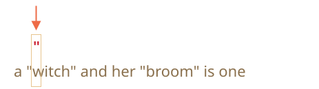
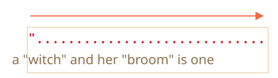
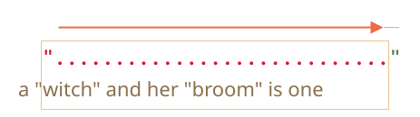
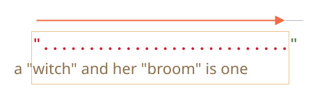
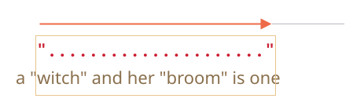
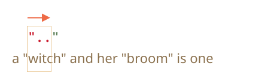
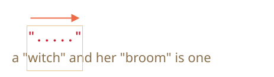
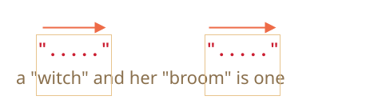

<<<<<<< HEAD
# 貪欲と怠惰な量指定子

量指定子は一見すると非常に簡単ですが、実際には扱いにくいです。

`pattern:/\d+/` よりも複雑なものを探す場合、検索がどのように上手く動作しているのかを理解する必要があります。

例として、次のタスクをやってみましょう。

テキストがあり、すべての引用符 `"..."` をギルメットマーク `«...»` に置き換える必要があります。それらは多くの国でタイポグラフィとして好まれています。

例えば: `"Hello, world"` は `«Hello, world»` になります。

国によっては、`„Witam, świat!”` (ポーランド語)や `「你好，世界」` (中国語) の引用符を好みます。異なるロケールでは、異なる置換を選ぶ可能性がありますが、すべて同じように動作するので、まずは `«...»` で始めましょう。

置換するためには、まずすべての引用符で囲まれた部分文字列を見つける必要があります。

正規表現はこのようになります: `pattern:/".+"/g` (引用符に続いて何かがあり、その後別の引用符)。良さそうに見えますが、これはうまくいきません!

やってみましょう:

```js run
let reg = /".+"/g;

let str = 'a "witch" and her "broom" is one';

alert( str.match(reg) ); // "witch" and her "broom"
```

...意図通りに動作していないことが分かります!

`match:"witch"` と `match:"broom"`, 2つのマッチを見つけるのではなく、1つ `match:"witch" and her "broom"` を見つけます。

それは、"貪欲は諸悪の根源" と表現することができます。

## 貪欲(欲張り/最大量)検索

マッチを見つけるために、正規表現エンジンは次のアルゴリズムを使います:

- 文字列内のすべての位置で
    -  その位置でパターンをマッチさせます
    - マッチしない場合は次の位置に移動します。

これらの一般的な言葉では正規表現が失敗する理由が明白でないため、パターン 
`pattern:".+"` に対して検索がどのように機能するかを詳しく見ていきましょう。

1. 最初のパターン文字は引用符 `pattern:"` です。

    正規表現エンジンは、ソース文字列 `subject:a "witch" and her "broom" is one` のゼロ位置でそのパターンを見つけようとしますが、そこは `subject:a` なので、すぐには一致しません。

    次に進みます: ソース文字列の次の位置に移動し、そこで最初のパターン文字を見つけようとします。そして3番目の位置で引用符を見つけます。:

    

2. 引用符が検出され、次にエンジンはパターン残り部分のマッチを見つけようとします。ソース文字列の残りの部分が `pattern:.+"` に従っているかを確かめます。

    我々のケースでは、次のパターン文字は `pattern:.` (ドット)です。それは "改行以外の任意の文字" を意味するので、次の文字 `match:'w'` にフィットします:

    

3. 次に、量指定子 `pattern:.+` なのでドットを繰り返します。正規表現エンジンは可能な限り文字を1つずつ取り込み、マッチを作成します。

    ...いつ不可能になるでしょう？すべての文字はドットにマッチするので、文字列の最後に到達したときにだけ停止します。:

    

4. いま、エンジンは `pattern:.+` の繰り返しを終了し、次のパターン文字を見つけようとします。それは引用符 `pattern:"` です。しかし、ここで問題あります: 文字列は終了したのでこれ以上文字はありません!

    正規表現エンジンはあまりに多くの `pattern:.+` が引っかかったと理解し、*来た道を戻り* 始めます。

    つまり、量指定子のマッチを1文字減らします。:

    

    今、`pattern:.+` は末尾の1文字前で終わり、残りのパターンをその位置からマッチさせようとします。

    もしそこに引用符があれば終了しますが、最後の文字は `subject:'e'` なので一致しません。

5. ...なので、エンジンは `pattern:.+` の繰り返し回数をもう1文字減らします:

    

    引用符 `pattern:'"'` は `subject:'n'` に一致しません。

6. エンジンは戻り続けます: エンジンは残りのパターン(今回のケースでは `pattern:'"'`)にマッチするまで `pattern:'.'` の繰り返し回数を減らします。:

    

7. マッチが完了しました。

8. したがって、最初のマッチは `match:"witch" and her "broom"` です。さらなる検索は最初のマッチが終わったところから始まりますが、残りの文字列  `subject:is one` にはこれ以上引用はないため、それ以上の結果はありません。

これは恐らく我々が期待したものではありませんが、このように動作します。

**貪欲(Greedy)モード(デフォルト)では、量指定子は可能な限り繰り返されます。**

正規表現エンジンは `pattern:.+` でできるだけ多くの文字を取得しようとし、その後1つずつ縮めていきます。

私たちのタスクでは、別のものが欲しいです。そのためのものとして、怠惰な/控えめな量指定子モードがあります。

## 怠惰(最短)モード

量指定子の怠惰モードは貪欲モードとは逆です。それは "最小限の回数だけ繰り返す" を意味します。

これを有効にするには量指定子の後に疑問符 `pattern:'?'` を置き、`pattern:'?'` に対して `pattern:*?` や `pattern:+?` または `pattern:??`になるようにします。

よりはっきりさせる為に: 通常、疑問符マーク `pattern:?` はそれ自身が量指定子(0か1)ですが、*別の量指定子(または自身も)* の後に追加された場合、別の意味を持ちます -- マッチングのモードを貪欲から怠惰に切り替えます。

正規表現 `pattern:/".+?"/g` は期待通りに動作します: これは `match:"witch"` と `match:"broom"` を見つけます。:

```js run
let reg = /".+?"/g;

let str = 'a "witch" and her "broom" is one';

alert( str.match(reg) ); // witch, broom
```

変更をよりはっきり理解するために、検索をステップ毎にトレースしてみましょう。

1. 最初のステップは同じです: 3番目の位置でパターンの開始 `pattern:'"'` を見つけます。:

    

2. 次のステップも似ています: エンジンはドット `pattern:'.'` に対するマッチを見つけます:

    

3. ここから検索は異なります。`pattern:+?` は怠惰モードなので、エンジンはもう一度マッチさせようとはせず、パターンの残り部分 `pattern:'"'` とマッチさせようとします:

    

    もしそこに引用符があれば、検索は終わっていましたが、`'i'` なのでマッチしません。
4. 次に、正規表現エンジンはドットの繰り返し回数を増やし、もう一度試みます。:

    

    再び失敗です。その後、繰り返し回数は何度も増えていきます...
5. ...パターンの残り部分への一致が見つかるまで繰り返されます:

    

6. 次の検索は現在のマッチの終わりから始まり、もう1つ結果が得られます:

    

この例では、`pattern:+?` に対して怠惰モードがどのように動作するかを見てきました。量指定子 `pattern:+?` と `pattern:??` は同様の方法で動作します -- 残りのパターンが指定された位置で一致しない場合のみ、正規表現エンジンは繰り返し回数を増やします。

**怠惰は `?` をつけた量指定子に対してのみ有効です。**

他の量指定子は依然として貪欲です。

例:

```js run
alert( "123 456".match(/\d+ \d+?/g) ); // 123 4
```

1. パターン `pattern:\d+` はできるだけ多くマッチさせようとし(貪欲モード)、`match:123` を見つけ停止します。なぜなら次の文字は空白 `pattern:' '` だからです。
2. 次にパターンに空白があるので、それがマッチします。
3. 続いて `pattern:\d+?` です。量指定子は怠惰モードなので、1桁の `match:4` を見つけ、残りのパターンがそこからマッチするかをチェックします。

    ...しかしパターンは `pattern:\d+?` で終わりです。

    怠惰モードは必要がないので何も繰り返しません。パターンは終了したので、やることは終わりました。マッチしたのは `match:123 4` です。

```smart header="最適化"
現代の正規表現エンジンはより高速に動作するために内部のアルゴリズムを最適化します。なので、実際には説明したアルゴリズムとは少し異なる動作をする場合があります。

しかし、正規表現がどのように動作するかを理解したり、正規表現を構築するのにそれらを知る必要はありません。それらは物事を最適化するために内部でのみ使用されます。

複雑な正規表現は最適化が難しいので、検索は説明した通りに正確に動作します。
```

## 代替のアプローチ

正規表現では、同じことをする方法が複数あることがよくあります。

我々のケースでは、`pattern:"[^"]+"` を使うことで、怠惰モードなしで引用符で囲まれた文字列を見つけることができます。:

```js run
let reg = /"[^"]+"/g;

let str = 'a "witch" and her "broom" is one';

alert( str.match(reg) ); // witch, broom
```

正規表現 `pattern:"[^"]+"` は正しい結果を返します。なぜなら、引用符 `pattern:'"'` に続けて1つ以上の非引用符 `pattern:[^"]` 、その後引用符を閉じるというパターンを探すからです。

正規表現エンジンが `pattern:[^"]+` を探す際、引用符閉じに出会うと繰り返しをやめ、検索が終わります。

このロジックは怠惰量指定子を置き換えるものではないことに注意してください!

私たちはいずれかが必要なときがあります。

**怠惰量指定子が失敗し、このバリアントが正しく動作する例を見てみましょう。**

例えば、任意の `href` をもつ形式 `<a href="..." class="doc">` のリンクを取得したいとします。

どちらの正規表現を使うべきでしょう？

最初のアイデアは: `pattern:/<a href=".*" class="doc">/g` です。

確認してみましょう:
```js run
let str = '...<a href="link" class="doc">...';
let reg = /<a href=".*" class="doc">/g;

// 動作します!
alert( str.match(reg) ); // <a href="link" class="doc">
```

...しかし、仮にテキスト中にもっとリンクがあるとどうなるでしょう？

```js run
let str = '...<a href="link1" class="doc">... <a href="link2" class="doc">...';
let reg = /<a href=".*" class="doc">/g;

// Whoops! 1つのマッチに2つのリンクがあります!
alert( str.match(reg) ); // <a href="link1" class="doc">... <a href="link2" class="doc">
```

今の結果は、上述の "魔女(witch)" の例と同じ理由で間違っています。量指定子 `pattern:.*` は文字を多く取り過ぎました。

一致はこのように見えます:
=======
# Greedy and lazy quantifiers

Quantifiers are very simple from the first sight, but in fact they can be tricky.

We should understand how the search works very well if we plan to look for something more complex than `pattern:/\d+/`.

Let's take the following task as an example.

We have a text and need to replace all quotes `"..."` with guillemet marks: `«...»`. They are preferred for typography in many countries.

For instance: `"Hello, world"` should become `«Hello, world»`. There exist other quotes, such as `„Witaj, świecie!”` (Polish) or `「你好，世界」` (Chinese), but for our task let's choose `«...»`.

The first thing to do is to locate quoted strings, and then we can replace them.

A regular expression like `pattern:/".+"/g` (a quote, then something, then the other quote) may seem like a good fit, but it isn't!

Let's try it:

```js run
let regexp = /".+"/g;

let str = 'a "witch" and her "broom" is one';

alert( str.match(regexp) ); // "witch" and her "broom"
```

...We can see that it works not as intended!

Instead of finding two matches `match:"witch"` and `match:"broom"`, it finds one: `match:"witch" and her "broom"`.

That can be described as "greediness is the cause of all evil".

## Greedy search

To find a match, the regular expression engine uses the following algorithm:

- For every position in the string
    - Try to match the pattern at that position.
    - If there's no match, go to the next position.

These common words do not make it obvious why the regexp fails, so let's elaborate how the search works for the pattern `pattern:".+"`.

1. The first pattern character is a quote `pattern:"`.

    The regular expression engine tries to find it at the zero position of the source string `subject:a "witch" and her "broom" is one`, but there's `subject:a` there, so there's immediately no match.

    Then it advances: goes to the next positions in the source string and tries to find the first character of the pattern there, fails again, and finally finds the quote at the 3rd position:

    

2. The quote is detected, and then the engine tries to find a match for the rest of the pattern. It tries to see if the rest of the subject string conforms to `pattern:.+"`.

    In our case the next pattern character is `pattern:.` (a dot). It denotes "any character except a newline", so the next string letter `match:'w'` fits:

    

3. Then the dot repeats because of the quantifier `pattern:.+`. The regular expression engine adds to the match one character after another.

    ...Until when? All characters match the dot, so it only stops when it reaches the end of the string:

    

4. Now the engine finished repeating `pattern:.+` and tries to find the next character of the pattern. It's the quote `pattern:"`. But there's a problem: the string has finished, there are no more characters!

    The regular expression engine understands that it took too many `pattern:.+` and starts to *backtrack*.

    In other words, it shortens the match for the quantifier by one character:

    

    Now it assumes that `pattern:.+` ends one character before the string end and tries to match the rest of the pattern from that position.

    If there were a quote there, then the search would end, but the last character is `subject:'e'`, so there's no match.

5. ...So the engine decreases the number of repetitions of `pattern:.+` by one more character:

    

    The quote `pattern:'"'` does not match `subject:'n'`.

6. The engine keep backtracking: it decreases the count of repetition for `pattern:'.'` until the rest of the pattern (in our case `pattern:'"'`) matches:

    

7. The match is complete.

8. So the first match is `match:"witch" and her "broom"`. If the regular expression has flag `pattern:g`, then the search will continue from where the first match ends. There are no more quotes in the rest of the string `subject:is one`, so no more results.

That's probably not what we expected, but that's how it works.

**In the greedy mode (by default) a quantified character is repeated as many times as possible.**

The regexp engine adds to the match as many characters as it can for `pattern:.+`, and then shortens that one by one, if the rest of the pattern doesn't match.

For our task we want another thing. That's where a lazy mode can help.

## Lazy mode

The lazy mode of quantifiers is an opposite to the greedy mode. It means: "repeat minimal number of times".

We can enable it by putting a question mark `pattern:'?'` after the quantifier, so that it becomes  `pattern:*?` or `pattern:+?` or even `pattern:??` for `pattern:'?'`.

To make things clear: usually a question mark `pattern:?` is a quantifier by itself (zero or one), but if added *after another quantifier (or even itself)* it gets another meaning -- it switches the matching mode from greedy to lazy.

The regexp `pattern:/".+?"/g` works as intended: it finds `match:"witch"` and `match:"broom"`:

```js run
let regexp = /".+?"/g;

let str = 'a "witch" and her "broom" is one';

alert( str.match(regexp) ); // "witch", "broom"
```

To clearly understand the change, let's trace the search step by step.

1. The first step is the same: it finds the pattern start `pattern:'"'` at the 3rd position:

    

2. The next step is also similar: the engine finds a match for the dot `pattern:'.'`:

    

3. And now the search goes differently. Because we have a lazy mode for `pattern:+?`, the engine doesn't try to match a dot one more time, but stops and tries to match the rest of the pattern  `pattern:'"'` right now:

    

    If there were a quote there, then the search would end, but there's `'i'`, so there's no match.
4. Then the regular expression engine increases the number of repetitions for the dot and tries one more time:

    

    Failure again. Then the number of repetitions is increased again and again...
5. ...Till the match for the rest of the pattern is found:

    

6. The next search starts from the end of the current match and yield one more result:

    

In this example we saw how the lazy mode works for `pattern:+?`. Quantifiers `pattern:*?` and `pattern:??` work the similar way -- the regexp engine increases the number of repetitions only if the rest of the pattern can't match on the given position.

**Laziness is only enabled for the quantifier with `?`.**

Other quantifiers remain greedy.

For instance:

```js run
alert( "123 456".match(/\d+ \d+?/) ); // 123 4
```

1. The pattern `pattern:\d+` tries to match as many digits as it can (greedy mode), so it finds  `match:123` and stops, because the next character is a space `pattern:' '`.
2. Then there's a space in the pattern, it matches.
3. Then there's `pattern:\d+?`. The quantifier is in lazy mode, so it finds one digit `match:4` and tries to check if the rest of the pattern matches from there.

    ...But there's nothing in the pattern after `pattern:\d+?`.

    The lazy mode doesn't repeat anything without a need. The pattern finished, so we're done. We have a match `match:123 4`.

```smart header="Optimizations"
Modern regular expression engines can optimize internal algorithms to work faster. So they may work a bit differently from the described algorithm.

But to understand how regular expressions work and to build regular expressions, we don't need to know about that. They are only used internally to optimize things.

Complex regular expressions are hard to optimize, so the search may work exactly as described as well.
```

## Alternative approach

With regexps, there's often more than one way to do the same thing.

In our case we can find quoted strings without lazy mode using the regexp `pattern:"[^"]+"`:

```js run
let regexp = /"[^"]+"/g;

let str = 'a "witch" and her "broom" is one';

alert( str.match(regexp) ); // "witch", "broom"
```

The regexp `pattern:"[^"]+"` gives correct results, because it looks for a quote `pattern:'"'` followed by one or more non-quotes `pattern:[^"]`, and then the closing quote.

When the regexp engine looks for `pattern:[^"]+` it stops the repetitions when it meets the closing quote, and we're done.

Please note, that this logic does not replace lazy quantifiers!

It is just different. There are times when we need one or another.

**Let's see an example where lazy quantifiers fail and this variant works right.**

For instance, we want to find links of the form `<a href="..." class="doc">`, with any `href`.

Which regular expression to use?

The first idea might be: `pattern:/<a href=".*" class="doc">/g`.

Let's check it:
```js run
let str = '...<a href="link" class="doc">...';
let regexp = /<a href=".*" class="doc">/g;

// Works!
alert( str.match(regexp) ); // <a href="link" class="doc">
```

It worked. But let's see what happens if there are many links in the text?

```js run
let str = '...<a href="link1" class="doc">... <a href="link2" class="doc">...';
let regexp = /<a href=".*" class="doc">/g;

// Whoops! Two links in one match!
alert( str.match(regexp) ); // <a href="link1" class="doc">... <a href="link2" class="doc">
```

Now the result is wrong for the same reason as our "witches" example. The quantifier `pattern:.*` took too many characters.

The match looks like this:
>>>>>>> 1dce5b72b16288dad31b7b3febed4f38b7a5cd8a

```html
<a href="....................................." class="doc">
<a href="link1" class="doc">... <a href="link2" class="doc">
```

<<<<<<< HEAD
量指定子 `pattern:.*?` を怠惰にすることでパターンを修正しましょう:

```js run
let str = '...<a href="link1" class="doc">... <a href="link2" class="doc">...';
let reg = /<a href=".*?" class="doc">/g;

// 動作します!
alert( str.match(reg) ); // <a href="link1" class="doc">, <a href="link2" class="doc">
```

これで機能し、2つのマッチが見つかります:
=======
Let's modify the pattern by making the quantifier `pattern:.*?` lazy:

```js run
let str = '...<a href="link1" class="doc">... <a href="link2" class="doc">...';
let regexp = /<a href=".*?" class="doc">/g;

// Works!
alert( str.match(regexp) ); // <a href="link1" class="doc">, <a href="link2" class="doc">
```

Now it seems to work, there are two matches:
>>>>>>> 1dce5b72b16288dad31b7b3febed4f38b7a5cd8a

```html
<a href="....." class="doc">    <a href="....." class="doc">
<a href="link1" class="doc">... <a href="link2" class="doc">
```

<<<<<<< HEAD
それがなぜ機能するか -- は上のすべての説明の後に明らかにした方がよいです。従って、詳細へは入らず、もう１つのテキストを試してみましょう:

```js run
let str = '...<a href="link1" class="wrong">... <p style="" class="doc">...';
let reg = /<a href=".*?" class="doc">/g;

// 間違った一致です!
alert( str.match(reg) ); // <a href="link1" class="wrong">... <p style="" class="doc">
```

正規表現がリンクだけでなく、`<p...>` を含むその後に続くテキストもマッチしていることがわかります。

なぜこのようなことが起こるのでしょうか?

1. まず、正規表現はリンクの開始 `match:<a href="` を見つけます
2. 次に `pattern:.*?` を探し、1文字を取ります。その後、パターンの残り部分にマッチするものがあるかをチェックし、もう1文字取ります...

    量指定子 `pattern:.*?` は `match:class="doc">` に到達するまで文字を取ります。

    ...それはどこで見つかるでしょう？テキストを見ると、`match:class="doc">` はリンクを越えた、タグ `<p>` の中にだけあることが分かります。

3. したがって、一致は次のようになります:

    ```html
    <a href="..................................." class="doc">
    <a href="link1" class="wrong">... <p style="" class="doc">
    ```

そのため、怠惰はここでは動作しませんでした。

私たちは `<a href="...something..." class="doc">` を探すパターンが必要ですが、貪欲と怠惰、両方のバリアントに問題がありません。

正しいバリアントは次のようになります: `pattern:href="[^"]*"`。これは `href` 属性の中のすべての文字を取ります。それは最も近い引用符までであり、まさに私たちが必要なものです。

動作例:
=======
...But let's test it on one more text input:

```js run
let str = '...<a href="link1" class="wrong">... <p style="" class="doc">...';
let regexp = /<a href=".*?" class="doc">/g;

// Wrong match!
alert( str.match(regexp) ); // <a href="link1" class="wrong">... <p style="" class="doc">
```

Now it fails. The match includes not just a link, but also a lot of text after it, including `<p...>`.

Why?

That's what's going on:

1. First the regexp finds a link start `match:<a href="`.
2. Then it looks for `pattern:.*?`: takes one character (lazily!), check if there's a match for `pattern:" class="doc">` (none).
3. Then takes another character into `pattern:.*?`, and so on... until it finally reaches `match:" class="doc">`.

But the problem is: that's already beyond the link `<a...>`, in another tag `<p>`. Not what we want.

Here's the picture of the match aligned with the text:

```html
<a href="..................................." class="doc">
<a href="link1" class="wrong">... <p style="" class="doc">
```

So, we need the pattern to look for `<a href="...something..." class="doc">`, but both greedy and lazy variants have problems.

The correct variant can be: `pattern:href="[^"]*"`. It will take all characters inside the `href` attribute till the nearest quote, just what we need.

A working example:
>>>>>>> 1dce5b72b16288dad31b7b3febed4f38b7a5cd8a

```js run
let str1 = '...<a href="link1" class="wrong">... <p style="" class="doc">...';
let str2 = '...<a href="link1" class="doc">... <a href="link2" class="doc">...';
<<<<<<< HEAD
let reg = /<a href="[^"]*" class="doc">/g;

// 動作します!
alert( str1.match(reg) ); // null, マッチしません。これは正しいです。
alert( str2.match(reg) ); // <a href="link1" class="doc">, <a href="link2" class="doc">
```

## サマリ

量指定子には2つの動作モードがあります:

貪欲(Greedy)
: デフォルトでは、正規表現エンジンは可能な限り多く量指定子を繰り返そうとします。例えば、`pattern:\d+` は可能なすべての数字になります。(これ以上数字がない,または文字の終わり)でこれ以上繰り返せなくなると、パターンの残り部分のマッチを続けます。もし一致がない場合、繰り返しの数を減らし(バックトレース)、再度マッチを試みます。

怠惰(Lazy)
: 量指定子の後の疑問符記号 `pattern:?` で有効になります。正規表現エンジンは、量指定子の各繰り返しの前に残りのパターンのマッチを試みます。

これまで見てきたように、怠惰モードは貪欲検索の "万能薬" ではありません。代替となる方法は、`pattern:"[^"]+"` のような、除外をもつ "微調整された" 貪欲検索です。
=======
let regexp = /<a href="[^"]*" class="doc">/g;

// Works!
alert( str1.match(regexp) ); // null, no matches, that's correct
alert( str2.match(regexp) ); // <a href="link1" class="doc">, <a href="link2" class="doc">
```

## Summary

Quantifiers have two modes of work:

Greedy
: By default the regular expression engine tries to repeat the quantified character as many times as possible. For instance, `pattern:\d+` consumes all possible digits. When it becomes impossible to consume more (no more digits or string end), then it continues to match the rest of the pattern. If there's no match then it decreases the number of repetitions (backtracks) and tries again.

Lazy
: Enabled by the question mark `pattern:?` after the quantifier. The regexp engine tries to match the rest of the pattern before each repetition of the quantified character.

As we've seen, the lazy mode is not a "panacea" from the greedy search. An alternative is a "fine-tuned" greedy search, with exclusions, as in the pattern `pattern:"[^"]+"`.
>>>>>>> 1dce5b72b16288dad31b7b3febed4f38b7a5cd8a
