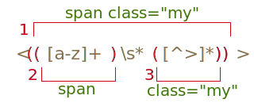

<<<<<<< HEAD
# キャプチャグループ

パターンの一部を丸括弧 `pattern:(...)`で囲むことができます。これは "キャプチャグループ" と呼ばれています。

これには2つの効果があります:

1. 結果の配列の中で、マッチした部分を別々の項目として取得することができます。
2. 丸括弧の後の量指定子がある場合、最後の文字ではなく全体に丸括弧が適用されます。

## 例

例でどのように丸括弧が動作するか見てみましょう:

### 例: gogogo

括弧なしだと、パターン `pattern:/go+/` は `subject:g` と、それに続けて1回以上の `subject:o` の繰り返しを意味します、例えば、`match:goooo` や `match:gooooooooo` です。

括弧は文字をグループ化するので、`pattern:(go)+` は `match:go`, `match:gogo`, `match:gogogo` etc を意味します:

```js run
alert( 'Gogogo now!'.match(/(go)+/i) ); // "Gogogo"
```

### 例: domain

もっと複雑なもの -- web サイトのドメインを探す正規表現を作りましょう。

例:
=======
# Capturing groups

A part of a pattern can be enclosed in parentheses `pattern:(...)`. This is called a "capturing group".

That has two effects:

1. It allows to get a part of the match as a separate item in the result array.
2. If we put a quantifier after the parentheses, it applies to the parentheses as a whole.

## Examples

Let's see how parentheses work in examples.

### Example: gogogo

Without parentheses, the pattern `pattern:go+` means `subject:g` character, followed by `subject:o` repeated one or more times. For instance, `match:goooo` or `match:gooooooooo`.

Parentheses group characters together, so `pattern:(go)+` means `match:go`, `match:gogo`, `match:gogogo` and so on.

```js run
alert( 'Gogogo now!'.match(/(go)+/ig) ); // "Gogogo"
```

### Example: domain

Let's make something more complex -- a regular expression to search for a website domain.

For example:
>>>>>>> ea7738bb7c3616bb51ff14ae3db2a2747d7888ff

```
mail.com
users.mail.com
smith.users.mail.com
```

<<<<<<< HEAD
ご覧の通り、ドメインは繰り返される単語で構成され、最後の単語以外の各単語のあとにドットがあります。

正規表現では、`pattern:(\w+\.)+\w+` となります:
=======
As we can see, a domain consists of repeated words, a dot after each one except the last one.

In regular expressions that's `pattern:(\w+\.)+\w+`:
>>>>>>> ea7738bb7c3616bb51ff14ae3db2a2747d7888ff

```js run
let regexp = /(\w+\.)+\w+/g;

alert( "site.com my.site.com".match(regexp) ); // site.com,my.site.com
```

<<<<<<< HEAD
検索は機能しますが、このパターンは `my-site.com` といったハイフンを含むドメインにはマッチしません。なぜなら、ハイフンはクラス `pattern:\w` には含まれていないからです。

最後の単語以外の各単語部分を、`pattern:\w` から `pattern:[\w-]` に置き換えることで対処できます。

### 例: email

前の例が拡張できます。前の例をベースにして正規表現を作りましょう。

email のフォーマットは `name@domain` です。任意の文字が name になれ、ハイフンとドットが許可されます。正規表現では `pattern:[-.\w]+` となります。

パターン:
=======
The search works, but the pattern can't match a domain with a hyphen, e.g. `my-site.com`, because the hyphen does not belong to class `pattern:\w`.

We can fix it by replacing `pattern:\w` with `pattern:[\w-]` in every word except the last one: `pattern:([\w-]+\.)+\w+`.

### Example: email

The previous example can be extended. We can create a regular expression for emails based on it.

The email format is: `name@domain`. Any word can be the name, hyphens and dots are allowed. In regular expressions that's `pattern:[-.\w]+`.

The pattern:
>>>>>>> ea7738bb7c3616bb51ff14ae3db2a2747d7888ff

```js run
let regexp = /[-.\w]+@([\w-]+\.)+[\w-]+/g;

alert("my@mail.com @ his@site.com.uk".match(regexp)); // my@mail.com, his@site.com.uk
```

<<<<<<< HEAD
この正規表現は完璧ではありませんが、ほとんどの場合機能し偶発的なミスを修正するのに役立ちます。なお、メールアドレスの唯一の信頼できるチェックは送信することによってのみ行うことができます。

## 括弧の中身

丸括弧は左から右へ番号付けされます。検索エンジンはそれぞれの中身を覚えており、パターンまたは置換文字列の中で内容を参照することができます。

メソッド `str.match(regexp)` では、`regexp` に `g` フラグがなければ最初の一致を探し、それを配列として返します:

1. インデックス `0`: 完全な一致
2. インデックス `1`: 最初の丸括弧の中身
3. インデックス `2`: 2つ目の丸括弧の中身
4. ...続く...

例えば、HTML タグ `pattern:<.*?>`  を探したいとします。別々の変数にタグの中身があると便利です。

内部のコンテンツを括弧でくくりましょう: `pattern:<(.*?)>`

これでタグ全体 `match:<h1>` と、その中身 `match:h1` を結果の配列から得ることができます。:
=======
That regexp is not perfect, but mostly works and helps to fix accidental mistypes. The only truly reliable check for an email can only be done by sending a letter.

## Parentheses contents in the match

Parentheses are numbered from left to right. The search engine memorizes the content matched by each of them and allows to get it in the result.

The method `str.match(regexp)`, if `regexp` has no flag `g`, looks for the first match and returns it as an array:

1. At index `0`: the full match.
2. At index `1`: the contents of the first parentheses.
3. At index `2`: the contents of the second parentheses.
4. ...and so on...

For instance, we'd like to find HTML tags `pattern:<.*?>`, and process them. It would be convenient to have tag content (what's inside the angles), in a separate variable.

Let's wrap the inner content into parentheses, like this: `pattern:<(.*?)>`.

Now we'll get both the tag as a whole `match:<h1>` and its contents `match:h1` in the resulting array:
>>>>>>> ea7738bb7c3616bb51ff14ae3db2a2747d7888ff

```js run
let str = '<h1>Hello, world!</h1>';

let tag = str.match(/<(.*?)>/);

alert( tag[0] ); // <h1>
alert( tag[1] ); // h1
```

<<<<<<< HEAD
## ネストされたグループ

括弧はネストすることができます。この場合も数字は左から右です。

例えば、`subject:<span class="my">` でタグを探すとき、次の内容に興味を持つかもしれません:

1. タグ全体のコンテンツ: `match:span class="my"`.
2. タグの名前: `match:span`.
3. タグの属性: `match:class="my"`.

これらのための括弧を追加しましょう: `pattern:<(([a-z]+)\s*([^>]*))>`

番号の付け方は次の通りです(左から右に)



=======
### Nested groups

Parentheses can be nested. In this case the numbering also goes from left to right.

For instance, when searching a tag in `subject:<span class="my">` we may be interested in:

1. The tag content as a whole: `match:span class="my"`.
2. The tag name: `match:span`.
3. The tag attributes: `match:class="my"`.

Let's add parentheses for them: `pattern:<(([a-z]+)\s*([^>]*))>`.

Here's how they are numbered (left to right, by the opening paren):


In action:

>>>>>>> ea7738bb7c3616bb51ff14ae3db2a2747d7888ff
```js run
let str = '<span class="my">';

let regexp = /<(([a-z]+)\s*([^>]*))>/;

let result = str.match(regexp);
alert(result[0]); // <span class="my">
alert(result[1]); // span class="my"
alert(result[2]); // span
alert(result[3]); // class="my"
```

<<<<<<< HEAD
`result` のインデックス 0 は常のマッチ全体になります。

次に、開始括弧が左から右に番号付けられたグループになります。最初のグループは `result[1]` で返却されます。ここではタグの中身全体になります。

`result[2]` では2つ目の開始括弧 `pattern:([a-z]+)` にいき、タグ名を返します。`result[3]` は `pattern:([^>]*)` に対応するものです。

文字列中のすべてのグループの中身です:


### オプションのグループ

たとえグループがオプションであり、マッチに存在しない場合(例. 量指定子 `pattern:(...)?` がある)でも、対応する `result` の配列項目は存在し `undefined` と等価です。

例えば、正規表現 `pattern:a(z)?(c)?` を考えてみましょう。これは `"a"` に任意の `"z"`が続き, それに任意の `"c"` が続くパターンを探します。

もし1文字 `subject:a` に対して実行すると、結果はこのようになります:
=======
The zero index of `result` always holds the full match.

Then groups, numbered from left to right by an opening paren. The first group is returned as `result[1]`. Here it encloses the whole tag content.

Then in `result[2]` goes the group from the second opening paren `pattern:([a-z]+)` - tag name, then in `result[3]` the tag: `pattern:([^>]*)`.

The contents of every group in the string:


### Optional groups

Even if a group is optional and doesn't exist in the match (e.g. has the quantifier `pattern:(...)?`), the corresponding `result` array item is present and equals `undefined`.

For instance, let's consider the regexp `pattern:a(z)?(c)?`. It looks for `"a"` optionally followed by `"z"` optionally followed by `"c"`.

If we run it on the string with a single letter `subject:a`, then the result is:
>>>>>>> ea7738bb7c3616bb51ff14ae3db2a2747d7888ff

```js run
let match = 'a'.match(/a(z)?(c)?/);

alert( match.length ); // 3
<<<<<<< HEAD
alert( match[0] ); // a (マッチ全体)
=======
alert( match[0] ); // a (whole match)
>>>>>>> ea7738bb7c3616bb51ff14ae3db2a2747d7888ff
alert( match[1] ); // undefined
alert( match[2] ); // undefined
```

<<<<<<< HEAD
配列は長さ `3` ですが、すべてのグループは空です。

そして、文字列 `subject:ac` の場合はより複雑なマッチになります:
=======
The array has the length of `3`, but all groups are empty.

And here's a more complex match for the string `subject:ac`:
>>>>>>> ea7738bb7c3616bb51ff14ae3db2a2747d7888ff

```js run
let match = 'ac'.match(/a(z)?(c)?/)

alert( match.length ); // 3
<<<<<<< HEAD
alert( match[0] ); // ac (マッチ全体)
alert( match[1] ); // undefined, (z)? がないので。
alert( match[2] ); // c
```

配列の長さは不変で `3` です。しかしグループ `pattern:(z)?` は無いので、結果は `["ac", undefined, "c"]` になります。

## グループを含むすべての一致を検索する: matchAll

```warn header="`matchAll` は新しいメソッドなので polyfill が必要な場合があります"
メソッド `matchAll` は古いブラウザではサポートされていません。

<https://github.com/ljharb/String.prototype.matchAll> のような polyfill が必要な場合があります。
```

すべての一致を検索する場合(フラグ `pattern:g`)、`match` メソッドはグループの中身を返却しません。

例えば、文字列中のすべてのタグを探してみましょう。:
=======
alert( match[0] ); // ac (whole match)
alert( match[1] ); // undefined, because there's nothing for (z)?
alert( match[2] ); // c
```

The array length is permanent: `3`. But there's nothing for the group `pattern:(z)?`, so the result is `["ac", undefined, "c"]`.

## Searching for all matches with groups: matchAll

```warn header="`matchAll` is a new method, polyfill may be needed"
The method `matchAll` is not supported in old browsers.

A polyfill may be required, such as <https://github.com/ljharb/String.prototype.matchAll>.
```

When we search for all matches (flag `pattern:g`), the `match` method does not return contents for groups.

For example, let's find all tags in a string:
>>>>>>> ea7738bb7c3616bb51ff14ae3db2a2747d7888ff

```js run
let str = '<h1> <h2>';

let tags = str.match(/<(.*?)>/g);

alert( tags ); // <h1>,<h2>
```

<<<<<<< HEAD
結果は一致したものの配列ですが、それぞれに関する詳細は含まれていません。しかし、実際には、通常は結果としてキャプチャグループの中身が必要です。

それらを取得するには、`str.matchAll(regexp)` メソッドを使用して検索する必要があります。

これは、"新しく改良されたバージョン" として、`match` のずっと後に JavaScript 言語に追加されました。

`match` のように一致を探しますが、3つの違いがあります:

1. 配列ではなく反復可能(iterable)オブジェクトを返します。
2. フラグ `pattern:g` がある場合、グループを含めた配列として、すべての一致を返します。
3. 一致がない場合は、`null` ではなく、空の反復可能オブジェクトが返却されます。

例:
=======
The result is an array of matches, but without details about each of them. But in practice we usually need contents of capturing groups in the result.

To get them, we should search using the method `str.matchAll(regexp)`.

It was added to JavaScript language long after `match`, as its "new and improved version".

Just like `match`, it looks for matches, but there are 3 differences:

1. It returns not an array, but an iterable object.
2. When the flag `pattern:g` is present, it returns every match as an array with groups.
3. If there are no matches, it returns not `null`, but an empty iterable object.

For instance:
>>>>>>> ea7738bb7c3616bb51ff14ae3db2a2747d7888ff

```js run
let results = '<h1> <h2>'.matchAll(/<(.*?)>/gi);

<<<<<<< HEAD
// results - 配列ではなく反復可能オブジェクト
=======
// results - is not an array, but an iterable object
>>>>>>> ea7738bb7c3616bb51ff14ae3db2a2747d7888ff
alert(results); // [object RegExp String Iterator]

alert(results[0]); // undefined (*)

<<<<<<< HEAD
results = Array.from(results); // 配列に変換

alert(results[0]); // <h1>,h1 (1つ目のタグ)
alert(results[1]); // <h2>,h2 (2つ目のタグ)
```

ご覧の通り、行 `(*)` で示しているように1つ目の違いは非常に重要です。オブジェクトは疑似配列ではないため、`results[0]` で一致したものを取得することはできません。`Array.from` を使用して本当の `Array` にすることができます。疑似配列と反復可能についてのより詳細な内容に関しては、<info:iterable> を参照してください。

結果をループする場合は、`Array.from` は必要ありません。:
=======
results = Array.from(results); // let's turn it into array

alert(results[0]); // <h1>,h1 (1st tag)
alert(results[1]); // <h2>,h2 (2nd tag)
```

As we can see, the first difference is very important, as demonstrated in the line `(*)`. We can't get the match as `results[0]`, because that object isn't pseudoarray. We can turn it into a real `Array` using `Array.from`. There are more details about pseudoarrays and iterables in the article <info:iterable>.

There's no need in `Array.from` if we're looping over results:
>>>>>>> ea7738bb7c3616bb51ff14ae3db2a2747d7888ff

```js run
let results = '<h1> <h2>'.matchAll(/<(.*?)>/gi);

for(let result of results) {
  alert(result);
<<<<<<< HEAD
  // первый вывод: <h1>,h1
  // второй: <h2>,h2
}
```

...あるいは分割代入を使用します:
=======
  // first alert: <h1>,h1
  // second: <h2>,h2
}
```

...Or using destructuring:
>>>>>>> ea7738bb7c3616bb51ff14ae3db2a2747d7888ff

```js
let [tag1, tag2] = '<h1> <h2>'.matchAll(/<(.*?)>/gi);
```

<<<<<<< HEAD
`matchAll` で返却されるすべての一致は、フラグ `pattern:g` なしの `match` により返却されるものと同じ形式です: 追加のプロパティ `index` (文字列中で一致したインデックス)と `input` (元の文字列)を持つ配列です。:
=======
Every match, returned by `matchAll`, has the same format as returned by `match` without flag `pattern:g`: it's an array with additional properties `index` (match index in the string) and `input` (source string):
>>>>>>> ea7738bb7c3616bb51ff14ae3db2a2747d7888ff

```js run
let results = '<h1> <h2>'.matchAll(/<(.*?)>/gi);

let [tag1, tag2] = results;

alert( tag1[0] ); // <h1>
alert( tag1[1] ); // h1
alert( tag1.index ); // 0
alert( tag1.input ); // <h1> <h2>
```

<<<<<<< HEAD
```smart header="なぜ `matchAll` の結果は配列ではなく反復可能オブジェクトなのでしょう？"
なぜこのようにメソッドが設計されたのでしょう? 理由はシンプルです - 最適化のためです。

`matchAll` の呼び出しは検索を実行しません。代わりに、最初に結果なしの反復可能オブジェクトを返します。検索はループなど、それをイテレートするたびに実行されます。

そのため、必要なだけ結果が見つかります。

例. テキストに100個の一致がある可能性がありますが、`for..of` ループではそのうち5つを見つけ、それで十分と判断し、`break` します。すると、エンジンは他の 95 個の一致を探すために時間を費やさずにすみます。
```

## 名前付きグループ(Named groups)

番号でグループを覚えておくのは難しいです。簡単なパターンであれば問題ありませんが、より複雑なパターンの場合、括弧を数えるのには不便です。そのためのより良いオプションがあります: 括弧に名前をつけます。

開始括弧の直後に`pattern:?<name>` を置くことでできます。

例えば、フォーマット "year-month-day" の日付を探しましょう。:
=======
```smart header="Why is a result of `matchAll` an iterable object, not an array?"
Why is the method designed like that? The reason is simple - for the optimization.

The call to `matchAll` does not perform the search. Instead, it returns an iterable object, without the results initially. The search is performed each time we iterate over it, e.g. in the loop.

So, there will be found as many results as needed, not more.

E.g. there are potentially 100 matches in the text, but in a `for..of` loop we found 5 of them, then decided it's enough and made a `break`. Then the engine won't spend time finding other 95 matches.
```

## Named groups

Remembering groups by their numbers is hard. For simple patterns it's doable, but for more complex ones counting parentheses is inconvenient. We have a much better option: give names to parentheses.

That's done by putting `pattern:?<name>` immediately after the opening paren.

For example, let's look for a date in the format "year-month-day":
>>>>>>> ea7738bb7c3616bb51ff14ae3db2a2747d7888ff

```js run
*!*
let dateRegexp = /(?<year>[0-9]{4})-(?<month>[0-9]{2})-(?<day>[0-9]{2})/;
*/!*
let str = "2019-04-30";

let groups = str.match(dateRegexp).groups;

alert(groups.year); // 2019
alert(groups.month); // 04
alert(groups.day); // 30
```

<<<<<<< HEAD
ご覧の通り、グループは一致した結果の `.groups` プロパティにあります。

すべての日付を探すには、フラグ `pattern:g` を追加します。

グループと一緒に完全な一致を得るには `matchAll` も必要です。:
=======
As you can see, the groups reside in the `.groups` property of the match.

To look for all dates, we can add flag `pattern:g`.

We'll also need `matchAll` to obtain full matches, together with groups:
>>>>>>> ea7738bb7c3616bb51ff14ae3db2a2747d7888ff

```js run
let dateRegexp = /(?<year>[0-9]{4})-(?<month>[0-9]{2})-(?<day>[0-9]{2})/g;

let str = "2019-10-30 2020-01-01";

let results = str.matchAll(dateRegexp);

for(let result of results) {
  let {year, month, day} = result.groups;

  alert(`${day}.${month}.${year}`);
  // first alert: 30.10.2019
  // second: 01.01.2020
}
```

<<<<<<< HEAD
## 置換におけるキャプチャグループ

`str` 内の `regexp` によるすべての一致を置換するメソッド `str.replace(regexp, replacement)` では、`replacement` 文字列の中で括弧の中身を使用することができます。これは `pattern:$n` にで行うことができ、`pattern:n` はグループ番号です。

例えば,
=======
## Capturing groups in replacement

Method `str.replace(regexp, replacement)` that replaces all matches with `regexp` in `str` allows to use parentheses contents in the `replacement` string. That's done using `pattern:$n`, where `pattern:n` is the group number.

For example,
>>>>>>> ea7738bb7c3616bb51ff14ae3db2a2747d7888ff

```js run
let str = "John Bull";
let regexp = /(\w+) (\w+)/;

alert( str.replace(regexp, '$2, $1') ); // Bull, John
```

<<<<<<< HEAD
名前付き括弧の場合、その参照は `pattern:$<name>` となります。

例えば、日付の形式を "year-month-day" から "day.month.year" にしましょう。:
=======
For named parentheses the reference will be `pattern:$<name>`.

For example, let's reformat dates from "year-month-day" to "day.month.year":
>>>>>>> ea7738bb7c3616bb51ff14ae3db2a2747d7888ff

```js run
let regexp = /(?<year>[0-9]{4})-(?<month>[0-9]{2})-(?<day>[0-9]{2})/g;

let str = "2019-10-30, 2020-01-01";

alert( str.replace(regexp, '$<day>.$<month>.$<year>') );
// 30.10.2019, 01.01.2020
```

<<<<<<< HEAD
## ? を使用した非キャプチャグループ:

量指定子を正しく適用するためには括弧が必要ですが、結果にそれらの内容は必要ないことがあります。

先頭に `pattern:?:` を追加するとグループを除外することができます。

例えば、`pattern:(go)+` を見つけたいですが、別の配列項目にその内容 (`go`) は必要ない場合、`pattern:(?:go)+` と書くことができます。

下の例では、マッチの別要素として名前 `match:John` だけを取得します。:
=======
## Non-capturing groups with ?:

Sometimes we need parentheses to correctly apply a quantifier, but we don't want their contents in results.

A group may be excluded by adding `pattern:?:` in the beginning.

For instance, if we want to find `pattern:(go)+`, but don't want the parentheses contents (`go`) as a separate array item, we can write: `pattern:(?:go)+`.

In the example below we only get the name `match:John` as a separate member of the match:
>>>>>>> ea7738bb7c3616bb51ff14ae3db2a2747d7888ff

```js run
let str = "Gogogo John!";

*!*
<<<<<<< HEAD
// ?: キャプチャから 'go' を除外します
=======
// ?: excludes 'go' from capturing
>>>>>>> ea7738bb7c3616bb51ff14ae3db2a2747d7888ff
let regexp = /(?:go)+ (\w+)/i;
*/!*

let result = str.match(regexp);

<<<<<<< HEAD
alert( result[0] ); // Gogogo John (マッチ全体)
alert( result[1] ); // John
alert( result.length ); // 2 (配列には上以外の要素はなし)
```

## サマリ

丸括弧は正規表現の一部分をグループ化し、この場合量指定子は全体に適用されます。

丸括弧のグループは左から右に番号付けされ、オプションで `(?<name>...)` を利用して名前付けすることができます。

グループでマッチした中身は、結果から取得することができます。:

- メソッド `str.match` は `pattern:g` がない場合のみキャプチャグループを返します。
- メソッド `str.matchAll` は常にキャプチャグループを返します。

括弧に名前がない場合、それらの中身は番号によって一致した配列から取り出すことができます。名前付きの場合はプロパティ `groups` でも利用できます。

`str.replace` では、置換文字列中に括弧の中身を使用することもできます。: 番号 `$n` あるいは名前 `$<name>`。

グループは先頭に `pattern:?:` を追加することで番号付けから外すことができます。これはグループ全体に対して量指定子を適用するが、結果の配列に別の項目としては不要なときに使われます。このような括弧は置換文字列でも参照できません。
=======
alert( result[0] ); // Gogogo John (full match)
alert( result[1] ); // John
alert( result.length ); // 2 (no more items in the array)
```

## Summary

Parentheses group together a part of the regular expression, so that the quantifier applies to it as a whole.

Parentheses groups are numbered left-to-right, and can optionally be named with  `(?<name>...)`.

The content, matched by a group, can be obtained in the results:

- The method `str.match` returns capturing groups only without flag `pattern:g`.
- The method `str.matchAll` always returns capturing groups.

If the parentheses have no name, then their contents is available in the match array by its number. Named parentheses are also available in the property `groups`.

We can also use parentheses contents in the replacement string in `str.replace`: by the number `$n` or the name `$<name>`.

A group may be excluded from numbering by adding `pattern:?:` in its start. That's used when we need to apply a quantifier to the whole group, but don't want it as a separate item in the results array. We also can't reference such parentheses in the replacement string.
>>>>>>> ea7738bb7c3616bb51ff14ae3db2a2747d7888ff
